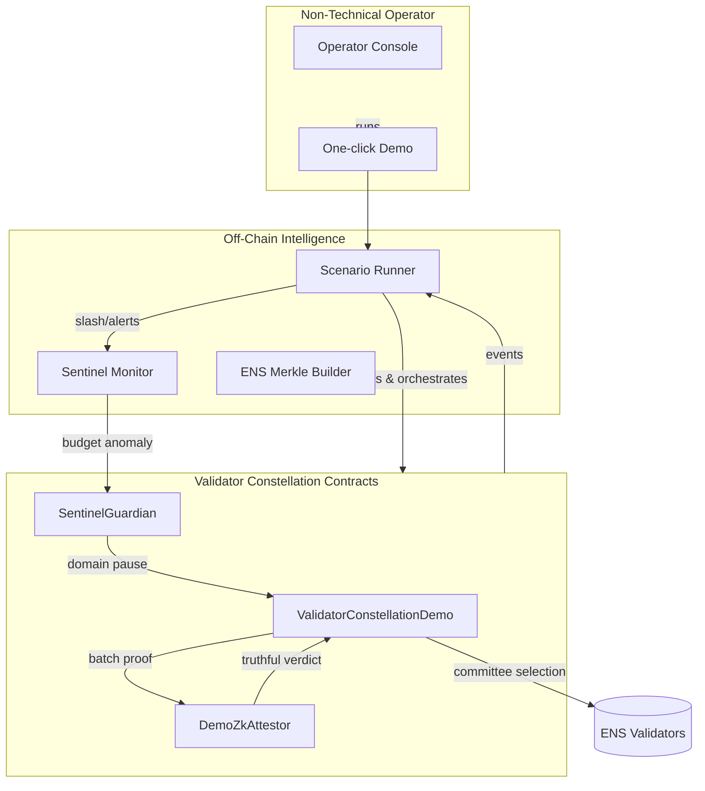
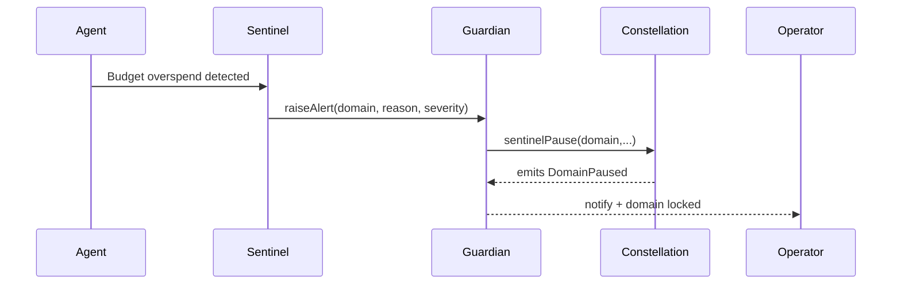

# 🎖️ Validator Constellation Demo (v0)

> A Kardashev-II ready validation lattice demonstrating how **AGI Jobs v0 (v2)** empowers non-technical operators to command a superintelligent validator fabric with cryptographic truth, zero-knowledge throughput and sentinel guardrails.

## ✨ Why this matters

- **Commit–reveal validation with VRF randomness** prevents collusion and guarantees unbiased quorum selection.
- **ZK batched attestations** finalise one thousand jobs with a single proof submission, unlocking planetary throughput.
- **Sentinel anomaly detection + domain-scoped pause** ensures autonomous agents halt instantly when unsafe behaviour emerges.
- **ENS-bound identities** keep every agent and validator accountable with verifiable ownership proofs.
- **Owner-operated controls** (pause, resume, attestor rotation, identity lists) keep the business sovereign.

## 🧭 System overview



## 📁 Directory layout

- `contracts/` – Solidity contracts with commit–reveal, attestor interface and sentinel circuit breaker.
- `scripts/` – Operator-friendly automation, including `runDemo.ts`, `runScenario.ts` and an interactive console.
- `src/` – TypeScript helpers (ENS trees, sentinel monitors) exposing the same primitives you will run in production.
- `tests/` – Ultra-high fidelity integration test executed via `npm run test:validator-constellation`.
- `subgraph/` – Schema + manifest for indexing validator slashing, round lifecycle and sentinel alerts.
- `docs/` – (Reserved) drop-in space for future whitepapers or diagrams.

## 🚀 Quickstart (non-technical friendly)

```bash
npm install
npm run demo:validator-constellation
```

The script will:

1. Build ENS Merkle trees for both mainnet (`*.club.agi.eth`) and alpha domains.
2. Deploy the contracts locally with Hardhat.
3. Register validators and agents only when their ENS proofs succeed.
4. Run a commit–reveal round with deterministic VRF selection.
5. Submit a ZK proof finalising 1,000 jobs at once.
6. Trigger an automated sentinel anomaly → pause the affected domain → resume once acknowledged.
7. Emit structured telemetry, saved under `demo/Validator-Constellation-v0/reports/`.

## 🛡️ Sentinel guardrails



- The owner can resume a domain instantly with `resumeDomain`.
- Alerts are fully logged and indexable by the provided subgraph manifest.

## 🔑 ENS identity enforcement

- Validators must own `*.club.agi.eth` or `*.alpha.club.agi.eth` (treated equally for testnets).
- Agents must own `*.agent.agi.eth` or `*.alpha.agent.agi.eth`.
- Registration requires a Merkle proof linking the caller address to the ENS node hash.
- Identity roots are owner-rotatable via `setEnsRoots`, keeping full control with the platform operator.

## ⚙️ Owner control panel

The contract owner can:

- `setAttestor` – rotate to a new ZK verifier
- `setSentinel` – plug in upgraded sentinel guardians
- `setEnsRoots` – update identity registries atomically
- `setCommitRevealWindows` – tune block-level timing windows
- `pause` / `unpause` – fail-safe entire constellation
- `resumeDomain` – reopen paused domains after incident triage

## 📊 Subgraph manifest

`subgraph/subgraph.yaml` indexes:

- `RoundStarted`
- `VoteCommitted`
- `VoteRevealed`
- `RoundFinalised`
- `ValidatorSlashed`
- `DomainPaused` / `DomainResumed`
- `SentinelAlert`

This yields real-time dashboards showing validator behaviour, penalties, and domain status.

## 🧪 Testing & CI

Run the dedicated integration test:

```bash
npm run test:validator-constellation
```

All assets are prepared for inclusion in the global CI pipeline. The script compiles contracts, executes the full scenario, validates slashing, and ensures sentinel pausing works within a single run.

## 📘 Further reading

- `scripts/operatorConsole.ts` – Interactive CLI for mission control.
- `scripts/runDemo.ts` – One-command automation for non-technical operators.
- `subgraph/schema.graphql` – Entities for analytics + transparency dashboards.

Happy validating! 🛰️
