# Validator Constellation v0

> A Kardashev-II ready validator superstructure that a non-technical operator can launch with a single command. This demo fuses VRF-governed commit–reveal validation, ZK batched attestations, ENS-enforced identity, automated sentinel brakes, and transparent on-chain telemetry into a single orchestrated run.

## Mission Deck

```mermaid
flowchart LR
  subgraph Governance
    Owner["🛡️ Owner Control"] --> Params["Governance Module\n(commit blocks, quorum, penalties)"]
    Params --> StakeManager
  end
  subgraph Validation
    StakeManager["Stake Manager\nBond + Slash"] --> VRF["VRF Committee Selection"]
    VRF --> CommitReveal["Commit → Reveal"]
    CommitReveal --> ZKBatch["ZK Batch Prover"]
  end
  subgraph Safety
    Sentinels["Sentinel Guardians"] --> DomainPause["Domain Pause Controller"]
    DomainPause -->|alerts| Owner
  end
  ENSRoot["ENS Merkle Root"] --> StakeManager
  ENSRoot --> Sentinels
  CommitReveal -->|events| Subgraph["Live Subgraph"]
  ZKBatch -->|proof| Finality["Finalization"]
  Sentinels -->|pause| Finality
```



## Why this demo matters

* **Cryptographic truth** – deterministic VRF committee draws, salted commit–reveal voting, and automatic slashing mean hostile validators cannot game the outcome.
* **Zero-knowledge throughput** – a single proof finalizes **1,000 jobs** at once while preserving privacy and auditability.
* **Sentinel guardrails** – budget overruns or unsafe calls trigger autonomous domain pauses within the same round.
* **ENS-verified identity** – only operators with approved `.club.agi.eth` or `.alpha.club.agi.eth` subdomains pass the Merkle proof gate, making impersonation impossible.
* **Operator sovereignty** – one governance command updates penalties or committee size without redeploying contracts.

## Quickstart for non-technical operators

1. Ensure Node.js 20.18.1 is available (`nvm use` if needed).
2. Install dependencies (once per repo):
   ```bash
   npm ci
   ```
3. Launch the full validator constellation demo and generate the dashboard:
   ```bash
   npm run demo:validator-constellation
   ```
   The script writes human-readable reports to `demo/Validator-Constellation-v0/reports/latest/`, including a dashboard HTML file with live Mermaid diagrams.
4. Run the deterministic validation round test suite:
   ```bash
   npm run test:validator-constellation
   ```
5. Type-check every module:
   ```bash
   npm run lint:validator-constellation
   ```

No smart-contract tooling, solc, or blockchain node is required. Everything is simulated end-to-end with the same primitives we deploy on-chain.

## What the demo executes

1. **Identity attestation** – builds an ENS Merkle tree, verifies the owner of every validator/agent subdomain, and bans imposters.
2. **Stake orchestration** – bonds five validators with configurable stakes and records them in the Stake Manager.
3. **VRF committee draw** – derives unpredictable committee membership from mixed entropy and governance parameters.
4. **Commit–reveal voting** – logs sealed commitments, enforces honest reveals, and slashes non-compliant validators.
5. **Sentinel autonomy** – detects a synthetic overspend, issues a `BUDGET_OVERRUN` alert, and pauses the affected domain.
6. **ZK batch attestation** – computes a proof for 1,000 jobs, validates it twice (prove & verify), and emits telemetry to the subgraph feed.
7. **Transparency outputs** – writes summary JSON, NDJSON event stream, subgraph snapshots, and an immersive dashboard.

## Governance levers

Operators can change any governance knob without code:

```ts
import { ValidatorConstellationDemo } from './src/core/constellation';

const demo = new ValidatorConstellationDemo(setup);
demo.updateGovernanceParameter('slashPenaltyBps', 2_500);
demo.updateSentinelConfig({ budgetGraceRatio: 0.12 });
demo.updateDomainSafety('deep-space-lab', { unsafeOpcodes: ['STATICCALL', 'DELEGATECALL'] });
demo.pauseDomain('deep-space-lab', 'scheduled upgrade');
demo.resumeDomain('deep-space-lab');
demo.setAgentBudget('nova.agent.agi.eth', 2_000_000n);
```

All modules respond instantly (new committee sizes, quorum thresholds, penalty weights, etc.).

## Sentinel SLA


The Sentinel guarantee: any overspend or forbidden opcode pauses the domain within the same execution round, with fully logged context for operators and auditors.

## Files of interest

| Path | Description |
| --- | --- |
| `src/core/constellation.ts` | High-level orchestrator gluing governance, stake, sentinel, VRF, and ZK modules. |
| `src/core/commitReveal.ts` | Deterministic commit–reveal coordinator enforcing quorum and penalties. |
| `src/core/zk.ts` | Zero-knowledge batch prover/validator for job attestation throughput. |
| `src/core/sentinel.ts` | Budget/unsafe call monitors issuing automatic domain pauses. |
| `scripts/runDemo.ts` | One-command launcher that generates artifacts and dashboard. |
| `tests/validator_constellation.test.ts` | Deterministic end-to-end tests proving every acceptance criterion. |

## Output artifacts

After `npm run demo:validator-constellation`, inspect:

* `reports/latest/dashboard.html` – immersive control deck with Mermaid diagrams.
* `reports/latest/summary.json` – committee, proof, alert, and pause telemetry.
* `reports/latest/events.ndjson` – commit and reveal stream for auditors.
* `reports/latest/subgraph.json` – indexed events mirroring on-chain transparency feeds.

## Extending the constellation

* Add additional ENS leaves to onboard validators or agents; the Merkle builder keeps proofs consistent.
* Adjust `sentinelGraceRatio` to tighten/relax budgets or plug in new rules (unsafe opcode catalogues, geo-fenced calls, etc.).
* Swap in real VRF randomness (Chainlink, drand, beacon chain) without touching the committee logic.
* Replace the simulated ZK prover with Groth16/PLONK circuits – the interface is ready for drop-in SNARK backends.

## Trust guarantees checklist

- ✅ Slashing events mirror into the subgraph feed for real-time dashboards.
- ✅ Committee randomness is entropy-mixed and replay-protected.
- ✅ Only ENS-verified actors (both production and alpha namespaces) can participate.
- ✅ Domain-scoped pause ensures other environments stay online.
- ✅ Governance can pause, resume, or retune parameters instantly.

Launch the demo, explore the dashboard, and experience how AGI Jobs v0 (v2) turns Kardashev-II operator control into a single command for non-technical teams.
