# Validator Constellation v0 Demo

> A non-technical, production-grade walkthrough that shows how AGI Jobs v0 (v2) empowers operators to command a validator constellation, deliver ZK-supercharged throughput, and enforce Kardashev-II safety guardrails with a single command.

## ✨ Why this demo matters

This directory packages a complete, batteries-included simulation that mirrors the on-chain Validator Constellation and Sentinel Guardrail stack.  It is intentionally ergonomic: a business operator with zero blockchain experience can run the scenario, inspect results, and export compliance artefacts without editing code.  The workflow mirrors the live system:

1. **Identity-controlled onboarding** verifies ENS subdomain ownership for validators, agents, and nodes.
2. **VRF committee selection** deterministically elects an unbiased validation committee.
3. **Commit–reveal voting with block timelines** locks validator intent before the reveal phase, enforces commit and reveal deadlines, and produces auditable timelines.
4. **Zero-knowledge batch attestations** finalize 1,000 jobs at once while surfacing gas savings.
5. **Sentinel monitors** guardrail every domain and trigger domain-scoped emergency pauses inside the SLA window.
6. **Stake slashing events** emit auditable telemetry that downstream subgraphs can index in real time.
7. **Owner console controls** let governance update parameters live, resume paused domains, and broadcast `ConfigUpdated` events for downstream dashboards.

Running the demo therefore conveys—in minutes—the depth of control, throughput, and resilience that AGI Jobs v0 (v2) already delivers.

## 🚀 Quickstart (non-technical friendly)

```bash
cd demo/Validator-Constellation-v0
python run_demo.py \
  --seed community-round-42 \
  --truth true \
  --committee-size 3 \
  --quorum 2 \
  --commit-blocks 5 \
  --reveal-blocks 6 \
  --slash-non-reveal 0.35 \
  --output summary.json \
  --web-artifacts web/data
```

This single command spins up the validator constellation, performs VRF committee selection, executes the commit–reveal round with enforced block windows, batches 1,000 job attestations into one ZK proof, fires a Sentinel anomaly, and exports a JSON compliance bundle.  The JSON includes the selected committee, truthful outcome, slashed validator list, paused domains, proof root, gas saved by the batch attestation, the full timeline of the validation round, and a log of owner governance actions applied during the run.

Passing `--web-artifacts web/data` additionally produces `summary.json`, `events.json`, `timeline.json`, and `owner-actions.json` files that the `web/index.html` command deck automatically ingests.  Open the HTML file locally after running the command to see the live metrics and sentinel alert stream updated with your run's telemetry.

You can also run the package directly:

```bash
python -m validator_constellation
```

## 🧠 System architecture (Mermaid)

```mermaid
graph TD
    subgraph Identity & Governance
        Owner[Contract Owner]
        ENSVerifier[ENS Identity Verifier]
        StakeMgr[Stake Manager]
        Owner -->|configures| ENSVerifier
        Owner -->|governs| StakeMgr
    end

    subgraph Validation Flow
        VRF[Deterministic VRF]
        Committee[Validator Committee]
        CommitReveal[Commit-Reveal Round]
        ZKBatch[ZK Batch Attestor]
    end

    subgraph Autonomy Guardrails
        Sentinel[Sentinel Monitor]
        PauseCtrl[Domain Pause Controller]
        SubgraphIndexer[Subgraph Indexer]
    end

    ENSVerifier -->|authorises| Committee
    StakeMgr -->|stakes| Committee
    VRF -->|selects| Committee
    Committee -->|commits| CommitReveal
    Committee -->|reveals| CommitReveal
    CommitReveal -->|truth votes| StakeMgr
    CommitReveal -->|finalisation| ZKBatch
    ZKBatch -->|proof| StakeMgr
    Sentinel -->|alerts| PauseCtrl
    PauseCtrl -->|pause events| SubgraphIndexer
    StakeMgr -->|slashing events| SubgraphIndexer
```



## 🛰️ Sentinel guardrail topology


## 🛡️ ENS identity policy

* Validators: `*.club.agi.eth` and `*.alpha.club.agi.eth`
* Agents: `<name>.agent.agi.eth` and `<name>.alpha.agent.agi.eth`
* Nodes: `<name>.node.agi.eth` and `<name>.alpha.node.agi.eth`

The `ENSIdentityVerifier` enforces the namespace, validates deterministic signatures, and blocks any blacklisted address.  The contract owner can refresh the allowlists at runtime via `SystemConfig.update` and the `OwnerConsole` facade exposed in Python.

## 🧭 Owner command surface

Non-technical operators configure the demo via `run_demo.py` arguments or the programmatic `OwnerConsole`.  Both surfaces fan out to the same governance hooks:

* `--committee-size`, `--quorum`, `--commit-blocks`, `--reveal-blocks`, `--slash-non-reveal`, `--slash-incorrect`, `--owner`, and `--budget` map one-to-one to production configuration controls.
* The `OwnerConsole` publishes `ConfigUpdated` and `DomainResumed` events to the mock subgraph so dashboards stay synchronized.
* Governance history is emitted in `summary.ownerActions`, making export to regulators or auditors automatic.

## 🧪 Test matrix

Run the automated suite with:

```bash
PYTEST_DISABLE_PLUGIN_AUTOLOAD=1 pytest demo/Validator-Constellation-v0/tests
```

The tests cover:

* deterministic VRF committee selection and commit–reveal flow with timeline enforcement
* automatic slashing for non-reveal and incorrect votes, including reveal deadline handling
* Sentinel anomaly detection halting affected domains
* zero-knowledge batch proof verification for 1,000 jobs
* ENS namespace enforcement for validators, agents, and nodes
* Governance controls updating configuration and resuming paused domains
* EventBus integration powering the subgraph indexer scenario

## 🌐 Interactive dashboard (static export)

Open [`web/index.html`](./web/index.html) for a single-page dashboard that renders the architecture diagrams, streaming events, and operator runbook.  The page bundles Mermaid.js and auto-renders the diagrams for any exported event traces.

## 🛠️ File map

| Path | Purpose |
| --- | --- |
| `validator_constellation/` | Python package with deterministic primitives |
| `run_demo.py` | CLI orchestrator for non-technical operators |
| `tests/` | Pytest suite ensuring production-grade behaviour |
| `web/index.html` | Interactive documentation and architecture viewer |

---

AGI Jobs v0 (v2) now demonstrates, in a single directory, how anyone can command an AI-native validator fleet with Kardashev-II guardrails.  The same primitives drop into production to power unstoppable validation constellations.
