# Validator Constellation v0

> A Kardashev-II ready validator superstructure that a non-technical operator can launch with a single command. This demo fuses VRF-governed commit–reveal validation, ZK batched attestations, ENS-enforced identity, automated sentinel brakes, and transparent on-chain telemetry into a single orchestrated run.

## Mission Deck

```mermaid
flowchart LR
  subgraph Governance
    Owner["🛡️ Owner Control"] --> Params["Governance Module\n(commit blocks, quorum, penalties)"]
    Params --> StakeManager
  end
  subgraph Validation
    StakeManager["Stake Manager\nBond + Slash"] --> VRF["VRF Committee Selection"]
    VRF --> CommitReveal["Commit → Reveal"]
    CommitReveal --> ZKBatch["ZK Batch Prover"]
  end
  subgraph Safety
    Sentinels["Sentinel Guardians"] --> DomainPause["Domain Pause Controller"]
    DomainPause -->|alerts| Owner
  end
  ENSRoot["ENS Merkle Root"] --> StakeManager
  ENSRoot --> Sentinels
  CommitReveal -->|events| Subgraph["Live Subgraph"]
  ZKBatch -->|proof| Finality["Finalization"]
  Sentinels -->|pause| Finality
```



## Why this demo matters

* **Cryptographic truth** – deterministic VRF committee draws, salted commit–reveal voting, and automatic slashing mean hostile validators cannot game the outcome.
* **Zero-knowledge throughput** – a single proof finalizes **1,000 jobs** at once while preserving privacy and auditability.
* **Sentinel guardrails** – budget overruns, forbidden opcodes, unauthorized targets, or calldata floods trigger autonomous domain pauses within the same round.
* **Deterministic supply-chain allowlists** – each domain now encodes hashed ENS target allowlists and calldata ceilings so auditors can replay sentinel verdicts byte-for-byte.
* **ENS-verified identity** – only operators with approved `.club.agi.eth` or `.alpha.club.agi.eth` subdomains pass the Merkle proof gate, making impersonation impossible.
* **Operator sovereignty** – one governance command updates penalties or committee size without redeploying contracts.
* **Block-by-block accountability** – every commit, reveal, and finalization is captured with explicit block windows, letting owners audit timing SLAs and prove the protocol stayed inside governance limits.
* **Entropy witness cross-checks** – each committee draw now publishes dual-hash randomness witnesses (Keccak + SHA-256) so anyone can independently re-derive the transcript.

## Quickstart for non-technical operators

1. Ensure Node.js 20.18.1 is available (`nvm use` if needed).
2. Install dependencies (once per repo):
   ```bash
   npm ci
   ```
3. Launch the full validator constellation demo and generate the dashboard:
   ```bash
   npm run demo:validator-constellation
   ```
   The script writes human-readable reports to `demo/Validator-Constellation-v0/reports/latest/`, including a dashboard HTML file with live Mermaid diagrams.
   Every run now emits a zero-trust evidence pack:

   * `summary.json` – high-level owner digest plus audit verdict.
   * `round.json` – full transcript of the commit, reveal, sentinel, and slashing timeline.
   * `jobs.json` – the attested batch, ready for independent proof verification.
   * `audit.json` – cryptographic audit result with a deterministic hash you can notarize.
   * `events.ndjson` / `subgraph.json` / `dashboard.html` – real-time telemetry, indexer feed, and control-room UI.
   * `owner-digest.md` – mission-briefing markdown for owners with audit checklist, sentinel log, and governance posture.
4. Run the deterministic validation round test suite:
   ```bash
   npm run test:validator-constellation
   ```
5. Type-check every module:
   ```bash
   npm run lint:validator-constellation
   ```

6. Run the cryptographic audit harness on any generated report directory:
   ```bash
   npm run demo:validator-constellation:audit-report -- --report-dir demo/Validator-Constellation-v0/reports/latest
   ```
   The auditor re-derives commitments, recomputes the VRF witness, verifies the ZK batch proof, and confirms sentinel-domain pause alignment. Any discrepancy exits with a non-zero status so owners can gate deployments on a provable attestation trail.

### Scenario-driven automation for non-technical owners

Ship entire validator rounds from a single YAML file—no coding required:

```bash
 npm run demo:validator-constellation:scenario -- \
  --config demo/Validator-Constellation-v0/config/stellar-scenario.yaml
```

The sample scenario expresses governance, sentinel tuning, committee overrides, ENS identities, and anomaly injections in one declarative document:

```yaml
name: "stellar-sentinel-constellation"
baseSetup:
  verifyingKey: 0xfeedfeedfeedfeedfeedfeedfeedfeedfeedfeedfeedfeedfeedfeedfeedfeed
  governance:
    committeeSize: 4
    slashPenaltyBps: 2000
domains:
  - id: deep-space-lab
    budgetLimit: 5000000
validators:
  - ens: andromeda.club.agi.eth
    address: 0x1111111111111111111111111111111111111111
    stake: 12000000000000000000
ownerActions:
  updateSentinel:
    budgetGraceRatio: 0.12
  updateEntropy:
    onChainEntropy: 0x0102030405060708090a0b0c0d0e0f101112131415161718191a1b1c1d1e1f20
```

Running the scenario creates a dedicated report folder (`reports/scenarios/<name>/`) with the same proof, sentinel, and subgraph telemetry as the baseline demo. Non-technical operators simply edit the YAML and re-run the command to retune governance levers.

No smart-contract tooling, solc, or blockchain node is required. Everything is simulated end-to-end with the same primitives we deploy on-chain.

### Operator Control Tower Console

Non-technical owners can now steer the constellation from a persistent control tower state without touching code:

```bash
npm run demo:validator-constellation:operator-console -- status --mermaid
```

Key capabilities:

* `init` – bootstrap or reset the control tower state with a pre-bonded validator set.
* `set-governance`, `set-sentinel`, `set-domain` – live-edit quorum thresholds, penalty weights, guardrails, and unsafe opcode policies.
* `bond-validator`, `register-agent`, `register-node` – onboard new participants with ENS-backed ownership checks.
* `pause-domain` / `resume-domain` – trigger or lift emergency halts domain-by-domain within seconds.
* `run-round` – execute a full validation round (with optional anomalies) and emit a full report deck under `reports/operator-console/`.

Every command persists updates to `demo/Validator-Constellation-v0/reports/operator-console/operator-state.json`, making the control plane fully declarative and restartable. Each run prints a contextual summary and a live Mermaid blueprint:

```mermaid
flowchart TD
  owner["🛡️ Owner Console"] --> governance["Governance
committeeSize: 4
quorum: 75%"]
  owner --> sentinel["Sentinel
Grace 5%"]; owner --> nodes["Domain Nodes"]
  subgraph validators["Validators"]
    val_andromeda["andromeda.club.agi.eth
10 ETH
ACTIVE"]
    val_orion["orion.club.agi.eth
10 ETH
ACTIVE"]
  end
  governance --> validators
  subgraph domain_deep_space_lab["Deep Space Research Lab
Budget 5,000,000
Paused: NO"]
    agent_nova["nova.agent.agi.eth
Budget 1,000,000"]
  end
  subgraph domain_lunar_foundry["Lunar Foundry
Budget 2,000,000
Paused: NO"]
    agent_sentinel["sentinel.agent.agi.eth
Budget 750,000"]
  end
  subgraph nodes["Domain Nodes"]
    node_polaris["polaris.node.agi.eth"]
    node_selene["selene.alpha.node.agi.eth"]
  end
  validators --> sentinel
  sentinel --> domain_deep_space_lab
  sentinel --> domain_lunar_foundry
```



The CLI enforces ENS subdomain policy, budget ceilings, and governance guardrails automatically—operators simply choose the right command and AGI Jobs v0 (v2) performs the rest.

## What the demo executes

1. **Identity attestation** – builds an ENS Merkle tree, verifies the owner of every validator/agent subdomain, and bans imposters.
2. **Node orchestration** – onboards production (`*.node.agi.eth`) and alpha (`*.alpha.node.agi.eth`) controllers with the same Merkle proof flow, ensuring operations teams have verifiable infrastructure custodians.
3. **Stake orchestration** – bonds five validators with configurable stakes and records them in the Stake Manager.
4. **VRF committee draw** – derives unpredictable committee membership from mixed entropy and governance parameters, emitting a deterministic entropy witness (`keccak`, `sha256`, transcript) for downstream auditors.
5. **Commit–reveal voting** – logs sealed commitments, enforces honest reveals, and slashes non-compliant validators.
6. **Sentinel autonomy** – detects a synthetic overspend, issues a `BUDGET_OVERRUN` alert, and pauses the affected domain.
7. **Guardrail forensics** – captures hashed target witnesses and calldata payload metrics for every sentinel escalation, enabling external replays of each shutdown decision.
8. **ZK batch attestation** – computes a proof for 1,000 jobs, validates it twice (prove & verify), and emits telemetry to the subgraph feed.
9. **Entropy & proof rotation** – rotates the VRF entropy mix and ZK verifying key mid-run so owners can refresh randomness and proving assets on demand.
10. **Transparency outputs** – writes summary JSON, NDJSON event stream, subgraph snapshots, and an immersive dashboard.

## Governance levers

Operators can change any governance knob without code:

```ts
import { ValidatorConstellationDemo } from './src/core/constellation';

const demo = new ValidatorConstellationDemo(setup);
demo.updateGovernanceParameter('slashPenaltyBps', 2_500);
demo.updateSentinelConfig({ budgetGraceRatio: 0.12 });
demo.updateDomainSafety('deep-space-lab', {
  unsafeOpcodes: ['STATICCALL', 'DELEGATECALL'],
  allowedTargets: ['0xa11ce5c1e11ce000000000000000000000000000', '0xbeac0babe00000000000000000000000000000000'],
  maxCalldataBytes: 8192,
});
demo.pauseDomain('deep-space-lab', 'scheduled upgrade');
demo.resumeDomain('deep-space-lab');
demo.setAgentBudget('nova.agent.agi.eth', 2_000_000n);
demo.updateEntropySources({
  onChainEntropy: '0x0123...abcd',
  recentBeacon: '0x9999...ffff',
});
demo.updateZkVerifyingKey('0xf1f2f3...0011');
demo.getEntropySources();
demo.registerNode('polaris.node.agi.eth', '0xcccccccccccccccccccccccccccccccccccccccc');
demo.registerNode('selene.alpha.node.agi.eth', '0xdddddddddddddddddddddddddddddddddddddddd');
```

All modules respond instantly (new committee sizes, quorum thresholds, penalty weights, etc.).

## Sentinel SLA


The Sentinel guarantee: any overspend, forbidden opcode, unauthorized target, or oversized calldata burst pauses the domain within the same execution round, with fully logged context for operators and auditors.

Guardrail metadata now includes:

* `UNAUTHORIZED_TARGET` – triggered with dual verification (`target` + `keccak(target)`) whenever an agent reaches outside the allowlist.
* `CALLDATA_EXPLOSION` – activates if a call attempts to exceed the domain-specific byte ceiling; the alert bundles the observed payload size so downstream monitors can replay the decision.

## Files of interest

| Path | Description |
| --- | --- |
| `src/core/constellation.ts` | High-level orchestrator gluing governance, stake, sentinel, VRF, and ZK modules. |
| `src/core/commitReveal.ts` | Deterministic commit–reveal coordinator enforcing quorum and penalties. |
| `src/core/zk.ts` | Zero-knowledge batch prover/validator for job attestation throughput. |
| `src/core/sentinel.ts` | Budget/unsafe call monitors issuing automatic domain pauses. |
| `scripts/runDemo.ts` | One-command launcher that generates artifacts and dashboard. |
| `tests/validator_constellation.test.ts` | Deterministic end-to-end tests proving every acceptance criterion. |

## Output artifacts

After `npm run demo:validator-constellation`, inspect:

* `reports/latest/dashboard.html` – immersive control deck with Mermaid diagrams.
* `reports/latest/summary.json` – committee, entropy witnesses (Keccak + SHA), VRF seed, proof, alert, and pause telemetry.
* `reports/latest/events.ndjson` – commit and reveal stream for auditors.
* `reports/latest/subgraph.json` – indexed events mirroring on-chain transparency feeds.

## Extending the constellation

* Add additional ENS leaves to onboard validators or agents; the Merkle builder keeps proofs consistent.
* Adjust `sentinelGraceRatio` to tighten/relax budgets or plug in new rules (unsafe opcode catalogues, geo-fenced calls, etc.).
* Swap in real VRF randomness (Chainlink, drand, beacon chain) without touching the committee logic.
* Replace the simulated ZK prover with Groth16/PLONK circuits – the interface is ready for drop-in SNARK backends.

## Trust guarantees checklist

- ✅ Slashing events mirror into the subgraph feed for real-time dashboards.
- ✅ Committee randomness is entropy-mixed and replay-protected.
- ✅ Only ENS-verified actors (both production and alpha namespaces) can participate.
- ✅ Domain-scoped pause ensures other environments stay online.
- ✅ Governance can pause, resume, or retune parameters instantly.
- ✅ Node orchestrators inherit the same ENS + blacklist guardrails as validators and agents.
- ✅ Owners rotate VRF entropy and ZK verifying keys on demand without touching code.
- ✅ Sentinel alerts include hashed target witnesses and calldata measurements for external reproducibility.

Launch the demo, explore the dashboard, and experience how AGI Jobs v0 (v2) turns Kardashev-II operator control into a single command for non-technical teams.
