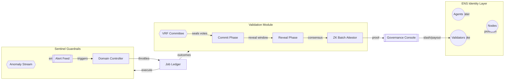
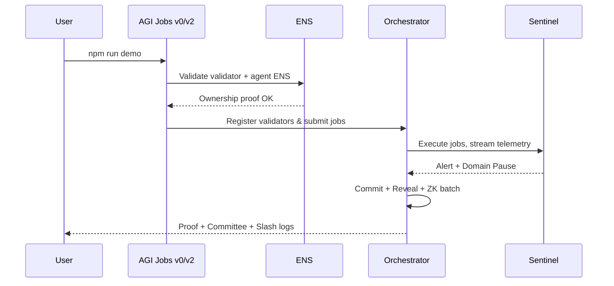

# Validator Constellation Demo v2 (AGI Jobs v0/v2)

> A zero-to-hero, non-technical friendly launchpad that turns the AGI Jobs v0/v2 toolkit into a full Kardashev-II ready validator constellation with sentinel guardrails, ZK throughput, ENS-gated identity, and on-chain grade accountability.

## ✨ Demo Value Proposition

- **Super-scaled validation** – deterministically select validator committees using VRF-grade entropy and commit–reveal so every decision is sealed until consensus.
- **Throughput with cryptographic certainty** – batch up to 1000 job outcomes into a single zero-knowledge attest, compressing a day’s worth of autonomous labour into one proof.
- **Autonomy with brakes** – Sentinel monitors enforce budget ceilings, detect unsafe calls, and freeze only the affected domain within seconds.
- **Human-sovereign control** – governance can pause, resume, slash, and reconfigure every parameter instantly with transparent eventing.
- **ENS-first identity** – validators, nodes, and agents must control approved subdomains (mainnet and alpha) before they can even attempt to participate.

## 🧭 Directory Structure

```text
demo/Validator-Constellation-v0/v2
├── README.md
├── package.json
├── package-lock.json
├── tsconfig.json
├── vitest.config.ts
├── src/
│   ├── demo-runner.ts
│   ├── domain/
│   ├── identity/
│   ├── jobs/
│   ├── sentinel/
│   ├── simulation/
│   ├── utils/
│   ├── validators/
│   └── zk/
└── tests/
    ├── commit-reveal.test.ts
    ├── ens.test.ts
    ├── orchestrator.test.ts
    ├── sentinel.test.ts
    ├── vrf.test.ts
    └── zk-batcher.test.ts
```

## 🛰️ System Flow (Validator Constellation)



## 🚀 Quickstart (Non-Technical Operator)

```bash
cd demo/Validator-Constellation-v0/v2
npm install
npm run demo
npm test
```

## 🛡️ Sentinel Guardrails

- Budget overruns above `10 ETH` are blocked instantly.
- Unsafe opcodes (configurable) trigger an immediate pause for the target domain.
- Alert bus feeds analytics dashboards and autopause logic simultaneously.

## ⚖️ Validator Governance

- Validators must register with ENS names under `*.club.agi.eth` or `*.alpha.club.agi.eth`.
- Slashing penalty defaults to `1 ETH` but is adjustable in the config block.
- Rewards accrue automatically for every successful reveal.
- Slashing emits on-chain-equivalent events captured inside `slashEvents` for indexers/subgraphs.

## 📡 Zero-Knowledge Throughput

- Each batch proof is a Merkle root + deterministic proof ID for append-only audit trails.
- Swap the Merkle builder with real circuits (Groth16/Plonk) by feeding the same job vector.
- Proof metadata is designed for subgraph consumption and can be extended with verifying keys.

## 🔐 ENS Identity Enforcement

- Validators: `name.club.agi.eth` or `name.alpha.club.agi.eth`
- Agents: `<agent>.agent.agi.eth` or `<agent>.alpha.agent.agi.eth`
- Nodes: `<node>.node.agi.eth` or `<node>.alpha.node.agi.eth`
- Ownership is verified via registry snapshots + Merkle root for audit.



## 🧪 Test Coverage

Vitest suites cover the VRF, commit–reveal, sentinel, ZK batcher, orchestrator, and ENS guardrails.

## 🛠️ Configuration Surface

All major levers (stakes, quorum, entropy, sentinel thresholds, batch size) are typed configs in `src/demo-runner.ts`.

## 🌌 Extending to Mainnet

- Swap `EnsRegistry` with on-chain ENS lookups.
- Replace deterministic randomness with production VRF.
- Hook `slashEvents` into the on-chain stake manager + subgraph stack.
- Drive sentinel from live telemetry feeds.

## ✅ Outcome

Running this v2 demo shows—in minutes—that AGI Jobs v0/v2 lets a single operator wield fully-governed validator constellations, cryptographic truth guarantees, high-throughput batching, sentinel guardrails, and ENS-enforced identity.
