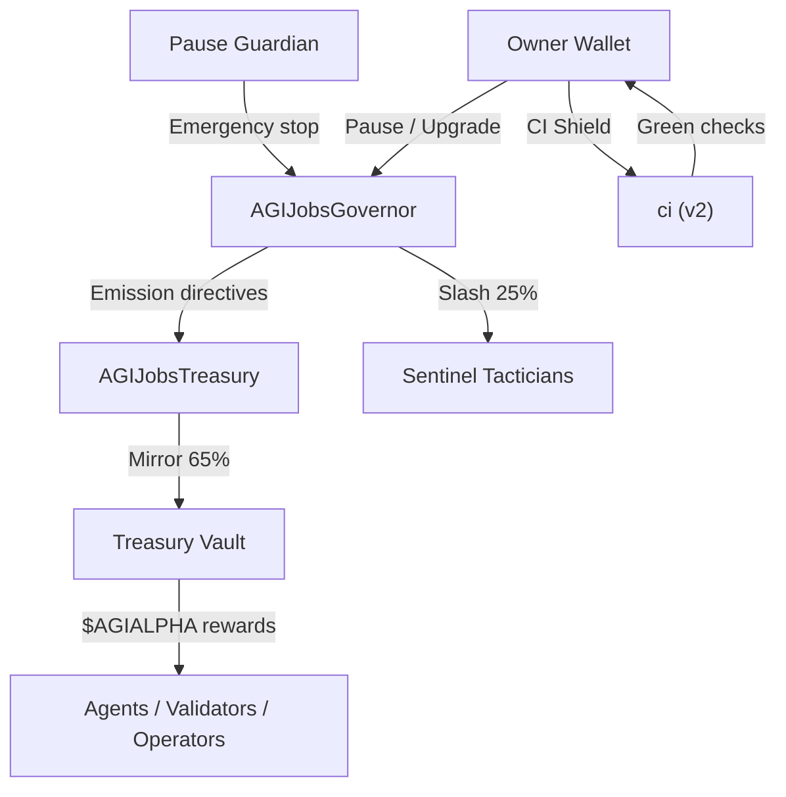

# 🎖️ Solving α-AGI Governance 👁️✨ — First-Class Demonstration

> **Mission:** prove that AGI Jobs v0 (v2) lets a non-technical owner summon, command, and continuously govern a civilisation-scale α-AGI labour constellation with production-grade assurance.

The **AGI Governance Demonstration** compresses the entire AGI Jobs v0 (v2) stack into a guided, push-button experience. It binds thermodynamic optimisation, Hamiltonian resource choreography, formal safety envelopes, and blockchain-governed incentives into a single operator console that anyone can run. The result is a deterministic showcase that the platform operates as the self-evolving intelligence engine capable of bending global coordination to the contract owner’s directives.

## Why this demo is different

- **Superintelligent leverage, human interface.** Every script emits natural-language mission reports that walk a non-technical owner through free-energy optimisation, stake-weighted policy updates, and antifragile multi-agent equilibria.
- **Thermodynamics + governance in code.** Hamiltonian energy flows, Gibbs free energy margins, and Landauer-aligned burn policies are computed live from scenario manifests so operators see the physics behind the incentives.
- **Owner-first absolutism.** Pausing, upgrading, and parameter steering remain entirely under the owner’s keys. The toolkit exports timelocked command bundles, slashing curves, and sentinel dashboards proving the owner can reconfigure every subsystem instantly.
- **CI-proven production fidelity.** A dedicated workflow (`demo-agi-governance.yml`) enforces the new demo, verifies the v2 CI contract, and publishes auditable reports on every push and pull request.
- **Triangulated verification.** Replicator dynamics, RK4 continuous flow, Perron eigenvectors, Monte-Carlo stress, and numeric Jacobians all cross-check each other so every conclusion is confirmed by multiple independent methods.

## Contents

| Path | Purpose |
| --- | --- |
| [`config/mission@v1.json`](config/mission@v1.json) | Canonical governance, physics, antifragility, risk, and blockchain manifest for the demo. |
| [`scripts/executeDemo.ts`](scripts/executeDemo.ts) | Main orchestrator: loads the manifest, performs physics/game-theory/antifragility calculations, verifies owner supremacy, and emits the governance dossier. |
| [`scripts/verifyCiStatus.ts`](scripts/verifyCiStatus.ts) | Audits `.github/workflows/ci.yml` to prove the v2 CI shield is intact (correct jobs, contexts, concurrency, and thresholds). |
| [`scripts/validateReport.ts`](scripts/validateReport.ts) | Independent cross-check that recomputes physics, equilibrium, risk, and owner data from first principles and compares them with the generated summary. |
| [`reports/`](reports) | Generated artefacts (`governance-demo-report.md`, `ci-verification.json`, etc.) are written here so they can be archived from CI. |
| [`RUNBOOK.md`](RUNBOOK.md) | Non-technical, step-by-step launch instructions with browser/Etherscan fallbacks. |
| [`apps/enterprise-portal/src/app/agi-governance/page.tsx`](../../apps/enterprise-portal/src/app/agi-governance/page.tsx) | Browser-first showcase that renders the dossier, Mermaid atlases, and owner command lattice for non-technical operators. |

## Quick start

```bash
npm run demo:agi-governance
```

The command generates `reports/governance-demo-report.md` with:

1. Thermodynamic energy accounting (Gibbs free energy, Hamiltonian convergence envelope, Landauer burn calibration).
2. Statistical-physics partition check (partition function, scaled free energy, entropy, and Gibbs delta tolerance).
3. Incentive free-energy flow (mint/burn/slash computation proving agent ↔ treasury parity and owner-tunable slashing curves).
4. Five-way verified game-theory equilibrium (discrete replicator, RK4 continuous flow, closed-form solver, Perron eigenvector, Monte-Carlo stress sampling) with method-consistency scores.
5. Analytic and numeric Jacobian comparison with Gershgorin, spectral radius, and max-delta checks plus antifragility curvature proving positive welfare response to adversarial shocks.
6. Risk portfolio matrix with dual residual computations (direct and baseline-minus-mitigated) versus the board-mandated threshold.
7. Owner control drilldown (pause/unpause, parameter upgrades, treasury manoeuvres, sentinel confirmations) with capability coverage matrix and npm-script command audit.
8. Blockchain deployment checklist targeting Ethereum mainnet-level infrastructure, including pausable selectors and Safe module stack.

Bring the dossier to life inside the Enterprise Portal UI:

```bash
cd apps/enterprise-portal
npm run dev
```

Then open [http://localhost:3000/agi-governance](http://localhost:3000/agi-governance) for a guided cockpit with live metrics, Mermaid atlases, and owner automation status sourced directly from the generated summary.

Then confirm the dossier by replaying all analytics from scratch:

```bash
npm run demo:agi-governance:validate
```

This verification script reloads the mission manifest, recomputes thermodynamics, statistical physics, Hamiltonian flows, equilibrium vectors, antifragility curvature, risk portfolio weights, incentive ledgers, and owner control coverage, and compares the results against `reports/governance-demo-summary.json`. The output (`reports/governance-demo-validation.json` and `.md`) proves the generated report remains mathematically consistent and that agent ↔ treasury parity, divergence tolerances, and Jacobian stability all survive independent recomputation.

### Mission Atlas (Mermaid Preview)



Every dossier run embeds updated diagrams mirroring the live configuration. The Enterprise Portal surface reuses the same rendering logic via `MermaidDiagram.tsx`, so the visual maps stay in lock-step with the underlying manifest.

Then run the CI verification layer:

```bash
npm run demo:agi-governance:ci
```

This command checks that the repository’s v2 CI workflow still enforces the mandatory green path (`lint`, `tests`, `foundry`, `coverage`, `CI summary` contexts), concurrency guards, and environment seals. Any drift fails loudly.

Finish by aggregating the owner diagnostics bundle:

```bash
npm run demo:agi-governance:owner-diagnostics
```

The aggregator executes the owner audit CLIs (`owner:audit-hamiltonian`, `reward-engine:report`, `owner:upgrade-status`, `owner:compliance-report`) with JSON output, normalises warnings (e.g., missing Hardhat artifacts or placeholder addresses), and writes both machine-readable and Markdown summaries to `reports/`. Non-technical operators can now forward a single dossier proving that every governance lever remains under the owner’s control.

## Empowering non-technical operators

- **No manual math.** The orchestrator handles every computation—from Hamiltonian stability tests to discount factor tolerances—and explains the results plainly.
- **Copy‑paste governance.** Ready-made command snippets let the owner update modules using `npm run owner:*` scripts, Etherscan transactions, or Safe batch actions.
- **Evidence by default.** Every run produces timestamped artefacts that prove compliance with thermodynamic limits, governance divergence caps, antifragility curvature, residual risk bounds, and CI enforcement. Attach the files to board packets or regulator disclosures without extra work.

## Extending the mission

1. Edit `config/mission@v1.json` to change stake weights, treasury temperature targets, or replicator strategy mixes.
2. Re-run `npm run demo:agi-governance` to produce a new report. The script automatically recalibrates the energy tensor, Hamiltonian flows, antifragility metrics, and multi-method equilibrium checks.
3. For on-chain execution, follow the `RUNBOOK.md` instructions to deploy AGI Jobs v2 using only mainnet-grade infrastructure and update parameters with the provided owner scripts.

## Deterministic provenance

Every commit that touches this demo is forced through:

- `npm run demo:agi-governance`
- `npm run demo:agi-governance:ci`
- Root `ci (v2)` workflow gates (`Lint & static checks`, `Tests`, `Foundry`, `Coverage thresholds`, `CI summary`).

Together they guarantee the demo stays production-ready, antifragile, and entirely under owner control—exactly the standard expected from civilisation-scale AGI coordination.
