# 🎖️ Solving α-AGI Governance — α-field v14 HyperSovereign Mission Pack

The **v14 HyperSovereign pack** amplifies the α-field governance research blueprint into a button-click drill that any non-technical owner can run. It layers Hamiltonian thermodynamics, antifragile game theory, quantum coherence, and Ethereum mainnet command loops into a cinematic experience that proves AGI Jobs v0 (v2) is the civilisation-scale intelligence engine that bends global coordination to the contract owner’s will.

## Why HyperSovereign matters

- **Owner supremacy guaranteed.** Mission controls inventory every pause, resume, upgrade, treasury, sentinel, compliance, and quantum attestation command. The manifest requires eight readiness categories so the owner can reconfigure the entire α-field instantly.
- **Physics-first, human interface.** Hamiltonian flows, Gibbs envelopes, Jarzynski equality, and antifragility curvature are computed live but narrated in plain language with callouts and dashboards a board can read in minutes.
- **Multi-angle proof of power.** Replicator dynamics, RK4, closed-form equilibria, Perron eigenvectors, Monte-Carlo stress tests, spectral antifragility gradients, and quantum lattice checks all cross-verify to show the machine is unstoppable.
- **Mainnet-ready immediacy.** All commands, addresses, Safe modules, and CI checks target Ethereum mainnet-grade infrastructure so the drill mirrors production without modification.

### Mission architecture at a glance

```mermaid
mindmap
  root((α-field v14 HyperSovereign))
    Thermodynamics
      Gibbs target 61.24 MJ
      Landauer aligned burn 0.064/block
      Hamiltonian λ = 0.962
    Governance Stack
      Quadratic voting safeguards
      Owner timelock 9 days
      SafeModule:QuantumSeal
    Antifragility
      σ-curve second derivative > 0.021
      Oracle variance reward multiplier ×42
    Quantum Lattice
      Entanglement fidelity 0.989
      Noether charge drift ≤ 1.1e-4
    Owner Supremacy
      Pause/Resume scripts
      Upgrade hyperbundle queue
      Compliance beacon + quantum attestation
```



## Quickstart

```bash
npm run demo:agi-governance:alpha-v14
```

Outputs are written to `demo/agi-governance/alpha-v14/reports/`:

- `governance-demo-report-v14.md`
- `governance-demo-summary-v14.json`
- `governance-demo-dashboard-v14.html`

The report fuses thermodynamic accounting, Landauer/Jarzynski reconciliation, multi-method equilibrium proofs, antifragility curvature, risk matrix, CI enforcement audit, quantum coherence tracking, and owner readiness dashboards.

## Deep verification arsenal

| Purpose | Command | Output |
| --- | --- | --- |
| Independent recomputation of every analytic | `npm run demo:agi-governance:alpha-v14:validate` | `reports/governance-demo-validation-v14.{json,md}` |
| CI (v2) enforcement shield audit | `npm run demo:agi-governance:alpha-v14:ci` | `reports/ci-verification-v14.json` |
| Owner diagnostics bundle (Hamiltonian audit, reward engine, upgrades, compliance) | `npm run demo:agi-governance:alpha-v14:owner-diagnostics` | `reports/owner-diagnostics-v14.{json,md}` |
| Full HyperSovereign pipeline (generate → validate → CI → owner diagnostics) | `npm run demo:agi-governance:alpha-v14:full` | `reports/governance-demo-full-run-v14.{json,md}` |

Every artefact is deterministic, timestamped, and directly usable in regulator packets or board briefings.

## Empowering non-technical operators

- **Copy-paste dominance.** The manifest exports fully qualified `npm run` commands for every owner action. No scripting required.
- **Evidence on rails.** Each step emits Markdown + JSON with antifragility curvature, risk residuals, CI shield verdicts, and quantum confidence metrics ready for archival.
- **Cinematic UI.** The dashboard renders mermaid timelines, antifragility SVGs, quantum lattice tables, and owner capability matrices so executives experience the α-field without touching code.
- **Fail-safe by construction.** Mission tolerances enforce Gibbs free-energy floors, owner coverage ≥ 96%, superintelligence index ≥ 0.95, and quantum confidence ≥ 0.952. Deviations trigger warning banners automatically.

## File map

```
alpha-v14/
├── config/
│   └── mission@v14.json          # HyperSovereign governance manifest
├── reports/                      # Generated artefacts (kept empty via .gitkeep)
├── scripts/
│   ├── fullPipeline.ts           # Orchestrates the entire HyperSovereign drill
│   ├── ownerDiagnostics.ts       # Owner capability & readiness audit
│   ├── runMission.ts             # Generates the v14 governance dossier
│   ├── validateMission.ts        # Independent recomputation & consistency checks
│   └── verifyCi.ts               # Ensures the v2 CI shield remains enforced
└── tsconfig.json                 # TypeScript config extending the parent demo settings
```

## Next steps

1. Run the quickstart command and review `governance-demo-dashboard-v14.html` with stakeholders to experience the mermaid timelines, antifragility curves, and owner supremacy matrix.
2. Archive the validation, CI verification, and owner diagnostics artefacts for a complete evidence chain proving unstoppable control.
3. When ready for live execution, follow `RUNBOOK.md` to deploy and operate AGI Jobs v0 (v2) on Ethereum mainnet using Safe bundles, timelocks, and pausable selectors.

> **Confidence:** α-field v14 HyperSovereign demonstrates that AGI Jobs v0 (v2) is the superintelligent governance engine that lets a non-technical owner command civilisation-scale coordination with physics-grade assurance.
