# 🎖️ Solving α-AGI Governance — α-field v15 OmegaSovereign Mission Pack

The **v15 OmegaSovereign pack** is the most extreme Solving α-AGI Governance deployment we have ever released. It compresses
thermodynamic Hamiltonians, antifragile game theory, stochastic physics, quantum lattice verification, and Ethereum mainnet
command loops into a single button-click experience that an executive can run without reading a line of code. The result is a
deterministic, multi-proof dossier that shows AGI Jobs v0 (v2) operating as a civilisation-scale intelligence engine fully
subjugated to the contract owner.

## Why OmegaSovereign matters

- **Owner totality.** Ten mandatory command categories (pause, resume, parameter, treasury, sentinel, upgrade, compliance,
  quantum, expansion, resilience) are all wired to concrete `npm run` scripts. The manifest refuses to certify the mission until
  every lever is present, verified, and timelocked under the owner’s keys.
- **Physics & policy united.** Live computations surface Hamiltonian λ = 1.004, Gibbs energy cushions, Landauer burn limits,
  Jarzynski reconciliation, Perron equilibria, and σ²-antifragility curvature in narrative form. Executives read the physics in
  plain language while still receiving machine-verifiable JSON artefacts.
- **Triangulated supremacy.** Replicator dynamics, RK4 flows, Monte-Carlo stress, spectral Jacobians, Gershgorin discs,
  principal eigenvectors, stochastic antifragility sweep, and quantum coherence differentials all cross-check each other. Any
  deviation generates a red banner and fails the run.
- **Mainnet immediacy.** Contract addresses, Safe modules, pausable selectors, upgrade timelocks, and CI shields all target
  Ethereum mainnet-level infrastructure. Nothing is hypothetical: it is production-ready out of the box.

### Mission architecture at a glance

```mermaid
mindmap
  root((α-field v15 OmegaSovereign))
    Thermodynamics
      Gibbs reserve 128.6 MJ
      Landauer burn 0.072/block
      Hamiltonian λ = 1.004
    Governance Stack
      Quadratic vote curvature
      10-day timelock escape hatch
      SafeModule:OmegaGuardian
    Antifragility
      σ² curvature ≥ 0.031
      Variance reward multiplier ×54
    Quantum Lattice
      Entanglement fidelity 0.993
      Noether drift ≤ 9.5e-5
    Owner Supremacy
      Expansion sweeps unlocked
      Resilience drills automated
      Compliance+quantum evidence vault
```



## Quickstart

```bash
npm run demo:agi-governance:alpha-v15
```

Outputs live in `demo/agi-governance/alpha-v15/reports/`:

- `governance-demo-report-v15.md`
- `governance-demo-summary-v15.json`
- `governance-demo-dashboard-v15.html`

The report fuses thermodynamic accounting, statistical-physics partition checks, Jarzynski equality verification, incentive
parity, multi-method equilibrium proofs, antifragility curvature, risk portfolio, CI enforcement, quantum coherence, and owner
coverage into a single narrative dossier with embedded mermaid diagrams and SVG dashboards.

## Deep verification arsenal

| Purpose | Command | Output |
| --- | --- | --- |
| Independent recomputation of every analytic | `npm run demo:agi-governance:alpha-v15:validate` | `reports/governance-demo-validation-v15.{json,md}` |
| CI (v2) enforcement shield audit | `npm run demo:agi-governance:alpha-v15:ci` | `reports/ci-verification-v15.json` |
| Owner diagnostics bundle (Hamiltonian audit, reward engine, upgrades, compliance) | `npm run demo:agi-governance:alpha-v15:owner-diagnostics` | `reports/owner-diagnostics-v15.{json,md}` |
| Full OmegaSovereign pipeline (generate → validate → CI → owner diagnostics) | `npm run demo:agi-governance:alpha-v15:full` | `reports/governance-demo-full-run-v15.{json,md}` |

All artefacts are deterministic, timestamped, and ready to be attached to regulator packets or board briefings without any
post-processing.

## Empowering non-technical operators

- **Copy-paste omnipotence.** Every owner lever is exposed as an `npm run` command with the arguments prefilled. Executives copy
  and execute without touching code.
- **Evidence on rails.** Each step emits Markdown + JSON with antifragility curvature, risk residuals, CI shield verdicts,
  quantum confidence, superintelligence indices, and owner coverage matrices ready for archival.
- **Cinematic UI.** `governance-demo-dashboard-v15.html` renders mermaid timelines, antifragility SVGs, quantum lattice tables,
  and owner capability matrices inside a glassmorphism console that can be presented live during board meetings.
- **Fail-safe by construction.** Mission tolerances enforce Gibbs free-energy floors, owner coverage ≥ 98%, superintelligence
  index ≥ 0.975, quantum confidence ≥ 0.982, and antifragility curvature positivity. Deviations trigger automatic warnings.

## File map

```
alpha-v15/
├── config/
│   └── mission@v15.json          # OmegaSovereign governance manifest
├── reports/                      # Generated artefacts (kept empty via .gitkeep)
├── scripts/
│   ├── fullPipeline.ts           # Runs the entire OmegaSovereign drill end-to-end
│   ├── ownerDiagnostics.ts       # Owner capability & readiness audit
│   ├── runMission.ts             # Generates the v15 governance dossier
│   ├── validateMission.ts        # Independent recomputation & consistency checks
│   └── verifyCi.ts               # Ensures the v2 CI shield remains enforced
└── tsconfig.json                 # TypeScript config extending the parent demo settings
```

## Next steps

1. Run the quickstart command and open `governance-demo-dashboard-v15.html` with stakeholders to experience the mermaid
   timelines, antifragility curves, quantum lattice, and owner supremacy matrix.
2. Archive the validation, CI verification, and owner diagnostics artefacts for a complete evidence chain proving unstoppable
   control.
3. Follow `RUNBOOK.md` when deploying AGI Jobs v0 (v2) to Ethereum mainnet so the OmegaSovereign mission operates with Safe
   modules, timelocks, and pausable selectors from the outset.

> **Confidence:** α-field v15 OmegaSovereign proves that AGI Jobs v0 (v2) is the civilisation-scale intelligence engine that a
> non-technical owner can command with physics-grade assurance, antifragile reinforcement, and unstoppable blockchain execution.
