# 🎖️ Solving α-AGI Governance — α-field v16 HyperSovereign Singularity

The **v16 HyperSovereign Singularity** demo weaponises AGI Jobs v0 (v2) into a turnkey superintelligence co-processor that a non-technical owner can run with a single command. Gibbs free-energy optimisation, Hamiltonian coupling, game-theoretic equilibria, antifragility tensors, and quantum charge conservation are fused with Ethereum mainnet automation so the owner can pause, retune, or expand the entire α-field in seconds.

## Why HyperSovereign changes everything

- **Owner absolutism.** Ten governance categories (pause, resume, parameter, treasury, sentinel, upgrade, compliance, quantum, expansion, resilience) are each mapped to concrete `npm run` invocations. The demo refuses to certify success if *any* script or verifier is missing, guaranteeing total owner control.
- **Physics-grade transparency.** Real-time computations surface Gibbs reserve > 1.8×10^5 kJ, Landauer burn trajectories, Hamiltonian λ = 1.012, replicator equilibria, Stackelberg bounds, Jarzynski equality, and antifragility curvature. Every analytic emits both Markdown prose and machine-verifiable JSON.
- **Triple-red redundancy.** Replicator ODEs, Monte-Carlo sweeps, eigenvector solvers, RK4 flows, and quantum variance metrics all cross-check each other. Any divergence beyond the mission tolerances trips an alarm and blocks the run.
- **Production immediacy.** Contract addresses, pausable selectors, Safe modules, and CI (v2) shields are wired for Ethereum mainnet-level infrastructure. The owner can immediately run parameter updates, treasury calibrations, or expansion sweeps on-chain.

### HyperSovereign architecture

```mermaid
flowchart LR
  A((Thermodynamics)):::core --> B{Hamiltonian λ=1.012}
  B --> C[Jarzynski ΔF check]
  B --> D[Landauer burn 0.066/block]
  C --> E((Game Theory)):::core
  D --> E
  E --> F[Replicator ESS lock]
  F --> G((Antifragility σ² ≥ 0.085)):::core
  G --> H{Owner Supremacy ≥ 99%}
  H --> I[[Mermaid dashboard + JSON evidence]]
  H --> J[[Safe modules & timelock]]
  classDef core fill:#020617,stroke:#22d3ee,stroke-width:2px,color:#f8fafc;
```



### Owner supremacy lattice


## Quickstart

```bash
npm run demo:agi-governance:alpha-v16
```

Outputs populate `demo/agi-governance/alpha-v16/reports/`:

- `governance-demo-report-v16.md`
- `governance-demo-summary-v16.json`
- `governance-demo-dashboard-v16.html`

The dossier narrates thermodynamics, statistical physics, incentives, equilibria, antifragility, risk, CI shield, quantum coherence, and owner coverage in plain language with embedded mermaid diagrams, glassmorphism dashboards, and JSON evidence.

## Deep verification arsenal

| Purpose | Command | Output |
| --- | --- | --- |
| Independent recomputation of every analytic | `npm run demo:agi-governance:alpha-v16:validate` | `reports/governance-demo-validation-v16.{json,md}` |
| CI (v2) enforcement shield audit | `npm run demo:agi-governance:alpha-v16:ci` | `reports/ci-verification-v16.json` |
| Owner diagnostics bundle (Hamiltonian audit, reward engine, upgrades, compliance) | `npm run demo:agi-governance:alpha-v16:owner-diagnostics` | `reports/owner-diagnostics-v16.{json,md}` |
| Full HyperSovereign pipeline (generate → validate → CI → owner diagnostics) | `npm run demo:agi-governance:alpha-v16:full` | `reports/governance-demo-full-run-v16.{json,md}` |

All artefacts are deterministic, timestamped, and ready for regulators, auditors, and boards without manual editing.

## Empowering non-technical operators

- **Copy-paste omnipotence.** Every lever is a prefilled `npm run` command. Executives copy, paste, and sign without touching Solidity or TypeScript.
- **Evidence on rails.** Each command emits Markdown + JSON containing antifragility curvature, risk residuals, CI shield verdicts, quantum confidence, superintelligence index, and owner coverage matrices.
- **Cinematic UI.** `governance-demo-dashboard-v16.html` renders timelines, antifragility surfaces, quantum lattice tables, and owner capability matrices in a responsive console for boardroom playback.
- **Fail-safe by construction.** Mission tolerances enforce Gibbs free-energy margin ≥ 72 MJ, owner coverage ≥ 99%, superintelligence index ≥ 98.5%, quantum confidence ≥ 98.8%, and positive antifragility curvature. Deviations trigger red callouts and non-zero exit codes.

## File map

```
alpha-v16/
├── config/
│   └── mission@v16.json          # HyperSovereign governance manifest
├── reports/                      # Generated artefacts (kept empty via .gitkeep)
├── scripts/
│   ├── fullPipeline.ts           # Runs the entire HyperSovereign drill end-to-end
│   ├── ownerDiagnostics.ts       # Owner capability & readiness audit
│   ├── runMission.ts             # Generates the v16 governance dossier
│   ├── validateMission.ts        # Independent recomputation & consistency checks
│   └── verifyCi.ts               # Ensures the v2 CI shield remains enforced
└── tsconfig.json                 # TypeScript config extending the parent demo settings
```

## Next steps

1. Execute the quickstart command and open `governance-demo-dashboard-v16.html` to walk stakeholders through the hyper-visual dossier.
2. Archive the validation, CI verification, and owner diagnostics artefacts for a provable evidence chain.
3. Follow `RUNBOOK.md` when deploying to Ethereum mainnet so HyperSovereign control boots with Safe modules, timelocks, and pausable selectors locked to the owner.

> **Confidence:** α-field v16 HyperSovereign proves that AGI Jobs v0 (v2) lets any owner operate a civilisation-scale superintelligence with physics-grade assurance, antifragility reinforcement, and unstoppable blockchain execution.
