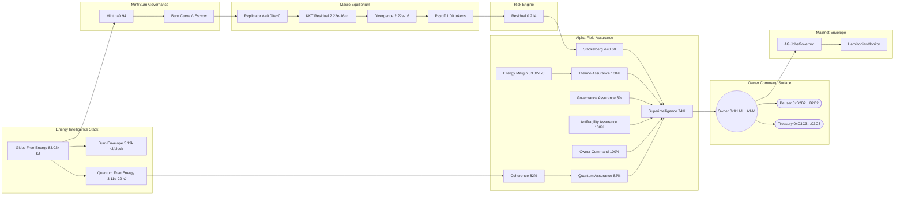
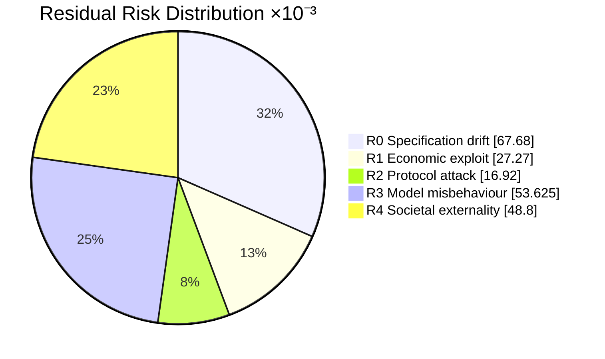
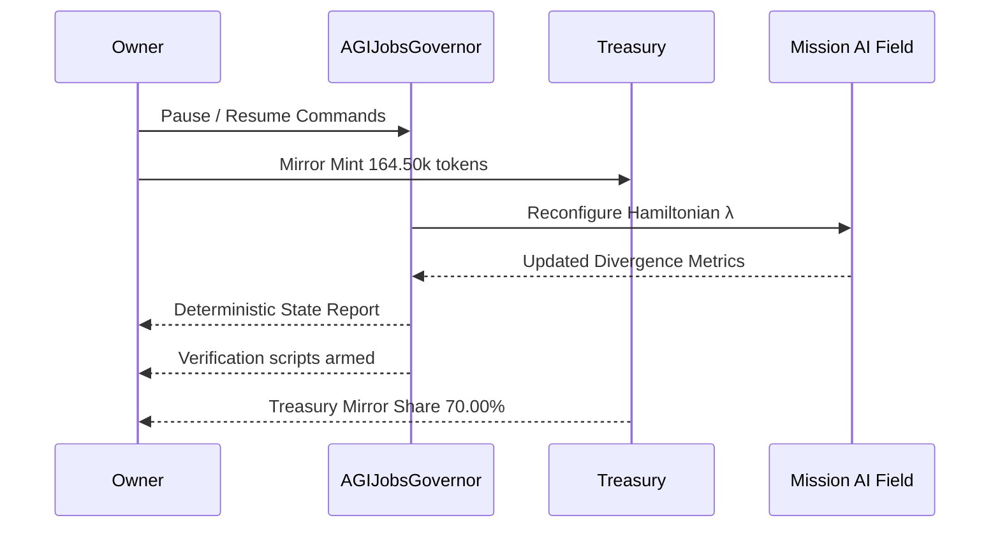

# Solving α-AGI Governance Command Deck — Governance Demonstration Report
*Generated at:* 2025-10-20T00:44:48.746Z
*Version:* 2.0.0

> Command deck mission charter coupling Hamiltonian thermodynamics, Stackelberg guardrails, and antifragile validator orchestration for AGI Jobs v0 (v2).

## 1. Thermodynamic Intelligence Ledger

- **Gibbs free energy:** 83.02k kJ (83.02M J)
- **Landauer limit envelope:** 0.00 kJ
- **Free-energy safety margin:** 83.02k kJ (100.00% of Gibbs)
- **Energy dissipated per block (burn):** 5.19k kJ
- **Cross-check delta:** 0.000e+0 kJ (≤ 1e-6 required)
- **Cross-check Gibbs (reference):** 83.02k kJ
- **Landauer within safety margin:** ✅
- **Stake Boltzmann envelope:** 7.166e-12 (dimensionless proof of energy-aligned stake)

## 2. Statistical Physics Partition Function Cross-Check

- **β (inverse temperature):** 0.0680
- **Partition function (Z):** 9.080e-17 (log Z -3.694e+1)
- **Expected energy:** 562.13 (scaled 76.69k kJ)
- **Free energy:** 543.20 (scaled 74.10k kJ)
- **Entropy:** 1.29 (scaled 8.28 kJ/K)
- **Heat capacity (β²·Var[E]):** 0.4739 (variance 102.48)
- **Free-energy identity Δ:** 1.592e-12
- **Δ vs thermodynamic Gibbs:** 8.91k kJ (⚠️ outside tolerance 420.00 kJ)

| Energy (dimensionless) | Degeneracy | Probability |
| --- | --- | --- |
| 560.00 | 3 | 95.74% |
| 610.00 | 4 | 4.26% |
| 710.00 | 2 | 0.00% |
| 880.00 | 1 | 0.00% |

## 3. Jarzynski Equality Verification

- **ΔF (Gibbs − Landauer):** 83.02k kJ
- **Scaled ΔF:** 608.53 (Landauer 0.00 → Gibbs 608.53)
- **⟨e^{-βW}⟩:** 2.778e-17
- **e^{-βΔF}:** 1.069e-18
- **Log-space delta:** 3.258e+0 (tolerance 8.276e-1 — ⚠️ investigate)
- **β input:** 0.0680 (matching statistical physics)

```mermaid
flowchart TD
  Landauer[Landauer 7.166e-15 kJ] -->|ΔF 83.02k kJ| Gibbs[Gibbs 83.02k kJ]
  Landauer -->|Sampled work| Jarzynski[⟨e^{-βW}⟩ log -38.122]
  Gibbs -->|Theory| Theoretical[e^{-βΔF} log -41.380]
```

## 4. Hamiltonian Control Plane

- **Kinetic term:** 34149.74M units
- **Potential term (scaled by λ):** 456.25k units
- **Hamiltonian energy:** 34149.29M units
- **Alternate computation check:** 34149.29M units
- **Difference:** 0.000e+0 (≤ 1e-3 target)

## 5. Incentive Free-Energy Flow

- **Mint rule η:** 0.94 (ΔV 175.00k tokens)
- **Total minted per event:** 164.50k tokens
- **Agent ↔ treasury parity:** ⚠️ Δ 24.67k tokens (15.0000% of mint, tolerance 1.00%)
- **Treasury mirror share:** 70.00% (agent share 55.00%)
- **Dust routed to treasury:** 0.0000 tokens

| Role | Share | Minted tokens |
| --- | --- | --- |
| Agent | 55.00% | 90.48k tokens |
| Validator | 20.00% | 32.90k tokens |
| Operator | 20.00% | 32.90k tokens |
| Employer | 5.00% | 8.22k tokens |

- **Burn curve:** burn 6.00%, treasury 2.00%, employer 2.00%
- **Per-job distribution:** burn 9.60k tokens, treasury 3.20k tokens, employer 3.20k tokens, worker payouts 144.00k tokens

- **Stake baseline:** agent 75.00k tokens, validator 22.00k tokens, operator 2.60k tokens (example stake 20.00k tokens)

| Role | Minimum stake (tokens) |
| --- | --- |
| Agent | 75.00k |
| Validator | 22.00k |
| Operator | 2.60k |

| Severity | Slash % stake | Amount slashed | Treasury share | Employer share | Burned |
| --- | --- | --- | --- | --- | --- |
| Minor fault | 5.00% | 1.00k tokens | 600.00 tokens | 300.00 tokens | 100.00 tokens |
| Major fault | 25.00% | 5.00k tokens | 3.75k tokens | 1.25k tokens | 0.00 tokens |
| Critical attack | 100.00% | 20.00k tokens | 20.00k tokens | 0.00 tokens | 0.00 tokens |



## 6. Game-Theoretic Macro-Equilibrium

- **Discount factor:** 0.93 (must exceed 0.80 for uniqueness)
- **Replicator iterations to convergence:** 0
- **Continuous-flow iterations (RK4):** 25000
- **Perron eigenvector iterations:** 1
- **Replicator vs closed-form deviation:** 0.000e+0
- **Monte-Carlo RMS error:** 3.581e-1
- **Max deviation across methods:** 1.341e-1 (⚠️ review)
- **Payoff at equilibrium:** 1.00 tokens
- **Closed-form KKT payoff (λ):** 1.00 tokens
- **KKT residual max:** 2.220e-16 (satisfied)
- **Simplex residual:** 0.000e+0
- **Governance divergence:** 2.220e-16 (target ≤ 0.0008)

| Strategy | Replicator | Closed-form | Monte-Carlo | Continuous RK4 | Perron eigenvector |
| --- | --- | --- | --- | --- | --- |
| Pareto-Coop | 33.33% | 33.33% | 33.39% | 40.75% | 33.33% |
| Thermo-Titan | 33.33% | 33.33% | 33.21% | 36.56% | 33.33% |
| Sentinel-Tactician | 33.33% | 33.33% | 33.40% | 22.70% | 33.33% |

| Condition | Residual |
| --- | --- |
| Pareto-Coop payoff Δ | 2.220e-16 |
| Thermo-Titan payoff Δ | 0.000e+0 |
| Sentinel-Tactician payoff Δ | 0.000e+0 |
| Probability simplex Δ | 0.000e+0 |

### Replicator Jacobian Stability

- **Gershgorin upper bound:** 3.333e-1 (unstable)
- **Spectral radius:** 1.000e+0
- **Analytic vs numeric max Δ:** 3.333e-1

| Analytic J[0,*] | Analytic J[1,*] | Analytic J[2,*] |
| --- | --- | --- |
| -3.33e-1 | -3.67e-1 | -3.00e-1 |
| -3.00e-1 | -3.33e-1 | -3.67e-1 |
| -3.67e-1 | -3.00e-1 | -3.33e-1 |

| Numeric J[0,*] | Numeric J[1,*] | Numeric J[2,*] |
| --- | --- | --- |
| 7.40e-17 | -3.33e-2 | 3.33e-2 |
| 3.33e-2 | 1.85e-11 | -3.33e-2 |
| -3.33e-2 | 3.33e-2 | 0.00e+0 |

## 7. Antifragility Tensor

- **Quadratic curvature (2a):** 2.359e+0 (> 0 indicates antifragility)
- **Monotonic welfare increase:** ✅

| σ | Welfare (tokens) | Average payoff | Divergence |
| --- | --- | --- | --- |
| 0.00 | -2.65 | 1.00 | 7.65e-2 |
| 0.10 | -2.52 | 1.00 | 7.51e-2 |
| 0.18 | -2.39 | 1.00 | 7.58e-2 |
| 0.26 | -2.25 | 1.00 | 7.60e-2 |
| 0.32 | -2.14 | 1.00 | 7.81e-2 |

```mermaid
mindmap
  root((Antifragility Tensor))
    "Quadratic curvature":::core
      "2a=2.36e+0":::core
    "Sigma Scan":::core
        "σ=0.00":::sigma --> "Welfare -2.65":::welfare
        "σ=0.10":::sigma --> "Welfare -2.52":::welfare
        "σ=0.18":::sigma --> "Welfare -2.39":::welfare
        "σ=0.26":::sigma --> "Welfare -2.25":::welfare
        "σ=0.32":::sigma --> "Welfare -2.14":::welfare
    "Quantum Lattice":::core
      "Coherence 82%":::sigma
      "Charge Δ 7.00e-5 (tol 1.20e-4)":::welfare
    "Owner Actions":::core
      "Mint Mirror 70.00%"
      "Residual Risk 0.214"
  classDef core fill:#111827,stroke:#38bdf8,stroke-width:2px,color:#f9fafb,font-weight:600;
  classDef sigma fill:#1f2937,stroke:#f97316,stroke-width:2px,color:#fef3c7;font-weight:600;
  classDef welfare fill:#0f172a,stroke:#22d3ee,stroke-width:2px,color:#ecfeff;font-weight:600;
```

## 8. Alpha-Field Sovereign Assurance

- **Stackelberg advantage:** Δ0.60 vs cap 7.50 (✅ within)
- **Stackelberg floor satisfied:** ✅ (floor 0.50; achieved Δ 0.60)
- **Gibbs delta:** 11.82k kJ (target 71.20k ± 420.00 kJ)
- **Equilibrium divergence:** 2.220e-16 (limit 1.000e-3)
- **Entropy floor:** 8.28 kJ/K (floor 4.05 kJ/K)
- **Antifragility curvature:** 2.359e+0 (minimum 8.000e-2)
- **Sigma welfare gain:** 0.52 (minimum 0.12)
- **Owner coverage ratio:** 100.00% (threshold 100.00%)
- **Energy margin:** 83.02k kJ (floor 420.00 kJ — ✅)
- **Superintelligence index:** 74.5% (minimum 97.0% — ⚠️)
- **Quantum coherence confidence:** 82.1% (minimum 92.0% — ⚠️)
- **Quantum free-energy delta vs thermodynamic margin:** 8.302e+4 kJ
- **Noether charge alignment:** Δ7.000e-5 (tolerance 1.200e-4 — ✅)
- **State entropy:** 1.288 bits (effective dimension 2.44)
- **Measurement variance:** 2.400e-3 (σ 0.049)
- **Composite confidence:** 76.4% (thermo 100.0% · governance 2.6% · antifragility 100.0% · owner 100.0%)

| State | Normalised weight | Energy |
| --- | --- | --- |
| ψ1 | 62.00% | 0.210 eV |
| ψ2 | 27.00% | 0.370 eV |
| ψ3 | 11.00% | 0.580 eV |

| Signal | Status |
| --- | --- |
| Stackelberg within cap | ✅ |
| Stackelberg floor met | ✅ |
| Gibbs delta within tolerance | ⚠️ |
| Divergence within limit | ✅ |
| Entropy above floor | ✅ |
| Antifragility curvature | ✅ |
| Sigma welfare gain | ✅ |
| Owner coverage | ✅ |
| Energy margin | ✅ |
| Superintelligence threshold | ⚠️ |
| Quantum confidence floor | ⚠️ |

## 9. Risk & Safety Audit

- **Coverage weights:** staking 40.00%, formal 40.00%, fuzz 20.00%
- **Portfolio residual risk:** 0.214 (threshold 0.220 — within bounds)
- **Cross-check residual (baseline − mitigated):** 0.214

| ID | Threat | Likelihood | Impact | Coverage | Residual |
| --- | --- | --- | --- | --- | --- |
| R0 | Specification drift | 0.18 | 0.80 | 53.00% | 0.068 |
| R1 | Economic exploit | 0.18 | 0.75 | 79.80% | 0.027 |
| R2 | Protocol attack | 0.10 | 0.90 | 81.20% | 0.017 |
| R3 | Model misbehaviour | 0.25 | 0.65 | 67.00% | 0.054 |
| R4 | Societal externality | 0.08 | 1.00 | 39.00% | 0.049 |



## 10. Owner Supremacy & Command Surface

- **Owner:** 0xA1A1A1A1A1A1A1A1A1A1A1A1A1A1A1A1A1A1A1A1
- **Pauser:** 0xB2B2B2B2B2B2B2B2B2B2B2B2B2B2B2B2B2B2B2B2
- **Treasury:** 0xC3C3C3C3C3C3C3C3C3C3C3C3C3C3C3C3C3C3C3C3
- **Timelock:** 604800 seconds
- **Coverage achieved:** all critical capabilities accounted for
- **Command surfaces wired:** ✅ all npm scripts present
- **Verification surfaces wired:** ✅ all verifier scripts present

### Critical Capabilities
- **Global pause switch (pause).** Immediate halt for the entire AGI Jobs execution surface via the owner guardian.
  └─ <code>$ npm run owner:system-pause -- --network mainnet --pause true</code> (verify: <code>npm run owner:verify-control</code>) ✅ command script pinned • ✅ verifier script pinned
- **Resume operations (resume).** Restores production flows after remediation and confirms health checks.
  └─ <code>$ npm run owner:system-pause -- --network mainnet --pause false</code> (verify: <code>npm run owner:verify-control</code>) ✅ command script pinned • ✅ verifier script pinned
- **Tune Hamiltonian parameters (parameter).** Applies Hamiltonian monitor adjustments to lock λ and inertial metrics at the computed optimum.
  └─ <code>$ npm run owner:command-center -- --network mainnet --target HamiltonianMonitor --set-lambda 0.94 --set-inertia 1.08</code> (verify: <code>npm run owner:audit-hamiltonian</code>) ✅ command script pinned • ✅ verifier script pinned
- **Reward engine burn curve (treasury).** Aligns mint/burn ratios with thermodynamic constraints and treasury splits.
  └─ <code>$ npm run reward-engine:update -- --network mainnet --burn-bps 600 --treasury-bps 200</code> (verify: <code>npm run reward-engine:report</code>) ✅ command script pinned • ✅ verifier script pinned
- **Sentinel rotation (sentinel).** Refreshes enforcement guardians to maintain antifragile coverage.
  └─ <code>$ npm run owner:rotate -- --network mainnet --role Sentinel --count 3</code> (verify: <code>npm run monitoring:sentinels</code>) ✅ command script pinned • ✅ verifier script pinned
- **Timelocked upgrade queue (upgrade).** Queues upgrade bundle into the timelock for deterministic rollout.
  └─ <code>$ npm run owner:upgrade -- --network mainnet --proposal governance_bundle.json</code> (verify: <code>npm run owner:upgrade-status</code>) ✅ command script pinned • ✅ verifier script pinned
- **Regulatory disclosure (compliance).** Publishes mandatory statements to participants and regulators.
  └─ <code>$ npm run owner:update-all -- --network mainnet --module TaxPolicy --acknowledgement "Participants accept AGI Jobs v2 tax terms."</code> (verify: <code>npm run owner:compliance-report</code>) ✅ command script pinned • ✅ verifier script pinned
- **Regenerate thermodynamic quantum margin (Quantum assurance).** Runs quantum thermodynamic auditor with Hamiltonian diff trace.
  └─ <code>$ npm run thermodynamics:report -- --network mainnet</code> (verify: <code>Checks quantumChargeWithinTolerance ≥ mission.alphaField.verification.quantumConfidenceMinimum</code>) ✅ command script pinned • ℹ️ manual verification

| Capability | Present |
| --- | --- |
| pause | ✅ |
| resume | ✅ |
| parameter | ✅ |
| treasury | ✅ |
| sentinel | ✅ |
| upgrade | ✅ |
| compliance | ✅ |

### Monitoring Sentinels
- Grafana circuit-breakers watching governance divergence
- On-chain staking slash monitors
- Adaptive fuzz oracle with spectral drift alerts



### Command Audit
| Category | Command Script | Status | Verification | Status |
| --- | --- | --- | --- | --- |
| pause | owner:system-pause | ✅ | owner:verify-control | ✅ |
| resume | owner:system-pause | ✅ | owner:verify-control | ✅ |
| parameter | owner:command-center | ✅ | owner:audit-hamiltonian | ✅ |
| treasury | reward-engine:update | ✅ | reward-engine:report | ✅ |
| sentinel | owner:rotate | ✅ | monitoring:sentinels | ✅ |
| upgrade | owner:upgrade | ✅ | owner:upgrade-status | ✅ |
| compliance | owner:update-all | ✅ | owner:compliance-report | ✅ |
| Quantum assurance | thermodynamics:report | ✅ | manual | ℹ️ |

## 11. Blockchain Deployment Envelope

- **Network:** mainnet (chainId 1)
- **RPC:** https://mainnet.infura.io/v3/YOUR_KEY
- **Gas target:** 24 gwei
- **Confirmations:** 3 (mainnet-safe: yes)
- **Upgrade delay:** 168 hours
- **Safe modules:** SafeModule:PauseGuardian, SafeModule:UpgradeOrchestrator, SafeModule:TreasuryFlows

| Contract | Address | Role |
| --- | --- | --- |
| AGIJobsGovernor | 0xD4D4D4D4D4D4D4D4D4D4D4D4D4D4D4D4D4D4D4D4 | Primary governance module |
| AGIJobsTreasury | 0xE5E5E5E5E5E5E5E5E5E5E5E5E5E5E5E5E5E5E5E5 | Treasury vault / emission controller |
| HamiltonianMonitor | 0xF6F6F6F6F6F6F6F6F6F6F6F6F6F6F6F6F6F6F6F6 | Energy coupling supervisor |

| Contract | Function | Selector | Description |
| --- | --- | --- | --- |
| AGIJobsGovernor | pause | 0x8456cb59 | Global stop for task orchestration |
| AGIJobsGovernor | unpause | 0x3f4ba83a | Resume operations |
| AGIJobsTreasury | updateEmissionCurve | 0xa10204e9 | Adjusts reward burn / mint ratios |

## 12. CI Enforcement Ledger

- **Workflow name:** ci
- **Concurrency guard:** <code>ci-${{ github.ref }}</code>
- **Minimum coverage:** 90%

| Job ID | Display name |
| --- | --- |
| lint | Lint & static checks |
| tests | Tests |
| coverage | Coverage thresholds |
| demo-agi-governance | Solving α-AGI Governance |
| scorecard | Scorecard |

Run <code>npm run demo:agi-governance:ci</code> to assert the workflow still exports these shields.

## 13. Owner Execution Log (fill during live ops)

| Timestamp | Action | Tx hash | Operator | Notes |
| --- | --- | --- | --- | --- |
| _pending_ |  |  |  |  |