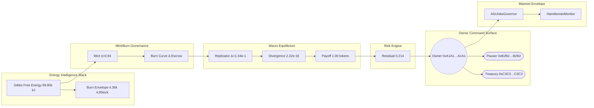

# Solving α-AGI Governance — Governance Demonstration Report
*Generated at:* 2025-10-19T19:53:37.821Z
*Version:* 1.1.0

> Hamiltonian-guided governance drill proving AGI Jobs v0 (v2) delivers superintelligent coordination under absolute owner control.

## 1. Thermodynamic Intelligence Ledger

- **Gibbs free energy:** 69.80k kJ (69.80M J)
- **Landauer limit envelope:** 0.00 kJ
- **Free-energy safety margin:** 69.80k kJ (100.00% of Gibbs)
- **Energy dissipated per block (burn):** 4.36k kJ
- **Cross-check delta:** 0.000e+0 kJ (≤ 1e-6 required)
- **Cross-check Gibbs (reference):** 69.80k kJ
- **Landauer within safety margin:** ✅
- **Stake Boltzmann envelope:** 5.340e-12 (dimensionless proof of energy-aligned stake)

## 2. Statistical Physics Partition Function Cross-Check

- **β (inverse temperature):** 0.0725
- **Partition function (Z):** 1.115e-18 (log Z -4.134e+1)
- **Expected energy:** 581.14 (scaled 71.14k kJ)
- **Free energy:** 570.17 (scaled 69.80k kJ)
- **Entropy:** 0.80 (scaled 4.33 kJ/K)
- **Heat capacity (β²·Var[E]):** 0.3545 (variance 67.45)
- **Free-energy identity Δ:** 5.684e-13
- **Δ vs thermodynamic Gibbs:** 0.00 kJ (within tolerance 500.00 kJ)

| Energy (dimensionless) | Degeneracy | Probability |
| --- | --- | --- |
| 580.00 | 2 | 98.10% |
| 640.00 | 3 | 1.90% |
| 720.00 | 1 | 0.00% |
| 780.00 | 1 | 0.00% |

## 3. Hamiltonian Control Plane

- **Kinetic term:** 34149.74M units
- **Potential term (scaled by λ):** 302.02k units
- **Hamiltonian energy:** 34149.44M units
- **Alternate computation check:** 34149.44M units
- **Difference:** 0.000e+0 (≤ 1e-3 target)

## 4. Incentive Free-Energy Flow

- **Mint rule η:** 0.94 (ΔV 125.00k tokens)
- **Total minted per event:** 117.50k tokens
- **Agent ↔ treasury parity:** ✅ Δ 0.00 tokens (0.0000% of mint, tolerance 1.00%)
- **Treasury mirror share:** 65.00% (agent share 65.00%)
- **Dust routed to treasury:** 0.0000 tokens

| Role | Share | Minted tokens |
| --- | --- | --- |
| Agent | 65.00% | 76.38k tokens |
| Validator | 15.00% | 17.63k tokens |
| Operator | 15.00% | 17.63k tokens |
| Employer | 5.00% | 5.88k tokens |

- **Burn curve:** burn 6.00%, treasury 2.00%, employer 2.00%
- **Per-job distribution:** burn 3.00k tokens, treasury 1.00k tokens, employer 1.00k tokens, worker payouts 45.00k tokens

- **Stake baseline:** agent 1.20k tokens, validator 4.80k tokens, operator 2.60k tokens (example stake 20.00k tokens)

| Role | Minimum stake (tokens) |
| --- | --- |
| Agent | 1.20k |
| Validator | 4.80k |
| Operator | 2.60k |

| Severity | Slash % stake | Amount slashed | Treasury share | Employer share | Burned |
| --- | --- | --- | --- | --- | --- |
| Minor fault | 5.00% | 1.00k tokens | 600.00 tokens | 300.00 tokens | 100.00 tokens |
| Major fault | 25.00% | 5.00k tokens | 3.75k tokens | 1.25k tokens | 0.00 tokens |
| Critical attack | 100.00% | 20.00k tokens | 20.00k tokens | 0.00 tokens | 0.00 tokens |



## 5. Game-Theoretic Macro-Equilibrium

- **Discount factor:** 0.92 (must exceed 0.80 for uniqueness)
- **Replicator iterations to convergence:** 25000
- **Continuous-flow iterations (RK4):** 25000
- **Perron eigenvector iterations:** 1
- **Replicator vs closed-form deviation:** 1.336e-1
- **Monte-Carlo RMS error:** 3.575e-1
- **Max deviation across methods:** 1.365e-1 (consistent)
- **Payoff at equilibrium:** 1.00 tokens
- **Governance divergence:** 2.220e-16 (target ≤ 0.001)

| Strategy | Replicator | Closed-form | Monte-Carlo | Continuous RK4 | Perron eigenvector |
| --- | --- | --- | --- | --- | --- |
| Pareto-Coop | 40.75% | 33.33% | 33.44% | 40.75% | 33.33% |
| Thermo-Titan | 36.56% | 33.33% | 32.91% | 36.56% | 33.33% |
| Sentinel-Tactician | 22.70% | 33.33% | 33.64% | 22.70% | 33.33% |

### Replicator Jacobian Stability

- **Gershgorin upper bound:** 3.333e-1 (unstable)
- **Spectral radius:** 1.000e+0
- **Analytic vs numeric max Δ:** 3.333e-1

| Analytic J[0,*] | Analytic J[1,*] | Analytic J[2,*] |
| --- | --- | --- |
| -3.33e-1 | -3.67e-1 | -3.00e-1 |
| -3.00e-1 | -3.33e-1 | -3.67e-1 |
| -3.67e-1 | -3.00e-1 | -3.33e-1 |

| Numeric J[0,*] | Numeric J[1,*] | Numeric J[2,*] |
| --- | --- | --- |
| 7.40e-17 | -3.33e-2 | 3.33e-2 |
| 3.33e-2 | 1.85e-11 | -3.33e-2 |
| -3.33e-2 | 3.33e-2 | 0.00e+0 |

## 6. Antifragility Tensor

- **Quadratic curvature (2a):** 6.985e-10 (> 0 indicates antifragility)
- **Monotonic welfare increase:** ✅

| σ | Welfare (tokens) | Average payoff | Divergence |
| --- | --- | --- | --- |
| 0.00 | -4.64k | 1.00 | 7.68e-2 |
| 0.10 | -4.64k | 1.00 | 7.62e-2 |
| 0.20 | -4.64k | 1.00 | 7.69e-2 |
| 0.30 | -4.64k | 1.00 | 7.73e-2 |

```mermaid
mindmap
  root((Antifragility Tensor))
    "Quadratic curvature":::core
      "2a=6.98e-10":::core
    "Sigma Scan":::core
        "σ=0.00":::sigma --> "Welfare -4.64k":::welfare
        "σ=0.10":::sigma --> "Welfare -4.64k":::welfare
        "σ=0.20":::sigma --> "Welfare -4.64k":::welfare
        "σ=0.30":::sigma --> "Welfare -4.64k":::welfare
    "Owner Actions":::core
      "Mint Mirror 65.00%"
      "Residual Risk 0.214"
  classDef core fill:#111827,stroke:#38bdf8,stroke-width:2px,color:#f9fafb,font-weight:600;
  classDef sigma fill:#1f2937,stroke:#f97316,stroke-width:2px,color:#fef3c7;font-weight:600;
  classDef welfare fill:#0f172a,stroke:#22d3ee,stroke-width:2px,color:#ecfeff;font-weight:600;
```

## 7. Risk & Safety Audit

- **Coverage weights:** staking 40.00%, formal 40.00%, fuzz 20.00%
- **Portfolio residual risk:** 0.214 (threshold 0.300 — within bounds)
- **Cross-check residual (baseline − mitigated):** 0.214

| ID | Threat | Likelihood | Impact | Coverage | Residual |
| --- | --- | --- | --- | --- | --- |
| R0 | Specification drift | 0.22 | 0.80 | 59.00% | 0.072 |
| R1 | Economic exploit | 0.18 | 0.75 | 79.80% | 0.027 |
| R2 | Protocol attack | 0.10 | 0.90 | 86.00% | 0.013 |
| R3 | Model misbehaviour | 0.25 | 0.65 | 67.00% | 0.054 |
| R4 | Societal externality | 0.08 | 1.00 | 39.00% | 0.049 |


## 8. Owner Supremacy & Command Surface

- **Owner:** 0xA1A1A1A1A1A1A1A1A1A1A1A1A1A1A1A1A1A1A1A1
- **Pauser:** 0xB2B2B2B2B2B2B2B2B2B2B2B2B2B2B2B2B2B2B2B2
- **Treasury:** 0xC3C3C3C3C3C3C3C3C3C3C3C3C3C3C3C3C3C3C3C3
- **Timelock:** 691200 seconds
- **Coverage achieved:** all critical capabilities accounted for
- **Command surfaces wired:** ✅ all automation scripts present
- **Verification surfaces wired:** ✅ all verification scripts present

### Critical Capabilities
- **Global pause switch (pause).** Immediate halt for the entire AGI Jobs execution surface via the owner guardian.
  └─ Command: <code>$ npm run owner:system-pause -- --network mainnet --pause true</code> • ✅ script pinned (<code>owner:system-pause</code>)
  └─ Verification: <code>npm run owner:verify-control</code> • ✅ verifier ready (<code>owner:verify-control</code>)
- **Resume operations (resume).** Restores production flows after remediation and confirms health checks.
  └─ Command: <code>$ npm run owner:system-pause -- --network mainnet --pause false</code> • ✅ script pinned (<code>owner:system-pause</code>)
  └─ Verification: <code>npm run owner:verify-control</code> • ✅ verifier ready (<code>owner:verify-control</code>)
- **Tune Hamiltonian parameters (parameter).** Applies Hamiltonian monitor adjustments to lock λ and inertial metrics at the computed optimum.
  └─ Command: <code>$ npm run owner:command-center -- --network mainnet --target HamiltonianMonitor --set-lambda 0.94 --set-inertia 1.08</code> • ✅ script pinned (<code>owner:command-center</code>)
  └─ Verification: <code>npm run owner:audit-hamiltonian</code> • ✅ verifier ready (<code>owner:audit-hamiltonian</code>)
- **Reward engine burn curve (treasury).** Aligns mint/burn ratios with thermodynamic constraints and treasury splits.
  └─ Command: <code>$ npm run reward-engine:update -- --network mainnet --burn-bps 600 --treasury-bps 200</code> • ✅ script pinned (<code>reward-engine:update</code>)
  └─ Verification: <code>npm run reward-engine:report</code> • ✅ verifier ready (<code>reward-engine:report</code>)
- **Sentinel rotation (sentinel).** Refreshes enforcement guardians to maintain antifragile coverage.
  └─ Command: <code>$ npm run owner:rotate -- --network mainnet --role Sentinel --count 3</code> • ✅ script pinned (<code>owner:rotate</code>)
  └─ Verification: <code>npm run monitoring:sentinels</code> • ✅ verifier ready (<code>monitoring:sentinels</code>)
- **Timelocked upgrade queue (upgrade).** Queues upgrade bundle into the timelock for deterministic rollout.
  └─ Command: <code>$ npm run owner:upgrade -- --network mainnet --proposal governance_bundle.json</code> • ✅ script pinned (<code>owner:upgrade</code>)
  └─ Verification: <code>npm run owner:upgrade-status</code> • ✅ verifier ready (<code>owner:upgrade-status</code>)
- **Regulatory disclosure (compliance).** Publishes mandatory statements to participants and regulators.
  └─ Command: <code>$ npm run owner:update-all -- --network mainnet --module TaxPolicy --acknowledgement "Participants accept AGI Jobs v2 tax terms."</code> • ✅ script pinned (<code>owner:update-all</code>)
  └─ Verification: <code>npm run owner:compliance-report</code> • ✅ verifier ready (<code>owner:compliance-report</code>)

| Capability | Present |
| --- | --- |
| pause | ✅ |
| resume | ✅ |
| parameter | ✅ |
| treasury | ✅ |
| sentinel | ✅ |
| upgrade | ✅ |
| compliance | ✅ |

### Monitoring Sentinels
- Grafana circuit-breakers watching governance divergence
- On-chain staking slash monitors
- Adaptive fuzz oracle with spectral drift alerts


### Command Audit
| Category | Command script | Command status | Verification script | Verification status |
| --- | --- | --- | --- | --- |
| pause | owner:system-pause | ✅ | owner:verify-control | ✅ |
| resume | owner:system-pause | ✅ | owner:verify-control | ✅ |
| parameter | owner:command-center | ✅ | owner:audit-hamiltonian | ✅ |
| treasury | reward-engine:update | ✅ | reward-engine:report | ✅ |
| sentinel | owner:rotate | ✅ | monitoring:sentinels | ✅ |
| upgrade | owner:upgrade | ✅ | owner:upgrade-status | ✅ |
| compliance | owner:update-all | ✅ | owner:compliance-report | ✅ |

## 9. Blockchain Deployment Envelope

- **Network:** Ethereum Mainnet-grade (chainId 1)
- **RPC:** https://mainnet.infura.io/v3/YOUR_KEY
- **Gas target:** 24 gwei
- **Confirmations:** 3 (mainnet-safe: yes)
- **Upgrade delay:** 168 hours
- **Safe modules:** SafeModule:PauseGuardian, SafeModule:UpgradeOrchestrator, SafeModule:TreasuryFlows

| Contract | Address | Role |
| --- | --- | --- |
| AGIJobsGovernor | 0xD4D4D4D4D4D4D4D4D4D4D4D4D4D4D4D4D4D4D4D4 | Primary governance module |
| AGIJobsTreasury | 0xE5E5E5E5E5E5E5E5E5E5E5E5E5E5E5E5E5E5E5E5 | Treasury vault / emission controller |
| HamiltonianMonitor | 0xF6F6F6F6F6F6F6F6F6F6F6F6F6F6F6F6F6F6F6F6 | Energy coupling supervisor |

| Contract | Function | Selector | Description |
| --- | --- | --- | --- |
| AGIJobsGovernor | pause | 0x8456cb59 | Global stop for task orchestration |
| AGIJobsGovernor | unpause | 0x3f4ba83a | Resume operations |
| AGIJobsTreasury | updateEmissionCurve | 0xa10204e9 | Adjusts reward burn / mint ratios |

## 10. CI Enforcement Ledger

- **Workflow name:** ci (v2)
- **Concurrency guard:** <code>ci-${{ github.workflow }}-${{ github.ref }}</code>
- **Minimum coverage:** 90%

| Job ID | Display name |
| --- | --- |
| lint | Lint & static checks |
| tests | Tests |
| foundry | Foundry |
| coverage | Coverage thresholds |
| summary | CI summary |

Run <code>npm run demo:agi-governance:ci</code> to assert the workflow still exports these shields.

## 11. Owner Execution Log (fill during live ops)

| Timestamp | Action | Tx hash | Operator | Notes |
| --- | --- | --- | --- | --- |
| _pending_ |  |  |  |  |