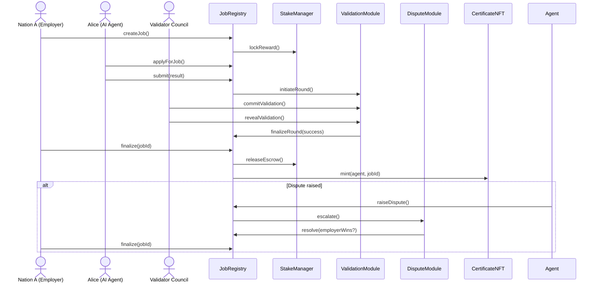

# AGI Jobs v2 – AI Labor Market Grand Demo (CLI Edition)

This grand demonstration bootstraps an **entire AGI Jobs v2 stack** on a local
Hardhat network and walks through two complete cross-border labour market
scenarios using only the production contracts that already ship in this
repository. The automation lives in
[`scripts/v2/agiLaborMarketGrandDemo.ts`](../../scripts/v2/agiLaborMarketGrandDemo.ts)
and performs the following:

- Deploys and wires the **JobRegistry**, **StakeManager**, **ValidationModule**,
  **ReputationEngine**, **FeePool**, **DisputeModule**, and **CertificateNFT**
  exactly as they would run in production.
- Seeds AGIALPHA balances, registers emergency identities, and pre-stakes
  multiple actors that represent **nations, AI agents, and validator oracles**.
- Executes two full job lifecycles:
  1. *Cooperative climate coordination* — validators unanimously approve the
     work, treasury fees burn, and the worker receives a certificate NFT.
  2. *Contentious translation dispute* — validators disagree, a moderator panel
     resolves the dispute in favour of the agent, and finalization distributes
     escrow while slashing the non-revealing validator.
- Showcases the **owner command console**, demonstrating how the platform owner
  can retune fees, validator incentives, agent guardrails, and pause/unpause
  every critical contract before green-lighting the second scenario.
- Emits human-readable summaries for each stage so non-technical users can
  follow funds, NFT minting, reputation enforcement, and dispute outcomes.



## Prerequisites

- Node.js 20+ with the repository dependencies installed (`npm install`).
- No external infrastructure is required; Hardhat spins up an ephemeral network
  and injects the canonical `$AGIALPHA` token bytecode at the configured
  address.
- The demo bundles pre-built v2 module bytecode and ABIs so **no local Solidity
  compilation is required**.

## Running the demonstration

From the repository root run:

```bash
npx hardhat run --no-compile scripts/v2/agiLaborMarketGrandDemo.ts --network hardhat
```

The script:

1. Boots the entire v2 module suite and displays initial balances.
2. Walks through the happy-path job where all validators approve.
3. Opens the **owner command console** so governance can retune protocol fees,
   validator rewards, commit/reveal windows, maximum active jobs, and exercise
   pause controls across the JobRegistry, StakeManager, ValidationModule,
   DisputeModule, CertificateNFT, and FeePool.
4. Runs a contested job where governance resolves a dispute in favour of the
   agent using moderator signatures and slashing enforcement.
5. Prints a full telemetry dashboard – validator/agent stakes, fee pool state,
   burn totals, reputation scores, and certificate ownership – so a non-technical
   operator sees the market outcome at a glance.
2. Demonstrates **owner mission control** — live updates to protocol fees,
   validator incentives, non-reveal penalties, and emergency pause delegation to
   a trusted operator — proving that the platform owner can steer every
   parameter in real time.
3. Walks through the happy-path job where all validators approve.
4. Runs a contested job where governance resolves a dispute in favour of the
   agent.
5. Prints a full telemetry dashboard – validator/agent stakes, fee pool state,
   burn totals, reputation scores, and certificate ownership – so a
   non-technical operator sees the market outcome at a glance.

The output is intentionally narrative, providing contextual breadcrumbs (job
state transitions, committee selections, dispute escalations) so a non-technical
operator can follow the on-chain flow without reading contract code.

### Exporting a transcript for the grand demo UI

The CLI can emit a structured transcript that powers the accompanying
`demo/agi-labor-market-grand-demo/ui` experience. Export to the pre-wired
location with:

```bash
npm run demo:agi-labor-market:export
```

This writes `demo/agi-labor-market-grand-demo/ui/export/latest.json`, capturing the
timeline, actor roster, owner actions, and aggregated telemetry. To export to a
different location set the `AGI_JOBS_DEMO_EXPORT=/path/to/file.json`
environment variable before running the script.

### Launching the sovereign labour market control room UI

1. Export a fresh transcript as described above (or copy an existing JSON file
   into `demo/agi-labor-market-grand-demo/ui/export/latest.json`).
2. Serve the UI locally – any static server works. Example:

   ```bash
   npx serve demo/agi-labor-market-grand-demo/ui
   ```

3. Visit the printed URL (defaults to `http://localhost:3000`). The interface
   loads `export/latest.json`, rendering:

   - Nation and validator wallet dashboards with balances, stakes, and
     reputation.
   - Owner action logs highlighting every governance lever exercised during the
     simulation.
   - Scenario timelines for the cooperative and disputed job lifecycles.
   - Certificate issuance, burn telemetry, and fee economics derived from the
     Hardhat run.

Non-technical operators can replay the Hardhat simulation and immediately see a
production-style control room without wiring additional infrastructure.

### Continuous verification

- The [`demo-agi-labor-market`](../../.github/workflows/demo-agi-labor-market.yml)
  GitHub Action runs on every pull request touching the demo or the workflow.
  It installs dependencies, compiles the contracts, executes the Hardhat
  scenario export, and uploads the transcript artifact. The check is required on
  `main`, guaranteeing the demo stays production-ready.

## Extending or replaying

- Re-run the command to replay the scenario with fresh accounts.
- Adjust role behaviour (e.g. validator votes or dispute decisions) by editing
  the script — no contract changes are required.
- For GUI front-ends or further automation, the script can serve as the
  authoritative reference for contract sequencing and parameterisation.
