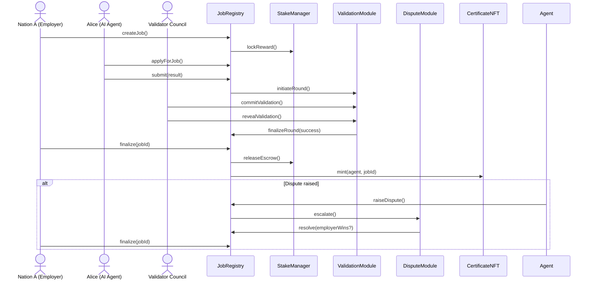

# AGI Jobs v2 – AI Labor Market Grand Demo (CLI Edition)

This grand demonstration bootstraps an **entire AGI Jobs v2 stack** on a local
Hardhat network and walks through two complete cross-border labour market
scenarios using only the production contracts that already ship in this
repository. The automation lives in
[`scripts/v2/agiLaborMarketGrandDemo.ts`](../../scripts/v2/agiLaborMarketGrandDemo.ts)
and performs the following:

- Deploys and wires the **JobRegistry**, **StakeManager**, **ValidationModule**,
  **ReputationEngine**, **FeePool**, **DisputeModule**, and **CertificateNFT**
  exactly as they would run in production.
- Seeds AGIALPHA balances, registers emergency identities, and pre-stakes
  multiple actors that represent **nations, AI agents, and validator oracles**.
- Executes two full job lifecycles:
  1. *Cooperative climate coordination* — validators unanimously approve the
     work, treasury fees burn, and the worker receives a certificate NFT.
  2. *Contentious translation dispute* — validators disagree, a moderator panel
     resolves the dispute in favour of the agent, and finalization distributes
     escrow while slashing the non-revealing validator.
- Emits human-readable summaries for each stage so non-technical users can
  follow funds, NFT minting, reputation enforcement, and dispute outcomes.



## Prerequisites

- Node.js 20+ with the repository dependencies installed (`npm install`).
- No external infrastructure is required; Hardhat spins up an ephemeral network
  and injects the canonical `$AGIALPHA` token bytecode at the configured
  address.
- The demo bundles pre-built v2 module bytecode and ABIs so **no local Solidity
  compilation is required**.

## Running the demonstration

From the repository root run:

```bash
npx hardhat run --no-compile scripts/v2/agiLaborMarketGrandDemo.ts --network hardhat
```

The script:

1. Boots the entire v2 module suite and displays initial balances.
2. Demonstrates **owner mission control** — live updates to protocol fees,
   validator incentives, non-reveal penalties, and emergency pause delegation to
   a trusted operator — proving that the platform owner can steer every
   parameter in real time. Every configuration change is immediately asserted,
   so the script halts if any module fails to reflect the owner’s command.
3. Walks through the happy-path job where all validators approve.
4. Runs a contested job where governance resolves a dispute in favour of the
   agent.
5. Verifies that each agent receives exactly one credential NFT, that burn
   accounting reconciles against total supply, and that the dispute flow mints
   credentials even when moderation is required.
6. Prints a full telemetry dashboard – validator/agent stakes, fee pool state,
   burn totals, reputation scores, and certificate ownership – so a
   non-technical operator sees the market outcome at a glance.

The output is intentionally narrative, providing contextual breadcrumbs (job
state transitions, committee selections, dispute escalations) so a non-technical
operator can follow the on-chain flow without reading contract code.

### Continuous verification for non-technical operators

The repository ships a dedicated GitHub Actions workflow,
[`demo-agi-labor-market.yml`](../../.github/workflows/demo-agi-labor-market.yml),
that replays the export on every pull request touching this demo. The job
produces an artefact containing `export/latest.json` and fails if:

- the Hardhat script does not emit a transcript,
- owner actions, scenarios, or timeline events are missing, or
- the sovereign control snapshot omits baseline parameters.

This guarantees that the showcased workflow remains fully functional and
accessible without requiring local manual testing.

### One-command sovereign control room (non-technical friendly)

Launch the full simulation **and** a static control room UI in a single step:

```bash
npm run demo:agi-labor-market:control-room
```

The helper script performs the following with friendly prompts:

1. Exports a fresh transcript to `demo/agi-labor-market-grand-demo/ui/export/latest.json`.
2. Boots an embedded HTTPS-free static server at `http://127.0.0.1:4173` that
   renders the transcript via the bundled UI.
3. Opens an interactive prompt where pressing <kbd>Enter</kbd> replays the full
   Hardhat scenario (refreshing the transcript and UI), while typing `q` cleanly
   shuts everything down.

This workflow is designed so a non-technical owner can run the end-to-end
experience without learning Hardhat CLI flags or spinning up a custom web
server.

### Exporting a transcript for the grand demo UI

The CLI can emit a structured transcript that powers the accompanying
`demo/agi-labor-market-grand-demo/ui` experience. Export to the pre-wired
location with:

```bash
npm run demo:agi-labor-market:export
```

This writes `demo/agi-labor-market-grand-demo/ui/export/latest.json`, capturing the
timeline, actor roster, owner actions, and aggregated telemetry. To export to a
different location set the `AGI_JOBS_DEMO_EXPORT=/path/to/file.json`
environment variable before running the script.

### Launching the sovereign labour market control room UI

1. Export a fresh transcript as described above (or copy an existing JSON file
   into `demo/agi-labor-market-grand-demo/ui/export/latest.json`).
2. Serve the UI locally – any static server works. Example:

   ```bash
   npx serve demo/agi-labor-market-grand-demo/ui
   ```

3. Visit the printed URL (defaults to `http://localhost:3000`). The interface
   loads `export/latest.json`, rendering:

   - Nation and validator wallet dashboards with balances, stakes, and
     reputation.
   - Live **agent and validator portfolios** summarising liquidity, locked
     capital, reputation, and credential NFTs minted during the simulation so a
     non-technical operator can confirm payouts and performance instantly.
   - Owner action logs highlighting every governance lever exercised during the
     simulation.
   - A **sovereign control snapshot** comparing baseline configuration, live
     drill adjustments, and restored settings, including pauser delegation and
     emergency pause outcomes so non-technical owners can verify authority at a
     glance.
   - Scenario timelines for the cooperative and disputed job lifecycles.
   - Certificate issuance, burn telemetry, and fee economics derived from the
     Hardhat run.

Non-technical operators can replay the Hardhat simulation and immediately see a
production-style control room without wiring additional infrastructure.

## Extending or replaying

- Re-run the command to replay the scenario with fresh accounts.
- Adjust role behaviour (e.g. validator votes or dispute decisions) by editing
  the script — no contract changes are required.
- For GUI front-ends or further automation, the script can serve as the
  authoritative reference for contract sequencing and parameterisation.
