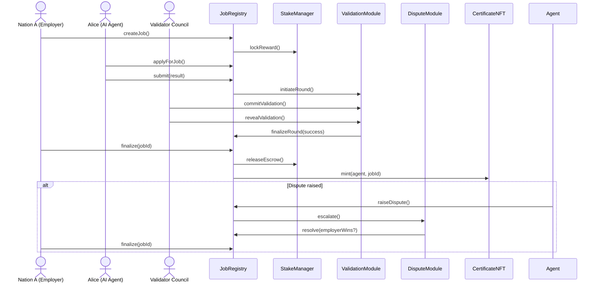

# AGI Jobs v2 – AI Labor Market Grand Demo (CLI Edition)

This grand demonstration bootstraps an **entire AGI Jobs v2 stack** on a local
Hardhat network and walks through two complete cross-border labour market
scenarios using only the production contracts that already ship in this
repository. The automation lives in
[`scripts/v2/agiLaborMarketGrandDemo.ts`](../../scripts/v2/agiLaborMarketGrandDemo.ts)
and performs the following:

- Deploys and wires the **JobRegistry**, **StakeManager**, **ValidationModule**,
  **ReputationEngine**, **FeePool**, **DisputeModule**, and **CertificateNFT**
  exactly as they would run in production.
- Seeds AGIALPHA balances, registers emergency identities, and pre-stakes
  multiple actors that represent **nations, AI agents, and validator oracles**.
- Executes two full job lifecycles:
  1. *Cooperative climate coordination* — validators unanimously approve the
     work, treasury fees burn, and the worker receives a certificate NFT.
  2. *Contentious translation dispute* — validators disagree, a moderator panel
     resolves the dispute in favour of the agent, and finalization distributes
     escrow while slashing the non-revealing validator.
- Emits human-readable summaries for each stage so non-technical users can
  follow funds, NFT minting, reputation enforcement, and dispute outcomes.



## Prerequisites

- Node.js 20+ with the repository dependencies installed (`npm install`).
- No external infrastructure is required; Hardhat spins up an ephemeral network
  and injects the canonical `$AGIALPHA` token bytecode at the configured
  address.

## Running the demonstration

From the repository root run:

```bash
npx hardhat run --no-compile scripts/v2/agiLaborMarketGrandDemo.ts --network hardhat
```

Once the automation completes you can export a structured JSON transcript and
drive the interactive owner console demo:

```bash
npm run demo:agi-labor-market:report
npm --prefix apps/console run dev
```

Open the console (default http://localhost:5173) to explore the “AGI Jobs v2 –
Sovereign Labour Market Grand Demo” panel. Non-technical operators can replay
the entire story – participating actors, validator steps, dispute escalations,
balance snapshots, and owner governance actions – without running any CLI
commands.

The script:

1. Boots the entire v2 module suite and displays initial balances.
2. Walks through the happy-path job where all validators approve.
3. Runs a contested job where governance resolves a dispute in favour of the
   agent.
4. Prints a full telemetry dashboard – validator/agent stakes, fee pool state,
   burn totals, reputation scores, and certificate ownership – so a non-technical
   operator sees the market outcome at a glance.

The output is intentionally narrative, providing contextual breadcrumbs (job
state transitions, committee selections, dispute escalations) so a non-technical
operator can follow the on-chain flow without reading contract code.

## Extending or replaying

- Re-run the command to replay the scenario with fresh accounts.
- Adjust role behaviour (e.g. validator votes or dispute decisions) by editing
  the script — no contract changes are required.
- For GUI front-ends or further automation, the script can serve as the
  authoritative reference for contract sequencing and parameterisation.
