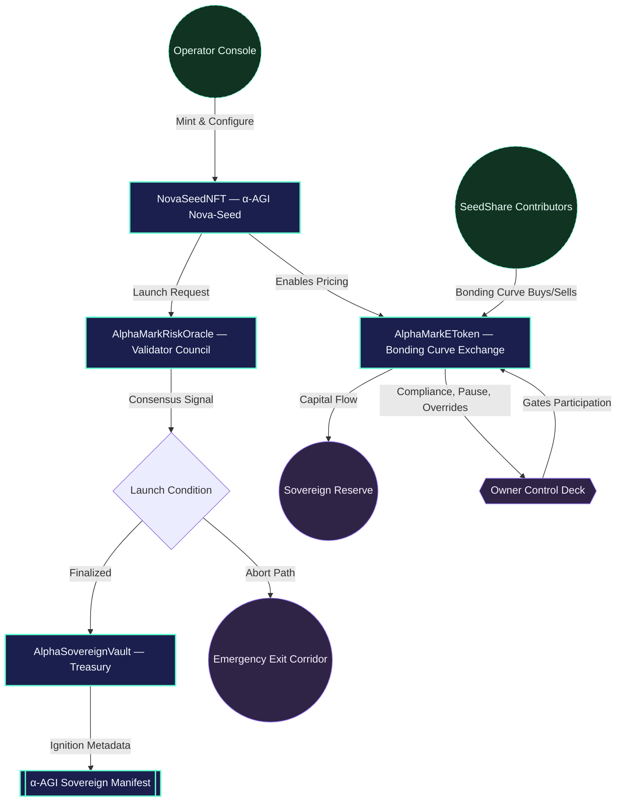
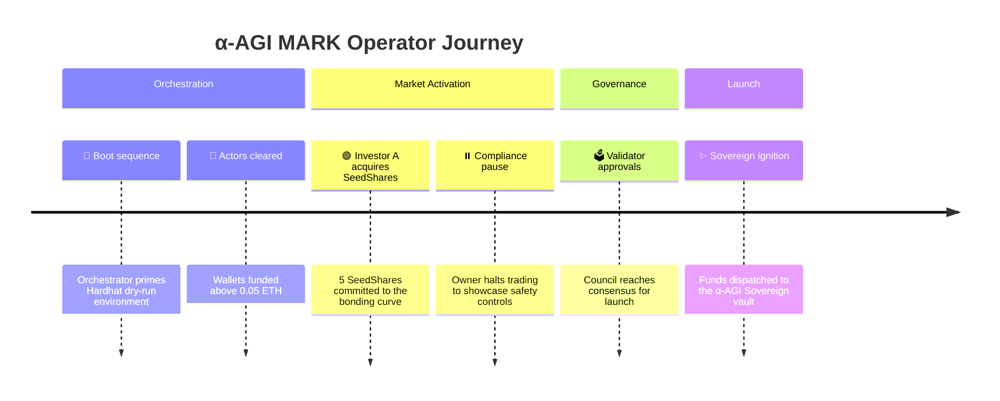
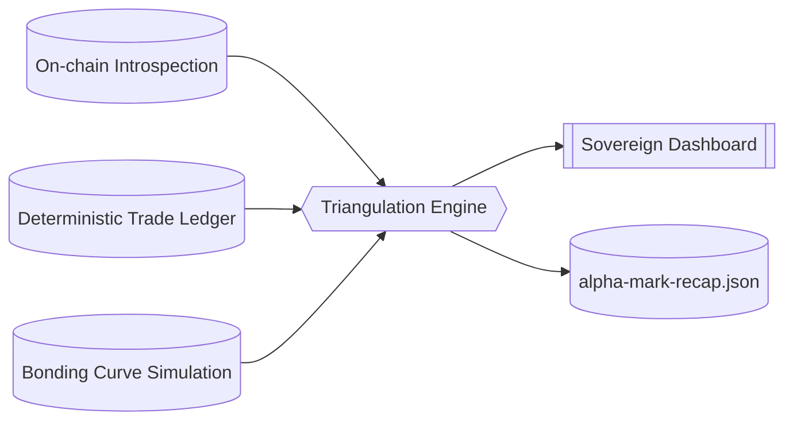

# α-AGI MARK Demo

The α-AGI MARK demo showcases how a non-technical operator can launch a foresight-driven decentralized market using the AGI Jobs v0 (v2) toolchain. It deploys a Nova-Seed NFT, a validator-governed risk oracle, and a bonding-curve powered funding exchange that culminates in a sovereign launch event.

## Contents

- [Architecture](#architecture)
- [Quickstart](#quickstart)
- [Owner Controls](#owner-controls)
- [Runbook](#runbook)

## Architecture

The demo deploys four core contracts:

1. **NovaSeedNFT** – ERC-721 token representing a foresight seed.
2. **AlphaMarkRiskOracle** – validator-governed approval oracle with owner override controls.
3. **AlphaMarkEToken** – ERC-20 bonding-curve market with programmable compliance gates, pause switches, base asset retargeting (ETH or ERC-20 stablecoins), launch finalization metadata, and sovereign callbacks.
4. **AlphaSovereignVault** – launch treasury that acknowledges the ignition metadata, tracks received capital, and gives the owner pause/withdraw controls for the sovereign stage.



> [!TIP]
> For a multi-perspective visual walkthrough (mindmap, journey map, and sovereign launch sequence) see the
> [`Operator Empowerment Atlas`](docs/operator-empowerment-atlas.md). Pair it with the new
> [`Operator Command Console`](docs/operator-command-console.md) to brief stakeholders using quadrant, timeline, and
> safety-state diagrams—no Solidity knowledge required. Seal the evidence loop with the
> [`Verification Compendium`](docs/operator-verification-compendium.md), which narrates the triple-verification matrix and
> shows non-technical operators exactly how to obtain board-ready confidence indices in minutes.

## Quickstart

```bash
npm run demo:alpha-agi-mark
```

This command:

1. Starts a Hardhat in-memory chain.
2. Deploys the demo contracts.
3. Simulates investor participation, validator approvals, pause/unpause sequences, and the sovereign launch transition.
4. Prints a full state recap that a non-technical operator can read to verify success.

### End-to-end operator suite

```bash
npm run demo:alpha-agi-mark:full
```

Runs the orchestrator above and immediately:

1. Prints the owner control matrix so governance levers are visible without extra commands.
2. Replays the trade ledger through the independent verifier, ensuring the recap dossier is internally consistent.
3. Generates the integrity dossier that fuses verification output, owner controls, and mission telemetry for stakeholder sign-off.

### Network & safety controls

- `AGIJOBS_DEMO_DRY_RUN` (default `true`) keeps the run in simulation mode. When set to `false` the script prompts for an explicit
  `launch` confirmation before broadcasting.
- To target a live network supply:
  - `ALPHA_MARK_NETWORK` – Hardhat network name (e.g. `sepolia`).
  - `ALPHA_MARK_RPC_URL` – RPC endpoint.
  - `ALPHA_MARK_CHAIN_ID` – (optional) explicit chain id for the RPC.
  - `ALPHA_MARK_OWNER_KEY` – hex private key for the operator account.
  - `ALPHA_MARK_INVESTOR_KEYS` – comma-separated investor keys (at least three) with gas funds.
  - `ALPHA_MARK_VALIDATOR_KEYS` – comma-separated validator keys (at least three) with gas funds.

The script verifies every supplied account holds at least 0.05 ETH before continuing.

To run the Hardhat unit tests for the demo:

```bash
npx hardhat test --config demo/alpha-agi-mark/hardhat.config.ts
```

### Interactive mission console

After a demo run, launch the operator console to brief stakeholders without touching Solidity:

```bash
npm run console:alpha-agi-mark
```

The console renders:

- A colour-coded mission summary with launch status, treasury destinations, and sovereign ignition metadata
- The full owner command deck (including the parameter matrix) with live state badges for every control lever
- Participant ledgers, validator council tallies, and the triple-verification matrix confidence index
- A cinematic timeline excerpt plus a dynamically generated Mermaid blueprint tailored to the latest recap

Non-interactive environments can emit a one-shot briefing via `npm run console:alpha-agi-mark -- --snapshot` for inclusion in
status reports or CI artefacts.

### Offline verification

After the demo run completes you can re-validate every figure using an independent triangulation script:

```bash
npm run verify:alpha-agi-mark
```

The verifier consumes the recap dossier, replays the trade ledger, recomputes bonding-curve pricing from first
principles, and prints a "confidence index" table that must reach 100% before sign-off.

Every recap is now wrapped in a tamper-evident envelope. The demo encodes network metadata, actor registries,
the orchestrator commit/branch, and a canonical JSON SHA-256 digest inside the recap file. The verifier recomputes
the digest with a key-sorted canonicalisation pass and fails if the checksum diverges, guaranteeing that stakeholders
review precisely the state emitted by the orchestrator.

For a presentation-ready briefing, render the integrity report:

```bash
npm run integrity:alpha-agi-mark
```

This generates `reports/alpha-mark-integrity.md` – a mermaid-enhanced dossier that summarises the
confidence matrix, owner controls, validator quorum, and participant contributions so non-technical
stakeholders can sign off in minutes.

## Sovereign Dashboard

Every demo run now emits a cinematic HTML dossier at `demo/alpha-agi-mark/reports/alpha-mark-dashboard.html`. Open the file in
any browser to explore:

- Mission control metrics capturing validator consensus, reserve power, and sovereign vault status
- Dedicated gauges for native vs. external sovereign intake with ignition-mode badges so compliance teams instantly know which
  asset underwrote the launch
- A telemetry envelope showing network, orchestrator git metadata, actor registries, and the live recap checksum badge
- A control-deck grid showing every owner actuator with live status badges
- Full participant ledger plus the operator parameter matrix rendered as responsive tables
- A trade resonance log charting every buy/sell action and its capital impact
- An auto-generated Mermaid diagram visualising the launch topology and emergency fail-safes

Regenerate the dashboard at any time from the latest recap JSON:

```bash
npm run dashboard:alpha-agi-mark
```

## Triple-Verification Matrix

## Mission Timeline

Every orchestrated action is now captured in a cinematic mission timeline so non-technical stakeholders can replay the entire
launch sequence at a glance. Generate the Markdown dossier at `demo/alpha-agi-mark/reports/alpha-mark-timeline.md`:

```bash
npm run timeline:alpha-agi-mark
```

The report embeds a Mermaid timeline plus a detailed event ledger. Use it to brief councils, auditors, or investors without
re-running the demo.



## Triple-Verification Matrix

α-AGI MARK now triangulates its state through three independent vantage points—on-chain contract reads, a deterministic
trade ledger, and a first-principles bonding-curve simulator. Every run prints a "Triple-Verification Matrix" confirming that
all three perspectives agree on supply, pricing, capital flows, and participant contributions. The recap dossier exposes the
results under a new `verification` section and the dashboard renders the matrix as a dedicated integrity panel.



## Owner Controls

The demo enumerates all tunable controls in the final recap:

- Curve parameters (base price, slope, supply caps)
- Base asset retargeting between native ETH and ERC-20 stablecoins
- Compliance whitelist toggles
- Pause / emergency exit switches
- Validator council membership and approval thresholds
- Validator roster resets and approval clearing
- Launch, abort, and override controls
- Full owner control snapshot exported under `ownerControls` in the recap dossier
- Tabular owner parameter matrix available via `npm run owner:alpha-agi-mark`
- Automated regression coverage in `test/AlphaMarkOwnerControls.test.ts` that exercises every actuator, including
  funding caps, supply guards, whitelist toggles, override switches, emergency exit, abort, and post-close residual
  withdrawals, proving the operator retains decisive authority in every phase.

## Runbook

The detailed walkthrough is stored at [`runbooks/alpha-agi-mark-runbook.md`](runbooks/alpha-agi-mark-runbook.md).
