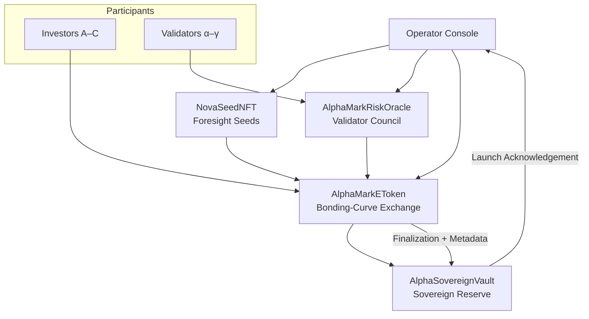
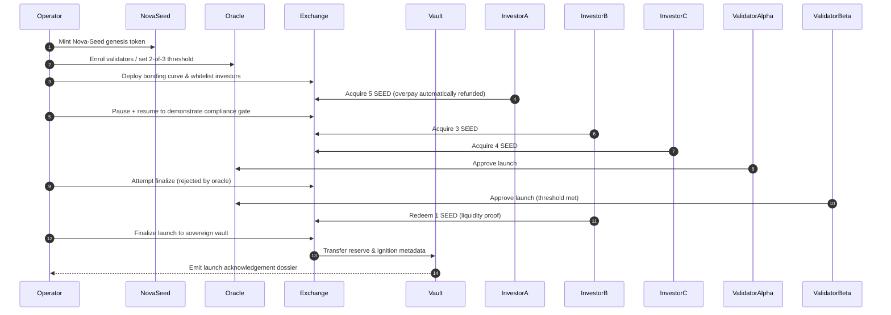

# α-AGI MARK Demo

α-AGI MARK is the foresight DEX where a single non-technical orchestrator can mint a Nova-Seed NFT, govern risk with a validator council, and ignite a sovereign launch treasury — all through the AGI Jobs v0 (v2) toolchain. The demo shows how the platform behaves like a superintelligent co-founder: every deployment, market interaction, safety brake, and recap dossier is handled automatically while the operator merely confirms intent.

## Celestial Architecture



## Sovereign Ignition Sequence



## Rapid Orchestration

```bash
npm run demo:alpha-agi-mark
```

Running the command boots a Hardhat chain, deploys the Nova-Seed NFT, risk oracle, bonding-curve exchange, and sovereign vault, simulates investor and validator activity, exercises pause/whitelist/base-asset controls, finalizes the launch, and produces mission-grade recap artifacts.

### Network & safety controls

- `AGIJOBS_DEMO_DRY_RUN` (default `true`) keeps execution in simulation mode. Set to `false` to allow real transactions, in which case the orchestrator requests a `launch` confirmation in the terminal.
- To run against a named Hardhat network or testnet provide:
  - `ALPHA_MARK_NETWORK` – Hardhat network name (e.g. `sepolia`).
  - `ALPHA_MARK_RPC_URL` – RPC endpoint.
  - `ALPHA_MARK_CHAIN_ID` – (optional) explicit chain id.
  - `ALPHA_MARK_OWNER_KEY` – hex private key for the operator account.
  - `ALPHA_MARK_INVESTOR_KEYS` – comma-separated investor keys (at least three).
  - `ALPHA_MARK_VALIDATOR_KEYS` – comma-separated validator keys (at least three).

Every supplied wallet is balance-checked (≥ 0.05 ETH) before the run proceeds.

### Tests

```bash
npx hardhat test --config demo/alpha-agi-mark/hardhat.config.ts
```

The suite covers bonding-curve arithmetic, whitelist enforcement, emergency exit behaviour, ERC-20 base-asset flows, validator council controls, and sovereign vault acknowledgements.

## Artifact Dossiers

After the demo completes, two operator-friendly dossiers are written under `demo/alpha-agi-mark/reports/`:

- `alpha-mark-recap.json` – structured machine-readable ledger containing contract addresses, owner controls, validator matrix, participant balances, and launch outcome flags.
- `alpha-mark-recap.md` – beautifully formatted Markdown briefing with Mermaid diagrams, human-readable tables, and an artifact index for immediate sharing.

Render the owner control matrix at any time with:

```bash
npm run owner:alpha-agi-mark
```

This command reads the latest recap JSON and prints a tabular summary of every owner lever (pause, whitelist, override, funding caps, deadlines, treasury, oracle references, and more).

## Owner Controls

The operator retains absolute control throughout the lifecycle:

- Bonding-curve parameters (base price, slope, supply and funding caps)
- Base asset retargeting between native ETH and ERC-20 stablecoins
- Compliance whitelist toggles with batch updates
- Pause / resume and emergency exit circuitry
- Validator council management (add/remove, thresholds, resets, overrides)
- Launch, abort, and validation override switches
- Sovereign treasury manifest updates and withdrawals

All of these levers surface inside both recap artifacts, guaranteeing a non-technical user can verify and document the system state instantly.

## Runbook

A detailed, step-by-step walkthrough for live operators is available in [`runbooks/alpha-agi-mark-runbook.md`](runbooks/alpha-agi-mark-runbook.md).
