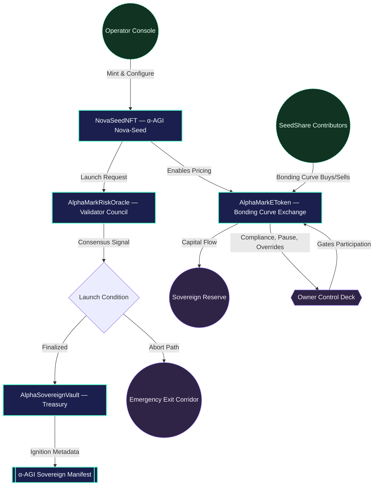
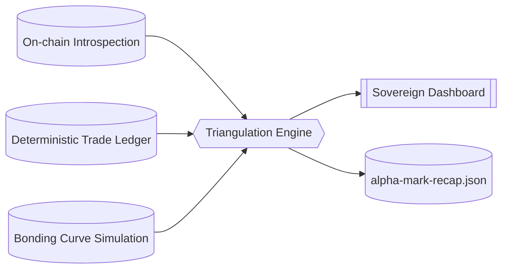

# α-AGI MARK Demo

The α-AGI MARK demo showcases how a non-technical operator can launch a foresight-driven decentralized market using the AGI Jobs v0 (v2) toolchain. It deploys a Nova-Seed NFT, a validator-governed risk oracle, and a bonding-curve powered funding exchange that culminates in a sovereign launch event.

## Contents

- [Architecture](#architecture)
- [Quickstart](#quickstart)
- [Owner Controls](#owner-controls)
- [Runbook](#runbook)

## Architecture

The demo deploys four core contracts:

1. **NovaSeedNFT** – ERC-721 token representing a foresight seed.
2. **AlphaMarkRiskOracle** – validator-governed approval oracle with owner override controls.
3. **AlphaMarkEToken** – ERC-20 bonding-curve market with programmable compliance gates, pause switches, base asset retargeting (ETH or ERC-20 stablecoins), launch finalization metadata, and sovereign callbacks.
4. **AlphaSovereignVault** – launch treasury that acknowledges the ignition metadata, tracks received capital, and gives the owner pause/withdraw controls for the sovereign stage.



> [!TIP]
> For a multi-perspective visual walkthrough (mindmap, journey map, and sovereign launch sequence) see the
> [`Operator Empowerment Atlas`](docs/operator-empowerment-atlas.md). Pair it with the new
> [`Operator Command Console`](docs/operator-command-console.md) to brief stakeholders using quadrant, timeline, and
> safety-state diagrams—no Solidity knowledge required.

## Quickstart

```bash
npm run demo:alpha-agi-mark
```

This command:

1. Starts a Hardhat in-memory chain.
2. Deploys the demo contracts.
3. Simulates investor participation, validator approvals, pause/unpause sequences, and the sovereign launch transition.
4. Prints a full state recap that a non-technical operator can read to verify success.

### Network & safety controls

- `AGIJOBS_DEMO_DRY_RUN` (default `true`) keeps the run in simulation mode. When set to `false` the script prompts for an explicit
  `launch` confirmation before broadcasting.
- To target a live network supply:
  - `ALPHA_MARK_NETWORK` – Hardhat network name (e.g. `sepolia`).
  - `ALPHA_MARK_RPC_URL` – RPC endpoint.
  - `ALPHA_MARK_CHAIN_ID` – (optional) explicit chain id for the RPC.
  - `ALPHA_MARK_OWNER_KEY` – hex private key for the operator account.
  - `ALPHA_MARK_INVESTOR_KEYS` – comma-separated investor keys (at least three) with gas funds.
  - `ALPHA_MARK_VALIDATOR_KEYS` – comma-separated validator keys (at least three) with gas funds.

The script verifies every supplied account holds at least 0.05 ETH before continuing.

To run the Hardhat unit tests for the demo:

```bash
npx hardhat test --config demo/alpha-agi-mark/hardhat.config.ts
```

### Offline verification

After the demo run completes you can re-validate every figure using an independent triangulation script:

```bash
npm run verify:alpha-agi-mark
```

The verifier consumes the recap dossier, replays the trade ledger, recomputes bonding-curve pricing from first
principles, and prints a "confidence index" table that must reach 100% before sign-off.

For a presentation-ready briefing, render the integrity report:

```bash
npm run integrity:alpha-agi-mark
```

This generates `reports/alpha-mark-integrity.md` – a mermaid-enhanced dossier that summarises the
confidence matrix, owner controls, validator quorum, and participant contributions so non-technical
stakeholders can sign off in minutes.

## Sovereign Dashboard

Every demo run now emits a cinematic HTML dossier at `demo/alpha-agi-mark/reports/alpha-mark-dashboard.html`. Open the file in
any browser to explore:

- Mission control metrics capturing validator consensus, reserve power, and sovereign vault status
- A control-deck grid showing every owner actuator with live status badges
- Full participant ledger plus the operator parameter matrix rendered as responsive tables
- A trade resonance log charting every buy/sell action and its capital impact
- An auto-generated Mermaid diagram visualising the launch topology and emergency fail-safes

Regenerate the dashboard at any time from the latest recap JSON:

```bash
npm run dashboard:alpha-agi-mark
```

## Triple-Verification Matrix

α-AGI MARK now triangulates its state through three independent vantage points—on-chain contract reads, a deterministic
trade ledger, and a first-principles bonding-curve simulator. Every run prints a "Triple-Verification Matrix" confirming that
all three perspectives agree on supply, pricing, capital flows, and participant contributions. The recap dossier exposes the
results under a new `verification` section and the dashboard renders the matrix as a dedicated integrity panel.

> [!NOTE]
> Want the full breakdown of every invariant, replay step, and failure mode? See the
> [`Triple-Verification Matrix Deep Dive`](docs/triple-verification-matrix.md) for command references,
> mermaid diagrams, and an executive checklist that keeps the matrix permanently green.



## Owner Controls

The demo enumerates all tunable controls in the final recap:

- Curve parameters (base price, slope, supply caps)
- Base asset retargeting between native ETH and ERC-20 stablecoins
- Compliance whitelist toggles
- Pause / emergency exit switches
- Validator council membership and approval thresholds
- Validator roster resets and approval clearing
- Launch, abort, and override controls
- Full owner control snapshot exported under `ownerControls` in the recap dossier
- Tabular owner parameter matrix available via `npm run owner:alpha-agi-mark`

## Runbook

The detailed walkthrough is stored at [`runbooks/alpha-agi-mark-runbook.md`](runbooks/alpha-agi-mark-runbook.md).
