# α-AGI MARK Demo

The α-AGI MARK demo showcases how a non-technical operator can launch a foresight-driven decentralized market using the AGI Jobs v0 (v2) toolchain. It deploys a Nova-Seed NFT, a validator-governed risk oracle, and a bonding-curve powered funding exchange that culminates in a sovereign launch event.

## Contents

- [Architecture](#architecture)
- [Quickstart](#quickstart)
- [Owner Controls](#owner-controls)
- [Runbook](#runbook)

## Architecture

The demo deploys four core contracts:

1. **NovaSeedNFT** – ERC-721 token representing a foresight seed.
2. **AlphaMarkRiskOracle** – validator-governed approval oracle with owner override controls.
3. **AlphaMarkEToken** – ERC-20 bonding-curve market with programmable compliance gates, pause switches, base asset retargeting (ETH or ERC-20 stablecoins), launch finalization metadata, and sovereign callbacks.
4. **AlphaSovereignVault** – launch treasury that acknowledges the ignition metadata, tracks received capital, and gives the owner pause/withdraw controls for the sovereign stage.

```mermaid
flowchart LR
  subgraph SeedForge["🌱 Nova-Seed Forge"]
    Mint{{"Mint Nova-Seed"}}
    ValidatorsConfig["Configure validator roster"]
  end
  subgraph MarketPulse["⚖️ AlphaMark Bonding Curve"]
    Acquire["Investors acquire SeedShares"]
    Pricing["Dynamic price: base = 0.1 ETH, slope = 0.05 ETH"]
    Reserve["Reserve deepens with every contribution"]
  end
  subgraph RiskChamber["🛡️ Risk Oracle"]
    Consensus["Approvals tallied toward launch"]
  end
  subgraph SovereignAscension["👑 Sovereign Vault"]
    Vault["Funds secured & manifest anchored"]
  end

  Mint --> Acquire
  Acquire --> Pricing --> Reserve
  Reserve --> Consensus
  Consensus -->|Green-light| Vault
```




## Quickstart

```bash
npm run demo:alpha-agi-mark
```

This command:

1. Starts a Hardhat in-memory chain.
2. Deploys the demo contracts.
3. Simulates investor participation, validator approvals, pause/unpause sequences, and the sovereign launch transition.
4. Prints a full state recap that a non-technical operator can read to verify success.

### Visual command deck

Transform the recap dossier into a cinematic command deck dashboard:

```bash
npm run dashboard:alpha-agi-mark
```

The script renders `reports/alpha-mark-dashboard.html` with dynamic Mermaid diagrams (flow, pie, timeline) and richly styled tables so an operator can review governance levers without touching Solidity.

### Network & safety controls

- `AGIJOBS_DEMO_DRY_RUN` (default `true`) keeps the run in simulation mode. When set to `false` the script prompts for an explicit
  `launch` confirmation before broadcasting.
- To target a live network supply:
  - `ALPHA_MARK_NETWORK` – Hardhat network name (e.g. `sepolia`).
  - `ALPHA_MARK_RPC_URL` – RPC endpoint.
  - `ALPHA_MARK_CHAIN_ID` – (optional) explicit chain id for the RPC.
  - `ALPHA_MARK_OWNER_KEY` – hex private key for the operator account.
  - `ALPHA_MARK_INVESTOR_KEYS` – comma-separated investor keys (at least three) with gas funds.
  - `ALPHA_MARK_VALIDATOR_KEYS` – comma-separated validator keys (at least three) with gas funds.

The script verifies every supplied account holds at least 0.05 ETH before continuing.

To run the Hardhat unit tests for the demo:

```bash
npx hardhat test --config demo/alpha-agi-mark/hardhat.config.ts
```

## Owner Controls

The demo enumerates all tunable controls in the final recap:

- Curve parameters (base price, slope, supply caps)
- Base asset retargeting between native ETH and ERC-20 stablecoins
- Compliance whitelist toggles
- Pause / emergency exit switches
- Validator council membership and approval thresholds
- Validator roster resets and approval clearing
- Launch, abort, and override controls
- Full owner control snapshot exported under `ownerControls` in the recap dossier
- Tabular owner parameter matrix available via `npm run owner:alpha-agi-mark`

## Runbook

The detailed walkthrough is stored at [`runbooks/alpha-agi-mark-runbook.md`](runbooks/alpha-agi-mark-runbook.md).
