# α-AGI MARK 🔮🌌✨ Demo

> "The on-chain agora where nascent futures crystallize."  
> This demo turns a single Nova-Seed foresight artefact into a sovereign treasury launch using AGI Jobs v0 (v2).

## Why this matters

The α-AGI MARK prototype demonstrates how a non-technical operator can orchestrate a validator-supervised bonding-curve market, complete with risk governance, compliance controls, and a sovereign treasury hand-off – all from a single command. It shows AGI Jobs v0 (v2) acting as a super-engineer that:

- Deploys and curates a Nova-Seed NFT representing a transformational foresight insight.
- Launches a MARK bonding-curve exchange where supporters purchase SeedShares priced algorithmically.
- Streams validator votes into an on-chain risk oracle that decides when the seed is “green-flamed”.
- Elevates the project into an α-AGI Sovereign vault once confidence and capital thresholds are satisfied.
- Keeps the owner in full command: pausing, whitelisting, parameter updates, validator composition, and validation overrides.

## Repository layout

```
demo/alpha-agi-mark/
├── README.md                 # This guide
├── bin/run-demo.sh           # One-command orchestration wrapper
├── scripts/run-demo.ts       # Hardhat script driving the full story
├── config/                   # Reserved for parameter packs
├── docs/                     # Operational runbooks (see below)
├── logs/                     # Human-facing log snapshots (runtime)
└── reports/ (via scripts)    # JSON artefacts for CI & auditors
contracts/demo/alpha-agi-mark/
├── AlphaAgiMark.sol          # Bonding curve, oracle, compliance + owner controls
├── AlphaSovereignVault.sol   # Sovereign treasury stub receiving launch funds
└── NovaSeedNFT.sol           # Minimal ERC-721 representing Nova-Seeds
```

## Quick start

```bash
npm install              # if not already done
npm run test:alpha-agi-mark
npm run demo:alpha-agi-mark
```

Or, from anywhere inside the repo:

```bash
demo/alpha-agi-mark/bin/run-demo.sh
```

The script executes entirely against Hardhat’s deterministic network (no wallets or RPC secrets required). The output narrates every step and emits machine-readable reports under `reports/alpha-agi-mark/`.

## Demo storyline

```mermaid
graph TD
    A[Owner invokes run-demo] --> B[Deploy NovaSeedNFT]
    B --> C[Mint α-AGI Nova-Seed]
    C --> D[Deploy AlphaAgiMark bonding curve]
    D --> E[Transfer seed under custodianship]
    E --> F[Supporters buy SeedShares via bonding curve]
    F --> G[Owner toggles whitelist / pause controls]
    G --> H[Validators cast risk votes]
    H --> I[α-AGI Sovereign Vault deployed]
    I --> J[Finalize launch & stream treasury]
    J --> K[Reports + governance snapshot exported]
```



During the run you will see:

1. **Dynamic Pricing** – SeedShares cost increases with each purchase (linear bonding curve with closed-form integration).
2. **Compliance Hooks** – Whitelisting and pausing instantly reconfigure the market without redeployments.
3. **Validator Oracle** – Risk council members can approve, reject, or rescind votes. Thresholds auto-adjust when the validator set changes.
4. **Launch Finalisation** – Once approvals and reserve thresholds are met, capital is transferred to an on-chain sovereign vault and trading is sealed.

## Contracts in detail

| Contract | Purpose | Key Controls |
| --- | --- | --- |
| `AlphaAgiMark` | ERC-20 bonding-curve exchange with validator-driven launch gating. | `pause/unpause`, `setWhitelistEnabled`, `setWhitelist`, `updatePricing`, `setMinLaunchReserve`, `setApprovalThreshold`, `updateValidator`, `forceSetSeedValidationStatus`, `abortLaunch`, `finalizeLaunch`. |
| `NovaSeedNFT` | Custodies the foresight artefact. Only the owner mints and can update metadata. | `mintSeed`, `updateTokenURI`. |
| `AlphaSovereignVault` | Receives MARK proceeds and exposes a governance-controlled mission statement with forward capability. | `updateMission`, `forwardFunds`. |

Security features baked in:

- **Reentrancy protected** buy/sell paths.
- **Discrete arithmetic bonding curve** with provable reserve invariants.
- **Comprehensive owner overrides** (including emergency pause and validator management).
- **Zero native ether fallback** to prevent accidental deposits.

## Runbook

An operator-focused walkthrough is available at [`docs/runbook.md`](docs/runbook.md). It explains each console message, what data to capture, and how to brief stakeholders using the generated summary files.

## Testing & CI

| Command | Description |
| --- | --- |
| `npm run test:alpha-agi-mark` | Hardhat unit tests covering bonding curve economics, whitelist + pause, validator gating, and owner governance. |
| `npm run demo:alpha-agi-mark` | Executes the end-to-end Hardhat story and emits artefacts under `reports/alpha-agi-mark/`. |

The CI workflow (`.github/workflows/demo-alpha-agi-mark.yml`) runs both commands on every pull request touching this demo, ensuring a permanent green signal on `main`.

## Extending the demo

- Tune pricing via `updatePricing` while paused to simulate different market appetites.
- Swap the risk council mid-flight to illustrate resilient governance.
- Enable whitelist mode to limit access to curated addresses.
- Adjust `minLaunchReserve` to require higher (or lower) capital buffers before promoting a seed.

With AGI Jobs v0 (v2), these sophisticated manoeuvres stay approachable – one command, instant readiness.
