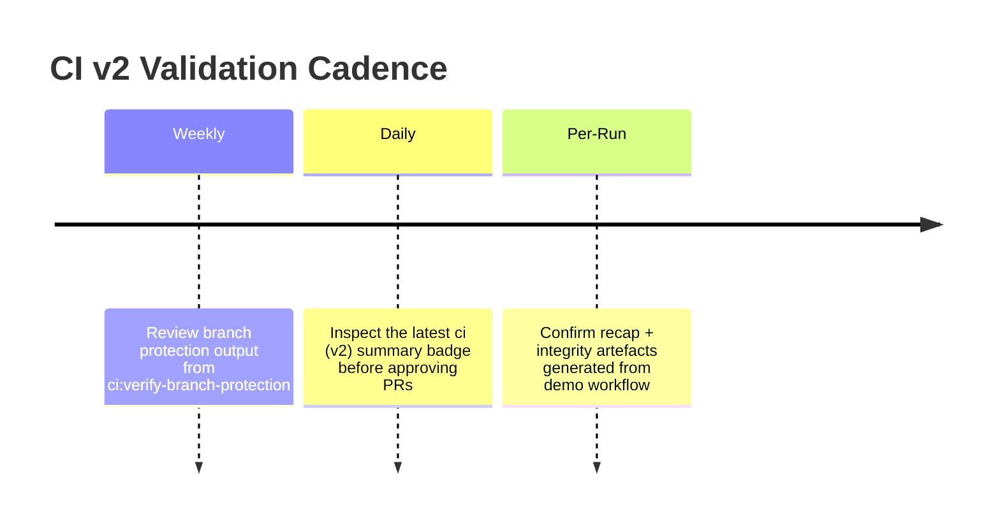

# α-AGI MARK CI v2 Mission Control

The α-AGI MARK foresight demo is guarded by the AGI Jobs v0 (v2) continuous-integration standard. This dossier explains how the
workflow enforces owner assurances, what artefacts are produced, and how non-technical operators can audit every gate in minutes.

## Pipeline Flyover

```mermaid
flowchart LR
    A[Pull Request or Main Push] --> B(ci.yml · CI summary)
    B --> C{demo-alpha-agi-mark.yml}
    C --> D[Install dependencies]
    D --> E[Hardhat unit tests]
    E --> F[Run foresight demo (dry-run safeguarded)]
    F --> G[Recap dossier validation]
    G --> H[Dashboard integrity scan]
    H --> I[Offline recap triangulation]
    I --> J[Integrity dossier build]
    J --> K[Artefact uploads (recap + integrity)]
```

Every block in the flowchart above is present in
[`.github/workflows/demo-alpha-agi-mark.yml`](../../.github/workflows/demo-alpha-agi-mark.yml) and is required on both pull
requests and the `main` branch. The workflow executes after the umbrella `ci (v2)` summary job succeeds, ensuring this demo
inherits the repo-wide lint, test, coverage, static-analysis, and fuzzing prerequisites before any scenario runs.

## Multi-Perspective Safeguards

| Stage | Command | Verification | Evidence Produced |
|---|---|---|---|
| Unit tests | `npm run test:alpha-agi-mark` | Enforces bonding-curve invariants, validator governance, ERC-20 & ETH flows.【F:demo/alpha-agi-mark/test/AlphaMarkDemo.test.ts†L12-L227】 | Hardhat report attached to the CI logs |
| Demo orchestration | `npm run demo:alpha-agi-mark:ci` | Executes the end-to-end foresight market drill with dry-run guards enabled.【F:.github/workflows/demo-alpha-agi-mark.yml†L31-L72】 | `alpha-mark-recap.json`, console ledger transcript |
| Offline triangulation | `npm run verify:alpha-agi-mark` | Replays the trade ledger and recomputes pricing from first principles, requiring a 100% confidence index before success.【F:demo/alpha-agi-mark/scripts/verifyRecap.ts†L78-L189】 | Terminal confidence table, verification flags embedded into recap |
| Integrity dossier | `npm run integrity:alpha-agi-mark` | Builds the Markdown control-room report with mermaid visualisations and owner command deck snapshot.【F:demo/alpha-agi-mark/scripts/generateIntegrityReport.ts†L15-L207】 | `reports/alpha-mark-integrity.md` uploaded as an artefact |

## Branch-Protection Expectations

Branch protection on `main` must list the following status checks as **Required**:

1. `ci (v2) / CI summary` – the umbrella workflow aggregating lint/test/coverage/security gates.【F:.github/workflows/ci.yml†L355-L401】
2. `demo-alpha-agi-mark / alpha-agi-mark-demo` – the foresight drill described above.【F:.github/workflows/demo-alpha-agi-mark.yml†L1-L109】

Administrators are not permitted to bypass these checks. Audit them anytime with the repository-wide
[`ci:verify-branch-protection` script](../../scripts/ci/verify-branch-protection.ts) or the published checklist in
[`docs/ci-v2-branch-protection-checklist.md`](../../docs/ci-v2-branch-protection-checklist.md).



## Operator Quick Audit

1. Open the most recent **demo-alpha-agi-mark** workflow run and download the recap plus integrity artefacts.
2. Run `npm run verify:alpha-agi-mark` locally to reproduce the 100% confidence index.
3. Confirm branch protection still references both `CI summary` and `alpha-agi-mark-demo`. If a name drifts, update the
   protection rule before merging.
4. File the generated integrity dossier alongside executive approvals so the sovereign launch trail remains tamper-evident.

These steps empower non-technical operators to certify that the “superintelligent” launch machine remains locked to its guardrails
while delivering full transparency to auditors and stakeholders.
