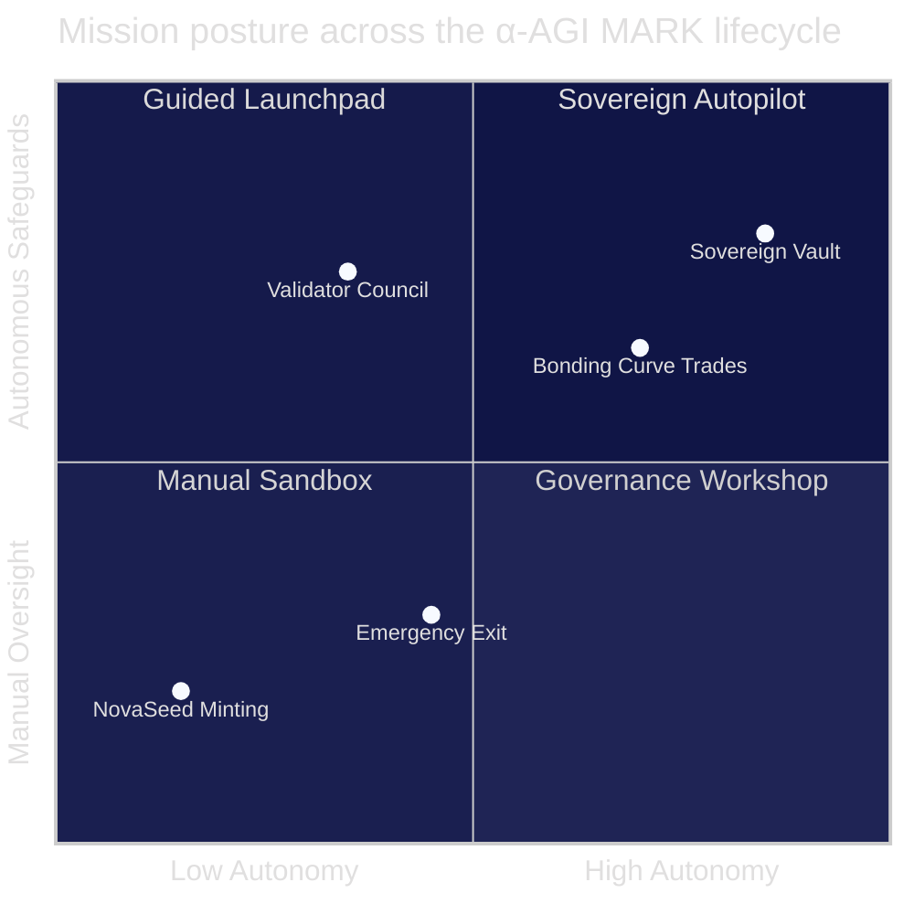
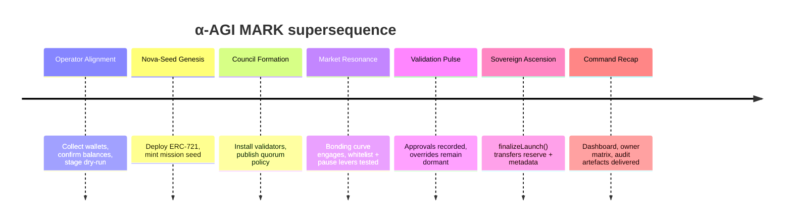
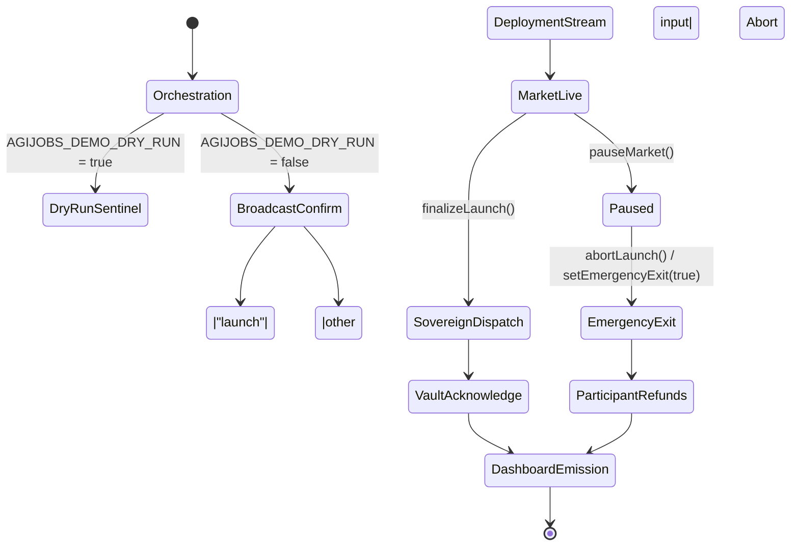

# α-AGI MARK Operator Command Console

The command console is a briefing aid for non-technical launch stewards.  It
layers multiple visualisations so the operator can reason about every control
lever exposed by AGI Jobs v0 (v2) before, during, and after ignition.

## Systems Constellation

## Launch Timeline

## Safety Relay Map

### Usage Notes

1. Review the **quadrant chart** to communicate autonomy vs. oversight for each
   subsystem when briefing stakeholders.
2. Use the **timeline** as a status board while the orchestrator runs; each
   segment corresponds to live log messages in `npm run demo:alpha-agi-mark`.
3. Follow the **safety relay map** during incident response drills to confirm
   which branch of control logic is active.
4. Pair this console with the [`Operator Empowerment Atlas`](operator-empowerment-atlas.md)
   to deliver both strategic and tactical clarity without touching Solidity.
