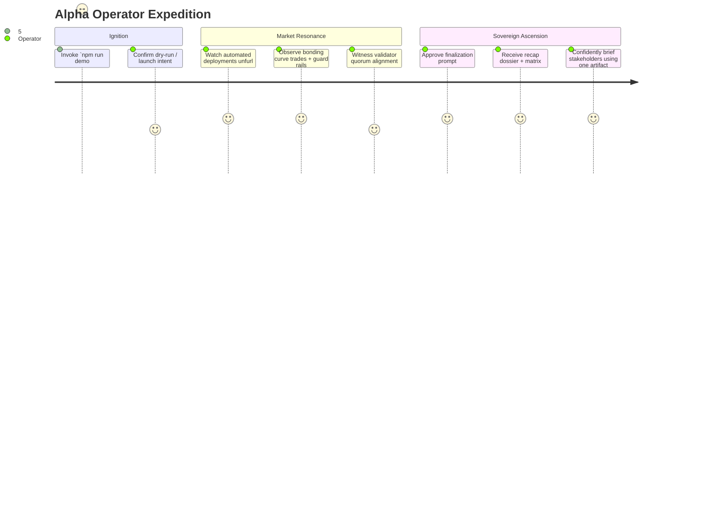
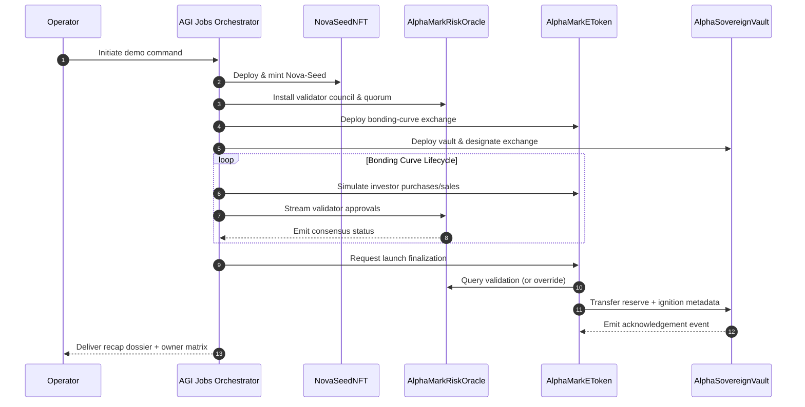
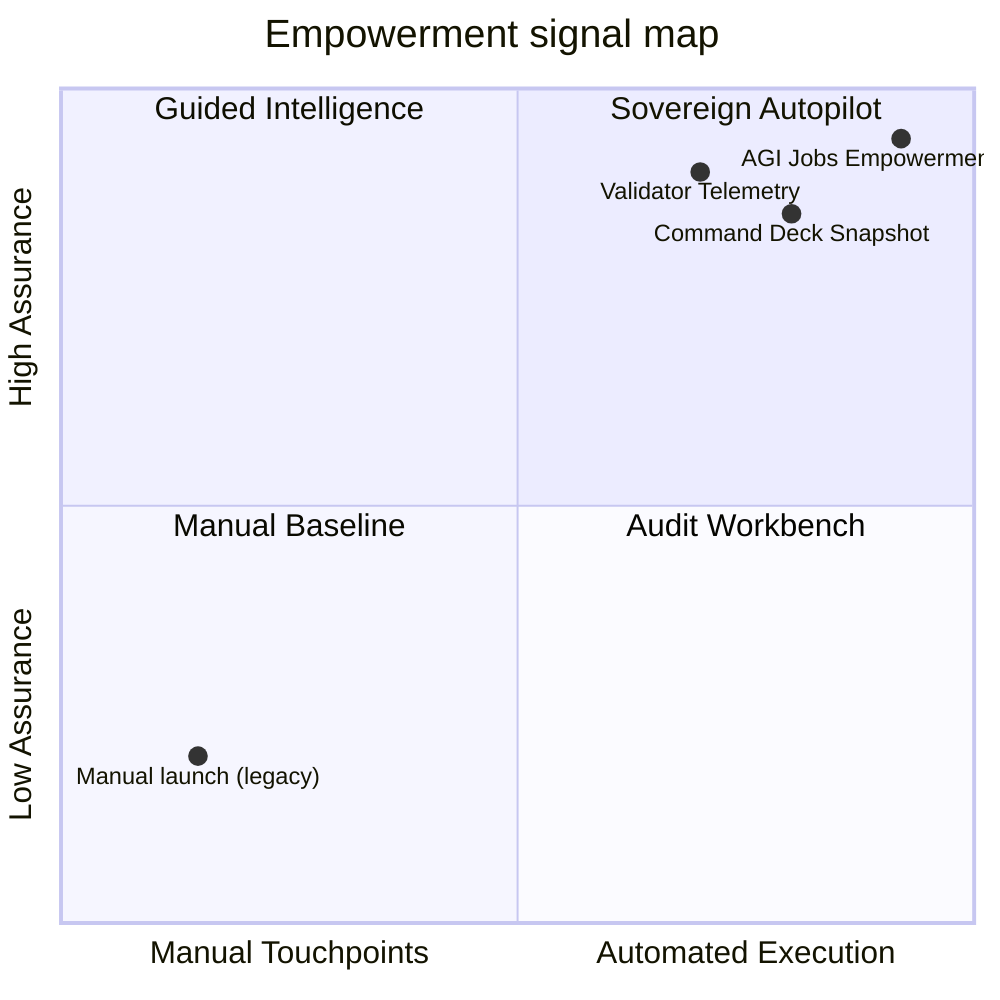

# α-AGI MARK Operator Empowerment Atlas

The atlas distills how AGI Jobs v0 (v2) lets a single non-technical steward conjure, govern, and finalize the α-AGI MARK foresight DEX. Each diagram highlights a distinct perspective of the same orchestration so operators can audit the system visually before ever touching Solidity.

## Holistic Mindmap

```mermaid
mindmap
  root((AGI Jobs v0 (v2) Orchestrator))
    Launch Preparation
      Dry-run Sentinel
      Wallet Balance Guardian
      Deterministic Hardhat Fabric
    Market Genesis
      Nova-Seed NFT
      Bonding Curve Exchange
      Validator Oracle
      Sovereign Vault
    Compliance Shield
      Whitelist Matrix
      Pause / Resume Switch
      Emergency Exit Ladder
      Override Scepter
    Intelligence Surfaces
      Recap Dossier JSON
      Owner Parameter Matrix
      Console Storytelling
```

## Non-Technical Operator Journey



## Sovereign Handshake Sequence



These visual systems can be printed, embedded in investor decks, or referenced in due diligence reports so the operator can demonstrate total command over α-AGI MARK without touching raw contract code.

## Empowerment Multiplier Glyph



The empowerment glyph translates the recap’s empowerment stanza into a single chart that any executive can interpret. The
default dry-run places the AGI Jobs empowerment index firmly inside the “Sovereign Autopilot” quadrant, signalling that a
single command delivered dozens of mission actions with board-ready assurance metrics.
