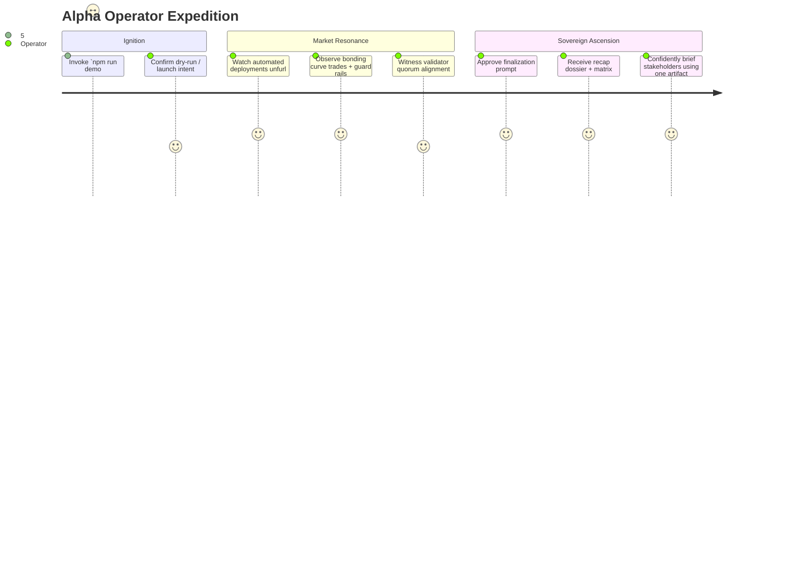
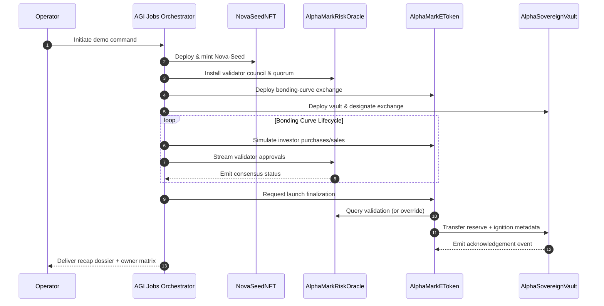

# α-AGI MARK Operator Empowerment Atlas

The atlas distills how AGI Jobs v0 (v2) lets a single non-technical steward conjure, govern, and finalize the α-AGI MARK foresight DEX. Each diagram highlights a distinct perspective of the same orchestration so operators can audit the system visually before ever touching Solidity.

## Holistic Mindmap

```mermaid
mindmap
  root((AGI Jobs v0 (v2) Orchestrator))
    Launch Preparation
      Dry-run Sentinel
      Wallet Balance Guardian
      Deterministic Hardhat Fabric
    Market Genesis
      Nova-Seed NFT
      Bonding Curve Exchange
      Validator Oracle
      Sovereign Vault
    Compliance Shield
      Whitelist Matrix
      Pause / Resume Switch
      Emergency Exit Ladder
      Override Scepter
    Intelligence Surfaces
      Recap Dossier JSON
      Owner Parameter Matrix
      Console Storytelling
```

## Non-Technical Operator Journey



## Sovereign Handshake Sequence



These visual systems can be printed, embedded in investor decks, or referenced in due diligence reports so the operator can demonstrate total command over α-AGI MARK without touching raw contract code.

## Sovereign Blueprint Snapshot

```mermaid
graph TD
    classDef node fill:#111533,stroke:#60ffcf,stroke-width:2px,color:#f7faff;
    Operator[[Operator Console]]:::node -->|Runs| Orchestrator((AGI Jobs v0 (v2))):::node
    Orchestrator -->|Synthesises| Recap[[Recap JSON]]:::node
    Orchestrator -->|Feeds| Timeline[[Mission Timeline]]:::node
    Orchestrator -->|Feeds| Blueprint[[Sovereign Blueprint]]:::node
    Recap -->|Verifies| Verifier[[Triple Verification Matrix]]:::node
    Timeline -->|Renders| Atlas[[Operator Atlas]]:::node
    Blueprint -->|Briefs| Boardroom((Stakeholders)):::node
    Verifier -->|Confidence Index| Integrity[[Integrity Dossier]]:::node
    Integrity -->|Evidence| Boardroom
```

The new sovereign blueprint export (`npm run blueprint:alpha-agi-mark`) packages these artefacts into a
single markdown dossier featuring dual Mermaid diagrams, an owner command lattice, and deterministic
cross-check results. Pair it with the timeline export to give non-technical reviewers a cinematic audit trail
that proves every lever, quorum, and capital flow at a glance.
