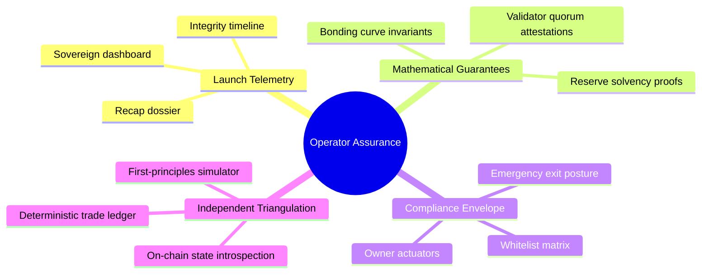
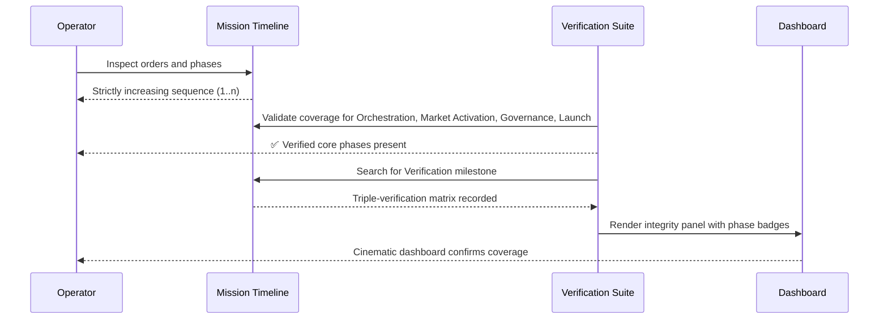
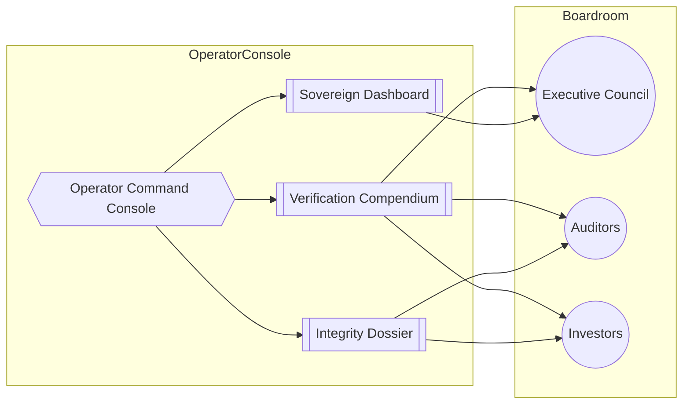

# α-AGI MARK Verification Compendium

*Empowering non-technical operators with a cinematic command of truth, trust, and telemetry.*

## Why this compendium exists

The α-AGI MARK demo already automates deployment, governance, and sovereign launch flows. This compendium distills the
triple-verification ecosystem into a playbook a non-technical operator can present to councils, auditors, or investors.
It is intentionally visual, redundant, and rigorous so that every stakeholder can trace how evidence is gathered,
triangulated, and notarised.

## Verification macrocosm



The orchestrator captures every signal into artefacts that a non-technical user can open in their browser. The
triangulation engine cross-references three independent perspectives so that no single ledger can be tampered with
without detection.

## Operator flow – five minute audit

1. `npm run demo:alpha-agi-mark` – generate the recap dossier and sovereign dashboard.
2. `npm run verify:alpha-agi-mark` – replay the trade ledger and recompute curve maths from first principles.
3. `npm run integrity:alpha-agi-mark` – assemble the confidence dossier ready for board review.
4. `npm run dashboard:alpha-agi-mark` *(optional)* – re-render the cinematic HTML dashboard from any recap snapshot.

These commands all run inside the demo directory and require no Solidity or DevOps knowledge. Every command prints a
confidence index and explains any mismatch, allowing a non-technical operator to intervene rapidly if a discrepancy ever
appears.

## Cross-check choreography

```mermaid
graph TD
  subgraph A[Primary Orchestrator]
    R{Recap JSON}
    T[Trade Ledger]
    O[Owner Parameter Matrix]
    TL[Timeline]
  end
  subgraph B[Independent Verifier]
    Z[Zod schema guards]
    S[Simulation Engine]
    C[Checksum Auditor]
    P[Phase Coverage Scanner]
  end
  R --> Z
  T --> S
  TL --> P
  O --> P
  Z --> C
  S --> C
  P --> C
  C -->|Confidence Index| D[Integrity Dossier]
  D -->|Confidence ≥ 99%?| Verdict{Auto-Signoff}
  Verdict -->|Yes| ✅[Stakeholder Sign-off]
  Verdict -->|No| 🛑[Operator Escalates]
```

The new **Phase Coverage Scanner** enforces that the mission timeline spans orchestration through launch and that a
verification milestone is documented. This protects against incomplete operator narratives sneaking through the review
process.

## Timeline integrity lenses



## Presenting to stakeholders



The compendium pairs with the existing Operator Command Console and Sovereign Dashboard. Together they let a single
operator hold the attention of a room full of executives and auditors, proving that AGI Jobs v0 (v2) gives them control
over a launch infrastructure that once required an entire engineering organisation.

## Further reading

- [Operator Empowerment Atlas](./operator-empowerment-atlas.md) – narrative visualisation of the launch journey.
- [Operator Command Console](./operator-command-console.md) – briefing materials and quadrant dashboards for governance
  meetings.
