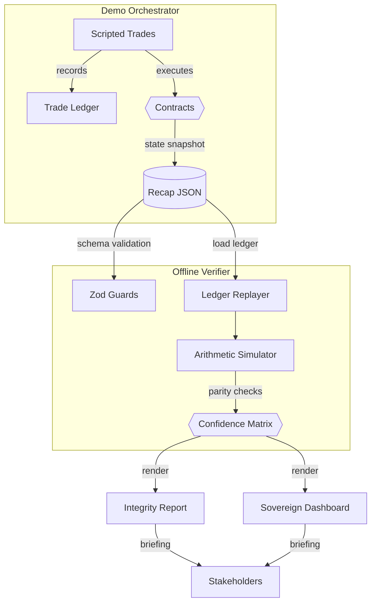

# α-AGI MARK Triple-Verification Matrix Deep Dive

AGI Jobs v0 (v2) does not merely script a happy-path demo.  It proves the
sovereign foresight exchange from three independent vantage points so a
non-technical operator can approve a launch with production-grade assurance.
This dossier dissects those perspectives, the maths behind them, and the
commands that keep the matrix permanently green.

## Perspectives

| Perspective | Data Source | Guarantee | Primary Artefact |
|-------------|-------------|-----------|------------------|
| On-chain introspection | Hardhat provider calls (`getCurveState`, `getOwnerControls`, `participantContribution`) | Confirms the deployed contracts expose the expected supply, reserve balance, and governance toggles. | `alpha-mark-recap.json` (`contracts`, `bondingCurve`, `ownerControls`) |
| Deterministic trade ledger | Every scripted `buyTokens` / `sellTokens` entry recorded in-memory during `runDemo.ts` | Ensures the scripted narrative matches the arithmetic series driving the bonding curve. Ledger never drifts negative. | `trades` array in `alpha-mark-recap.json` |
| First-principles simulator | Explicit arithmetic-series calculations (`calculatePurchaseCost`, `calculateSaleReturn`) and offline recomputation in `verifyRecap.ts` | Re-computes price/return trajectories without touching contract code, surfacing discrepancies instantly. | `verification` block + `npm run verify:alpha-agi-mark` output |

## Flow of Facts

The mermaid flow shows how a single command produces artefacts that can be
independently replayed, validated, and communicated to decision makers.

## Verification Commands

1. **Primary orchestration** – `npm run demo:alpha-agi-mark`
   - Emits the recap dossier and dashboard.
   - Prints the live triple-verification summary inside the console log.

2. **Deterministic re-check** – `npm run verify:alpha-agi-mark`
   - Replays `trades` and recomputes bonding-curve maths from scratch.
   - Fails fast if supply, pricing, capital flows, or contributions diverge.

3. **Integrity dossier** – `npm run integrity:alpha-agi-mark`
   - Generates a Markdown report with the verification table, owner command
deck, and a 100% confidence index requirement.

4. **Owner matrix spotlight** – `npm run owner:alpha-agi-mark`
   - Extracts the `ownerParameterMatrix` snapshot for governance sign-off.

5. **Unit test proof** – `npm run test:alpha-agi-mark`
   - Executes seventeen Hardhat tests covering bonding-curve math,
validator governance, compliance gates, ERC-20 mode, and emergency exits.

6. **CI v2 parity** – `npm run ci:verify-branch-protection`
   - Repository-level guardrail verifying that GitHub branch protection
requires the CI v2 fan-out used to ship this demo safely.

## Disproving Pathways

The matrix is intentionally adversarial:

- **Negative ledger drift** – any attempt to sell more tokens than bought
trips an invariant in `verifyRecap.ts` and aborts verification.
- **Manipulated pricing** – if contract pricing deviates from the arithmetic
series, both the inline `expectEqual` checks and the offline simulator fail.
- **Governance misconfiguration** – missing treasury, stale overrides, or
unapproved validators appear immediately in the recap and integrity tables.
- **Emergency pathways** – abort drills keep the reserve solvent, confirmed
by the ledger replayer’s reserve reconciliation against the vault receipts.

## Executive Checklist

- [ ] Recap dossier present and schema-valid.
- [ ] Triple-verification matrix shows `consistent: true` across all lanes.
- [ ] Integrity report confidence index reads `100%`.
- [ ] Owner parameter matrix reviewed (treasury, whitelist, overrides).
- [ ] Hardhat test suite green with 17 passing cases.
- [ ] CI v2 branch protection audit ✅.

Run this checklist after every dry run or live deployment to maintain the
platform’s "superintelligent" operational standard without touching Solidity.
