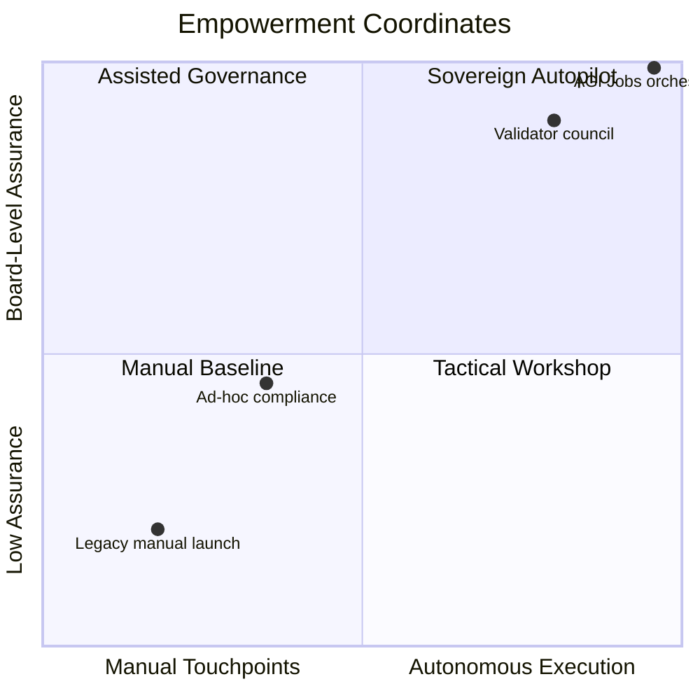
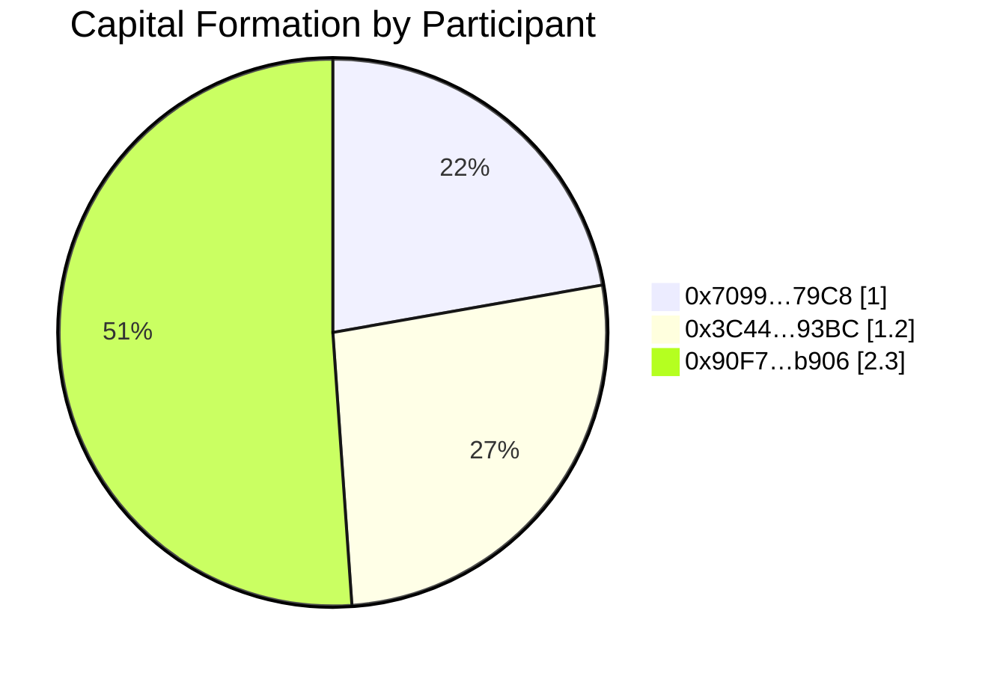
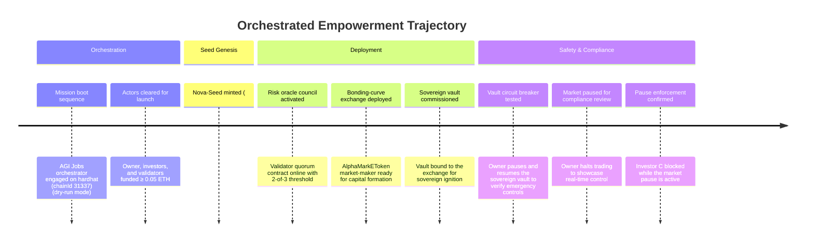

# α-AGI MARK Empowerment Pulse

Generated 2025-10-17T06:38:11.603Z on **hardhat (chainId 31337)** (hardhat, chainId 31337).

AGI Jobs orchestrated 22 mission events from 1 command, sustaining 100.00% confidence across 4/4 invariants.

## Mission Snapshot

- Orchestrator mode: **dry-run**
- Automation multiplier: **22.00×** (22 orchestrated actions from 1 command)
- Verification confidence: **100.00%** (4/4 checks · verdict PASS)
- Validator quorum: **2/2** approvals
- Capital formation: **3** participants · Gross **4.5 ETH** · Reserve **0 ETH**

## Autonomous Command Quadrant

## Capital Participation Map

## Orchestration Timeline

## Operator Command Deck

- Market paused: **Yes**
- Whitelist enforced: **Yes**
- Emergency exit: **Off**
- Validation override: **Inactive**
- Sale finalised: **Finalised**
- Sale aborted: **No**
- Base asset: **Native (ETH)**
- Sovereign treasury: `0xf39Fd6e51aad88F6F4ce6aB8827279cffFb92266`
- Active risk oracle: `0x9fE46736679d2D9a65F0992F2272dE9f3c7fa6e0`
- Highlighted actuators: `pauseMarket` · `whitelistEnabled` · `emergencyExitEnabled` · `validationOverrideEnabled`

## Participant Ledger

| Participant | Tokens | Contribution (ETH) |
| --- | ---: | ---: |
| 0x7099…79C8 | 5.0 | 1 |
| 0x3C44…93BC | 2.0 | 1.2 |
| 0x90F7…b906 | 4.0 | 2.3 |

---

The empowerment pulse evidences a sovereign-grade automation fabric: AGI Jobs v0 (v2) elevated a single operator into a
launch commander who steers validator governance, capital formation, and sovereign ignition without touching low-level
Solidity. This dossier exists so boards, auditors, and public stewards can witness that intelligence, assurance, and
governance fused into one artefact.
