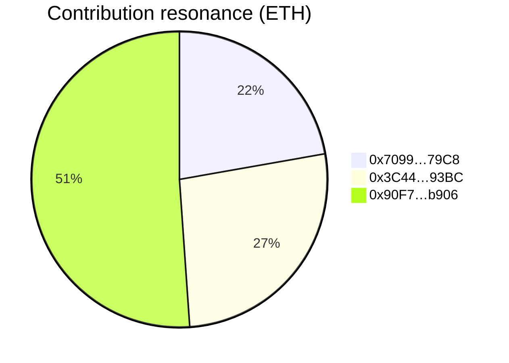

# α-AGI MARK Integrity Report

Generated: 2025-10-16T21:18:44.346Z

## Recap Envelope

- Network: hardhat (chainId 31337) (chain 31337, block 0)
- Dry-run mode: enabled
- Checksum (sha256/json-key-sorted): 03bed5b0e77f3148972204e0e07a1df196de416021d4114cd69ef9eb2221a6ab

### Orchestrator Telemetry

- Mode: dry-run
- Git commit: a4afab5557e2be3afa4dca6e9532732aa30ca080
- Git branch: work
- Workspace dirty: yes

### Actor Registry

- Owner: 0xf39Fd6e51aad88F6F4ce6aB8827279cffFb92266
- Investors: 0x70997970C51812dc3A010C7d01b50e0d17dc79C8, 0x3C44CdDdB6a900fa2b585dd299e03d12FA4293BC, 0x90F79bf6EB2c4f870365E785982E1f101E93b906
- Validators: 0x15d34AAf54267DB7D7c367839AAf71A00a2C6A65, 0x9965507D1a55bcC2695C58ba16FB37d819B0A4dc, 0x976EA74026E726554dB657fA54763abd0C3a0aa9

## Confidence Summary

- Confidence index: 100.00% (10/10 checks passed)
- Validator quorum: 2/2
- Ledger supply processed: 11 whole tokens
- Gross capital processed: 4500000000000000000 wei (4.5 ETH)
- Net capital secured in sovereign reserve: 3850000000000000000 wei (3.85 ETH)

| Check | Status | Expected | Observed |
|---|:---:|---|---|
| Ledger supply equals recorded supply | ✅ | 11 | 11 |
| Participant balances equal supply | ✅ | 11000000000000000000 | 11000000000000000000 |
| Next price matches base + slope * supply | ✅ | 650000000000000000 wei (0.65 ETH) | 650000000000000000 wei (0.65 ETH) |
| Vault receipts + reserve equal net capital | ✅ | 3850000000000000000 wei (3.85 ETH) | 3850000000000000000 wei (3.85 ETH) |
| Participant contributions equal gross capital | ✅ | 4500000000000000000 wei (4.5 ETH) | 4500000000000000000 wei (4.5 ETH) |
| Funding cap respected | ✅ | 1000000000000000000000 wei (1000.0 ETH) | 4500000000000000000 wei (4.5 ETH) |
| Embedded verification: supply | ✅ | - | - |
| Embedded verification: pricing | ✅ | - | - |
| Embedded verification: capital flows | ✅ | - | - |
| Embedded verification: contributions | ✅ | - | - |

## Participant Contribution Constellation

## Launch Telemetry

| Metric | Value |
|---|---|
| Supply | 11 SeedShares |
| Next price | 650000000000000000 wei (0.65 ETH) |
| Base price | 100000000000000000 wei (0.1 ETH) |
| Slope | 50000000000000000 wei (0.05 ETH) |
| Reserve balance | 0 wei (0.0 ETH) |
| Sovereign vault receipts | 3850000000000000000 wei (3.85 ETH) |
| Last acknowledged amount | 3850000000000000000 wei (3.85 ETH) |
| Vault balance | 3850000000000000000 wei (3.85 ETH) |
| Treasury address | 0xf39Fd6e51aad88F6F4ce6aB8827279cffFb92266 |
| Sovereign vault | ipfs://alpha-mark/sovereign/genesis |
| Sovereign metadata | α-AGI Sovereign ignition: Nova-Seed ascends |

## Owner Command Deck Snapshot

- ✅ Market paused
- ✅ Whitelist enforced
- ❌ Emergency exit armed
- ✅ Launch finalized
- ❌ Launch aborted
- ❌ Validation override enabled

### Control Parameters

| Parameter | Value |
|---|---|
| Funding cap | 1000.0 |
| Max supply | 100 SeedShares |
| Sale deadline | 0 |
| Treasury | 0xf39Fd6e51aad88F6F4ce6aB8827279cffFb92266 |
| Risk oracle | 0x9fE46736679d2D9a65F0992F2272dE9f3c7fa6e0 |
| Base asset | 0x0000000000000000000000000000000000000000 |
| Uses native asset | Yes (native ETH) |
| Base price (wei) | 100000000000000000 |
| Slope (wei) | 50000000000000000 |
