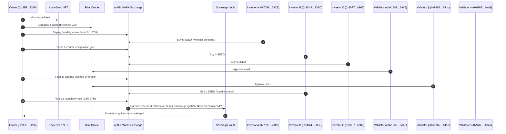
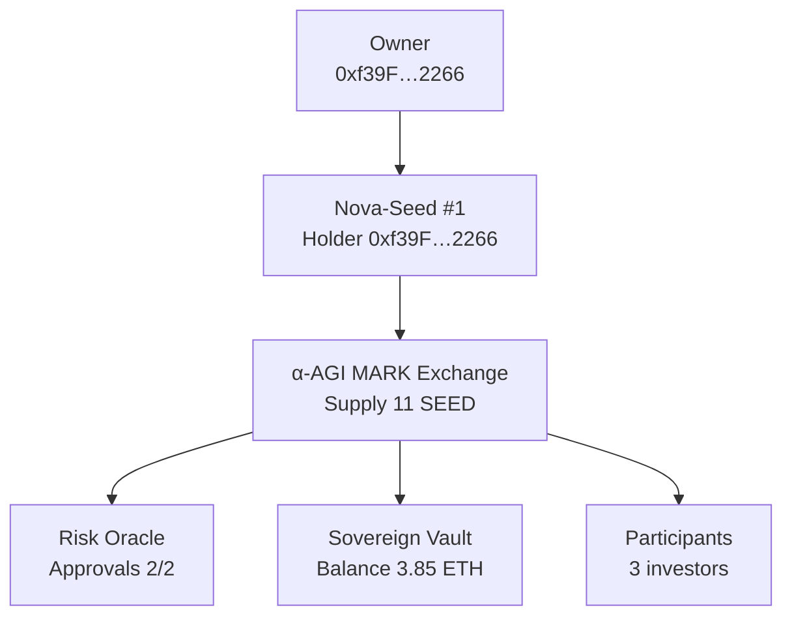

# α-AGI MARK Demo Recap

This dossier is generated automatically by the AGI Jobs v0 (v2) foresight orchestrator to give the operator a
mission-grade snapshot of the launch.

## Legendary Foresight Orchestration

## Sovereign Launch Snapshot
- **Nova-Seed**: Token #1 held by 0xf39F…2266
- **Validator approvals**: 2/2
- **Supply forged**: 11 SEED (next price 0.65 ETH)
- **Capital reserve**: 0.0 ETH committed pre-launch
- **Sovereign vault**: 3.85 ETH secured
- **Ignition metadata**: "α-AGI Sovereign ignition: Nova-Seed ascends"

## Owner Control Matrix
| Parameter | Value | Description |
| --- | --- | --- |
| pauseMarket | ✅ Enabled | Master halt switch for all bonding-curve trades |
| whitelistEnabled | ✅ Enabled | Compliance gate restricting participation to approved wallets |
| emergencyExitEnabled | ❌ Disabled | Allow redemptions while paused for orderly unwinding |
| validationOverrideEnabled | ❌ Disabled | Owner override switch for the risk oracle consensus |
| validationOverrideStatus | ❌ Disabled | Forced validation outcome when override is enabled |
| treasury | `0xf39Fd6e51aad88F6F4ce6aB8827279cffFb92266` | Address receiving proceeds on finalization |
| riskOracle | `0x9fE46736679d2D9a65F0992F2272dE9f3c7fa6e0` | Validator council contract controlling launch approvals |
| baseAsset | `0x0000000000000000000000000000000000000000` | Current financing currency (0x0 indicates native ETH) |
| fundingCapWei | 1000000000000000000000 | Upper bound on capital accepted before launch |
| maxSupplyWholeTokens | 100 | Maximum SeedShares that can ever be minted |
| saleDeadlineTimestamp | 0 | Timestamp after which purchases are rejected |
| basePriceWei | 100000000000000000 | Bonding curve base price component |
| slopeWei | 50000000000000000 | Bonding curve slope component |

## Participant Ledger
| Address | Balance | Contribution |
| --- | --- | --- |
| 0x7099…79C8 | 5.0 SEED | 1.0 ETH |
| 0x3C44…93BC | 2.0 SEED | 1.2 ETH |
| 0x90F7…b906 | 4.0 SEED | 2.3 ETH |

## Validator Council
- 0x15d3…6A65 — ✅ Approved
- 0x9965…A4dc — ✅ Approved
- 0x976E…0aa9 — ⌛ Pending

## Contract Addresses
| Component | Address |
| --- | --- |
| NovaSeedNFT | `0x5FbDB2315678afecb367f032d93F642f64180aa3` |
| Risk Oracle | `0x9fE46736679d2D9a65F0992F2272dE9f3c7fa6e0` |
| Bonding Curve Exchange | `0xCf7Ed3AccA5a467e9e704C703E8D87F634fB0Fc9` |
| Sovereign Vault | `0xDc64a140Aa3E981100a9becA4E685f962f0cF6C9` |

## Dynamic System Map

## Artifact Index
- JSON ledger: `reports/alpha-mark-recap.json`
- Markdown dossier: `reports/alpha-mark-recap.md`