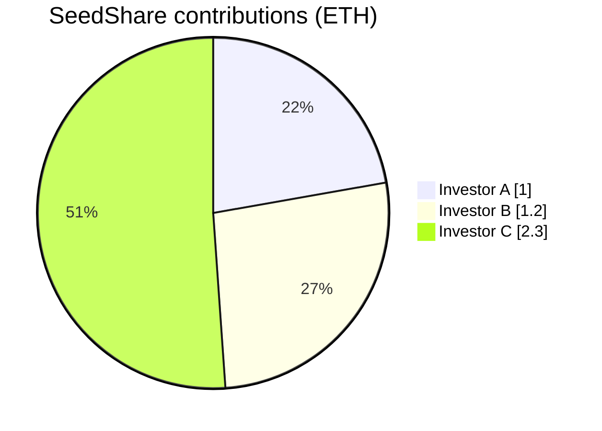
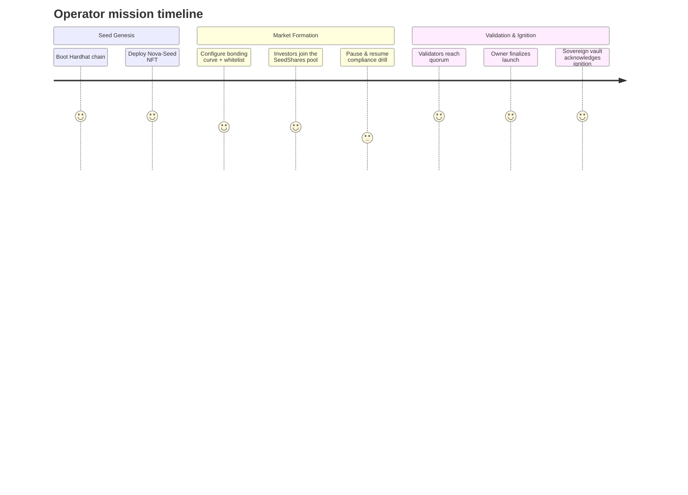

# α-AGI MARK Demo Recap

This dossier is generated automatically by the demo run so that a non-technical operator can audit every milestone of the foresight market ignition.

```mermaid
flowchart TD
    classDef operator fill:#302B70,stroke:#9A7FF2,color:#fff,stroke-width:2px;
    classDef contract fill:#0F4C75,stroke:#7FDBFF,color:#FFFFFF,stroke-width:1.5px;
    classDef action fill:#1B262C,stroke:#BBE1FA,color:#FFFFFF,stroke-width:1.5px;

    subgraph Operator[Operator -- guided by AGI Jobs v0 (v2)]
        Start[Run npm run demo:alpha-agi-mark]
    end

    subgraph Contracts[α-AGI MARK Foresight Stack]
        Seed[NovaSeedNFT\nGenesis seed minted]
        Oracle[AlphaMarkRiskOracle\nValidator quorum + overrides]
        Curve[AlphaMarkEToken\nBonding curve + compliance gates]
        Vault[AlphaSovereignVault\nIgnition manifest + treasury]
    end

    subgraph Dynamics[Market + Governance Dynamics]
        Investors[Investors acquire SeedShares]
        Validators[Validators approve seed]
        Finalize[Owner finalizes sovereign ignition]
        Recap[Recap dossier written for operator]
    end

    Start --> Seed --> Oracle --> Curve --> Investors --> Validators --> Finalize --> Vault
    Oracle -. Owner override .-> Finalize
    Curve -. Emergency exit .-> Investors
    Vault --> Recap

    class Start,Recap operator
    class Seed,Oracle,Curve,Vault contract
    class Investors,Validators,Finalize action
```

## Contracts

| Component | Address |
| --- | --- |
| NovaSeedNFT | 0x5FbDB2315678afecb367f032d93F642f64180aa3 |
| Risk Oracle | 0x9fE46736679d2D9a65F0992F2272dE9f3c7fa6e0 |
| AlphaMark Exchange | 0xCf7Ed3AccA5a467e9e704C703E8D87F634fB0Fc9 |
| Sovereign Vault | 0xDc64a140Aa3E981100a9becA4E685f962f0cF6C9 |

## Owner Control Dashboard

| Control | Status |
| --- | --- |
| Market paused | ✅ Enabled |
| Whitelist | ✅ Enabled |
| Emergency exit | ⬜ Disabled |
| Finalized | 🎯 Finalized |
| Aborted | 🟢 Active |
| Validation override | ⬜ Disabled |

**Treasury:** 0xf39Fd6e51aad88F6F4ce6aB8827279cffFb92266

**Base asset:** Native ETH

**Funding cap:** 1000.0 ETH

## Capital Formation Radar



| Participant | Address | SeedShares | Contribution (ETH) |
| --- | --- | --- | --- |
| Investor A | 0x70997970C51812dc3A010C7d01b50e0d17dc79C8 | 5.0 | 1.0 |
| Investor B | 0x3C44CdDdB6a900fa2b585dd299e03d12FA4293BC | 2.0 | 1.2 |
| Investor C | 0x90F79bf6EB2c4f870365E785982E1f101E93b906 | 4.0 | 2.3 |

## Validator Council

Approval threshold: 2 of 3

- Validator 1: 0x15d34AAf54267DB7D7c367839AAf71A00a2C6A65
- Validator 2: 0x9965507D1a55bcC2695C58ba16FB37d819B0A4dc
- Validator 3: 0x976EA74026E726554dB657fA54763abd0C3a0aa9

## Launch Telemetry

- Launch finalized: Yes
- Aborted: No
- Reserve transferred: 3.85 ETH
- Sovereign vault manifest: ipfs://alpha-mark/sovereign/genesis
- Ignition metadata: α-AGI Sovereign ignition: Nova-Seed ascends
- Vault balance: 3.85 ETH

