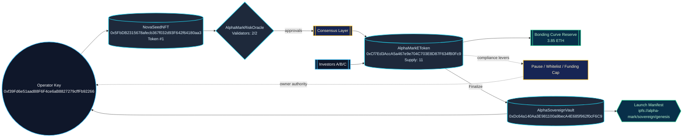

# α-AGI MARK Power Dossier

> Non-technical operators receive a sovereign-grade audit trail rendered directly from the AGI Jobs v0 (v2) run. The dossier fuses cryptoeconomic telemetry, validator consensus, and owner controls into a single launch brief.

## Hypergraph Overview

## System Snapshot

| Component | Address |
| --- | --- |
| NovaSeedNFT | 0x5FbDB2315678afecb367f032d93F642f64180aa3 |
| Risk Oracle | 0x9fE46736679d2D9a65F0992F2272dE9f3c7fa6e0 |
| Bonding Curve Exchange | 0xCf7Ed3AccA5a467e9e704C703E8D87F634fB0Fc9 |
| Sovereign Vault | 0xDc64a140Aa3E981100a9becA4E685f962f0cF6C9 |

## Owner Command Matrix

| Control Lever | Status | Details |
| --- | --- | --- |
| Market paused | ✅ | Exchange trading switch
| Whitelist enforced | ✅ | Compliance gate
| Emergency exit | ⬜️ | Enables redemptions during pauses
| Launch finalized | ✅ | Sale locked and reserves transferred
| Launch aborted | ⬜️ | Funds returned scenario
| Validation override | ⬜️ | Forced decision -> false
| Treasury address | ✅ | 0xf39Fd6e51aad88F6F4ce6aB8827279cffFb92266
| Base asset | ✅ | Native ETH
| Funding cap | ✅ | 1000 ETH
| Max supply | ✅ | 100 SeedShares
| Sale deadline | ✅ | —
| Curve base price | ✅ | 0.1 ETH
| Curve slope | ✅ | 0.05 ETH

## Validator Council Ledger

| # | Validator Address |
| --- | --- |
| 1 | 0x15d34AAf54267DB7D7c367839AAf71A00a2C6A65 |
| 2 | 0x9965507D1a55bcC2695C58ba16FB37d819B0A4dc |
| 3 | 0x976EA74026E726554dB657fA54763abd0C3a0aa9 |
| ✅ Consensus | 2/2 approvals |

## Participant Capitalization

| Investor | SeedShares | Contribution | Raw Wei |
| --- | ---: | ---: | --- |
| 0x70997970C51812dc3A010C7d01b50e0d17dc79C8 | 5.0 | 1 ETH | 1000000000000000000 |
| 0x3C44CdDdB6a900fa2b585dd299e03d12FA4293BC | 2.0 | 1.2 ETH | 1200000000000000000 |
| 0x90F79bf6EB2c4f870365E785982E1f101E93b906 | 4.0 | 2.3 ETH | 2300000000000000000 |

## Sovereign Vault State

| Field | Value |
| --- | --- |
| Manifest URI | ipfs://alpha-mark/sovereign/genesis |
| Vault balance | 3.85 ETH |
| Total received | 3.85 ETH |
| Last acknowledged amount | 3.85 ETH |
| Launch metadata | α-AGI Sovereign ignition: Nova-Seed ascends |

### Launch Verdict

- Finalized: ✅
- Aborted: ✅ No abort triggered (flag=false confirms sovereign ascent succeeded).
- Treasury receiving address: 0xf39Fd6e51aad88F6F4ce6aB8827279cffFb92266
- Sovereign vault manifest confirms ignition metadata: “α-AGI Sovereign ignition: Nova-Seed ascends”
- Bonding curve supply closed at 11 SeedShares with next price 0.65 ETH.

AGI Jobs v0 (v2) transforms the on-chain market choreography into a narrated briefing so the operator can execute audits, investor updates, or regulatory submissions without touching Solidity or CLI minutiae.
