# α-AGI MARK Risk Lattice Dossier

Generated: 2025-10-17T13:12:40.494Z

Network: **hardhat (chainId 31337)** · Owner: **0xf39Fd6e51aad88F6F4ce6aB8827279cffFb92266** · Investors orchestrated: **3** · Validators safeguarding: **3**

## Sovereign Control Deck

| Control | Status | Sovereign narrative |
| --- | --- | --- |
| Market pause | 🟢 Armed | Trading halted post-launch ensuring sovereign funds remain sealed. |
| Whitelist | 🟢 Locked | Participation restricted to owner-approved addresses, satisfying compliance mandates. |
| Emergency exit | ⚪ Dormant | Exit corridor dormant; owner can activate it in one transaction if risk materialises. |
| Oracle override | ⚪ Observer mode | Oracle consensus governs launch; override standing by for rapid intervention. |
| Sovereign vault | 🟢 Ignited | Launch finalised – 3850000000000000000 wei (3.85 ETH) secured for the α-AGI Sovereign vault. |
| Abort state | ⚪ Nominal | Launch nominal; abort switch unpulled but primed for immediate activation. |

## Mission Assurance Blueprint

```mermaid
mindmap
  root((α-AGI MARK\nRisk Lattice))
  Control Deck
    "🟢 Armed"
    "🟢 Locked"
    "⚪ Dormant"
    "⚪ Observer mode"
    "🟢 Ignited"
    "⚪ Nominal"
  Verification
    "🟢 Matrix aligned"
    "Confidence 100.00"
    "Verdict PASS"
  Capital Formation
    "11 SeedShares live"
    "0.0 ETH reserve"
    "Funding cap 1000.0 ETH"
    "Max supply 100 SeedShares"
```

```mermaid
flowchart TD
  classDef control fill:#1a1f4d,stroke:#60ffcf,color:#f6faff,stroke-width:2px;
  classDef signal fill:#173b3f,stroke:#42d7a1,color:#e9fff8,stroke-dasharray: 5 3;
  classDef assurance fill:#2f2445,stroke:#cfa9ff,color:#f8f4ff;

  Operator((Owner Command Deck)):::signal --> Pause{{🟢 Armed}}:::control
  Operator --> Whitelist{{🟢 Locked}}:::control
  Operator --> Exit{{⚪ Dormant}}:::control
  Operator --> Override{{⚪ Observer mode}}:::control
  Operator --> Sovereign{{🟢 Ignited}}:::control
  Operator --> Abort{{⚪ Nominal}}:::control
  VerificationMatrix[[Triple verification → 100.00]]:::assurance --> Sovereign
  ReservePower[[Reserve 0.0 ETH]]:::assurance --> Sovereign
  Sovereign -->|3.85 ETH delivered| Vault((α-AGI Sovereign Vault)):::signal
```



## Verification Signal

- Checks passed: **4/4** (100.00, verdict **PASS**)
- Reserve reconciliation: **0.0 ETH** live · Sovereign intake: **3.85 ETH**
- Next token price: **0.65 ETH** under bonding-curve discipline

### Empowerment Pulse

- **Tagline:** AGI Jobs orchestrated 22 mission events from 1 command, sustaining 100.00% confidence across 4/4 invariants.
- **Automation:** 22.00× multiplier (22 orchestrated actions from 1 command)
- **Assurance:** 100.00% confidence (4/4 checks · Validators 2/2)
- **Capital Formation:** 4.5 raised · Reserve 0.0
- **Control Highlights:** pauseMarket · whitelistEnabled · emergencyExitEnabled · validationOverrideEnabled

The α-AGI MARK lattice confirms that every actuator, ledger, and sovereign vault signal is aligned. A non-technical operator reads this single dossier to verify that the command deck is primed, the reserves are solvent, and the verification matrix is locked green — a tangible proof that AGI Jobs v0 (v2) places superintelligent market control directly into human hands.