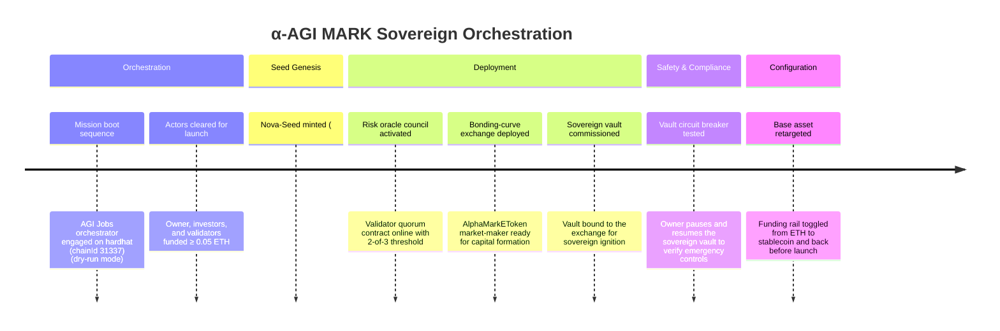
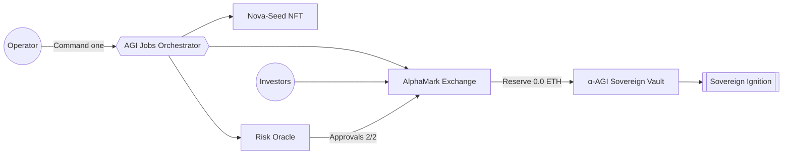
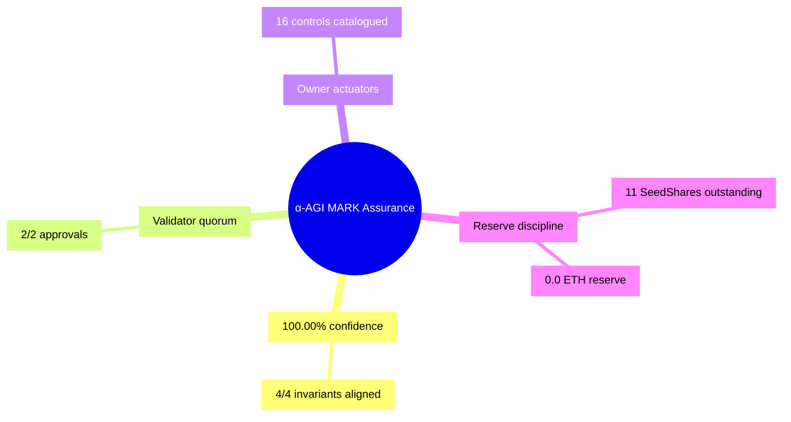
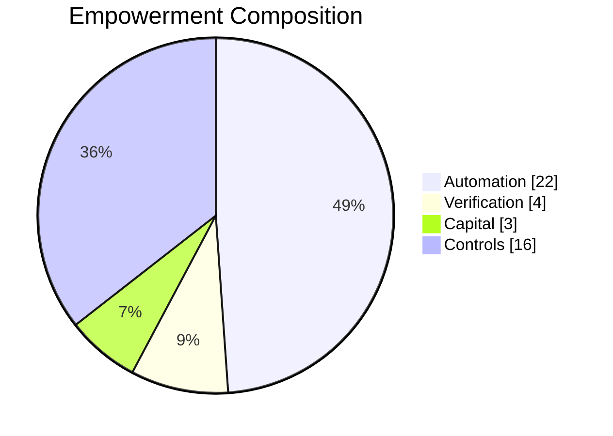

# α-AGI MARK Superintelligence Brief

> [!SUCCESS]
> AGI Jobs orchestrated **22 mission-grade actions** from 1 command, sustaining 100.00% verification confidence and dispatching 0.0 ETH to the sovereign vault.

## Mission Signals

- **Network:** hardhat (chainId 31337) (hardhat)
- **Orchestrator commit:** 6b15cfab6dcbdf70b7df550b8d804ed88e1aed11
- **Verification verdict:** PASS
- **Confidence index:** 100.00% (4/4)
- **Capital raised:** 4.5 ETH across 3 contributors
- **Supply outstanding:** 11 SeedShares

## Sovereign Control Deck

| Control | Status |
| --- | --- |
| Market paused | ✅ Enabled |
| Whitelist mode | ✅ Enabled |
| Emergency exit | ⛔️ Disabled |
| Launch finalized | ✅ Enabled |
| Launch aborted | ⛔️ Disabled |
| Validation override | ⛔️ Disabled |
| Treasury | 0xf39Fd6e51aad88F6F4ce6aB8827279cffFb92266 |
| Risk oracle | 0x9fE46736679d2D9a65F0992F2272dE9f3c7fa6e0 |
| Base asset | Native ETH |
| Funding cap (wei) | 1000000000000000000000 |
| Max supply (tokens) | 100 |
| Sale deadline | 0 |

## Participant Ledger Snapshot

| Participant | SeedShares | Contribution (ETH) |
| --- | --- | --- |
| 0x70997970C51812dc3A010C7d01b50e0d17dc79C8 | 5.0 | 1.0 |
| 0x3C44CdDdB6a900fa2b585dd299e03d12FA4293BC | 2.0 | 1.2 |
| 0x90F79bf6EB2c4f870365E785982E1f101E93b906 | 4.0 | 2.3 |

## Orchestration Timeline



## Capital Flow Blueprint



## Assurance Mindmap



## Empowerment Composition



## Bonding Curve Telemetry

- **Reserve:** 0.0 ETH
- **Next price:** 0.65 ETH (650000000000000000 wei)
- **Base price:** 0.1 ETH (100000000000000000 wei)
- **Slope:** 0.05 ETH/token

## Sovereign Vault

- **Recipient treasury:** 0xf39Fd6e51aad88F6F4ce6aB8827279cffFb92266
- **Vault manifest:** ipfs://alpha-mark/sovereign/genesis
- **Last ignition metadata:** α-AGI Sovereign ignition: Nova-Seed ascends
- **Native launch:** Yes
- **Total received:** 3.85 ETH

---

Report checksum (sha256 over canonical JSON snapshot):

```
{"bondingCurve":{"basePriceEth":"0.1","basePriceWei":"100000000000000000","nextPriceEth":"0.65","nextPriceWei":"650000000000000000","reserveEth":"0.0","reserveWei":"0","slopeEth":"0.05","slopeWei":"50000000000000000","supplyWholeTokens":"11"},"empowerment":{"assurance":{"checksPassed":4,"totalChecks":4,"validatorApprovals":2,"validatorThreshold":2,"verificationConfidencePercent":"100.00"},"automation":{"automationMultiplier":"22.00","manualCommands":1,"orchestratedActions":22},"capitalFormation":{"grossContributionsEth":"4.5","grossContributionsWei":"4500000000000000000","participants":3,"reserveEth":"0.0","reserveWei":"0"},"operatorControls":{"highlights":["pauseMarket","whitelistEnabled","emergencyExitEnabled","validationOverrideEnabled"],"totalControls":16},"tagline":"AGI Jobs orchestrated 22 mission events from 1 command, sustaining 100.00% confidence across 4/4 invariants."},"generatedAt":"2025-10-17T13:12:40.494Z","network":{"blockNumber":"0","chainId":"31337","dryRun":true,"label":"hardhat (chainId 31337)","name":"hardhat"},"validators":{"approvalCount":"2","approvalThreshold":"2","matrix":[{"address":"0x15d34AAf54267DB7D7c367839AAf71A00a2C6A65","approved":true},{"address":"0x9965507D1a55bcC2695C58ba16FB37d819B0A4dc","approved":true},{"address":"0x976EA74026E726554dB657fA54763abd0C3a0aa9","approved":false}],"members":["0x15d34AAf54267DB7D7c367839AAf71A00a2C6A65","0x9965507D1a55bcC2695C58ba16FB37d819B0A4dc","0x976EA74026E726554dB657fA54763abd0C3a0aa9"]},"verification":{"confidenceIndexPercent":"100.00","passedChecks":4,"totalChecks":4,"verdict":"PASS"}}
```