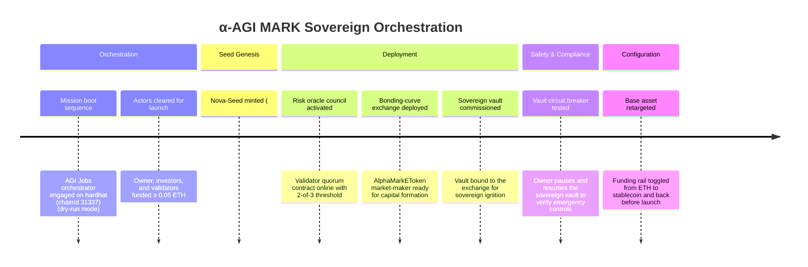
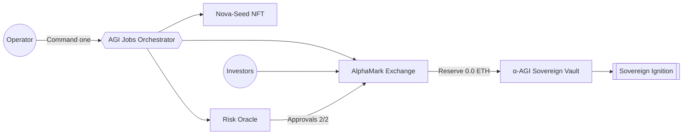
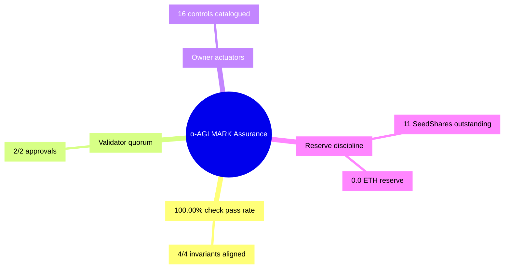
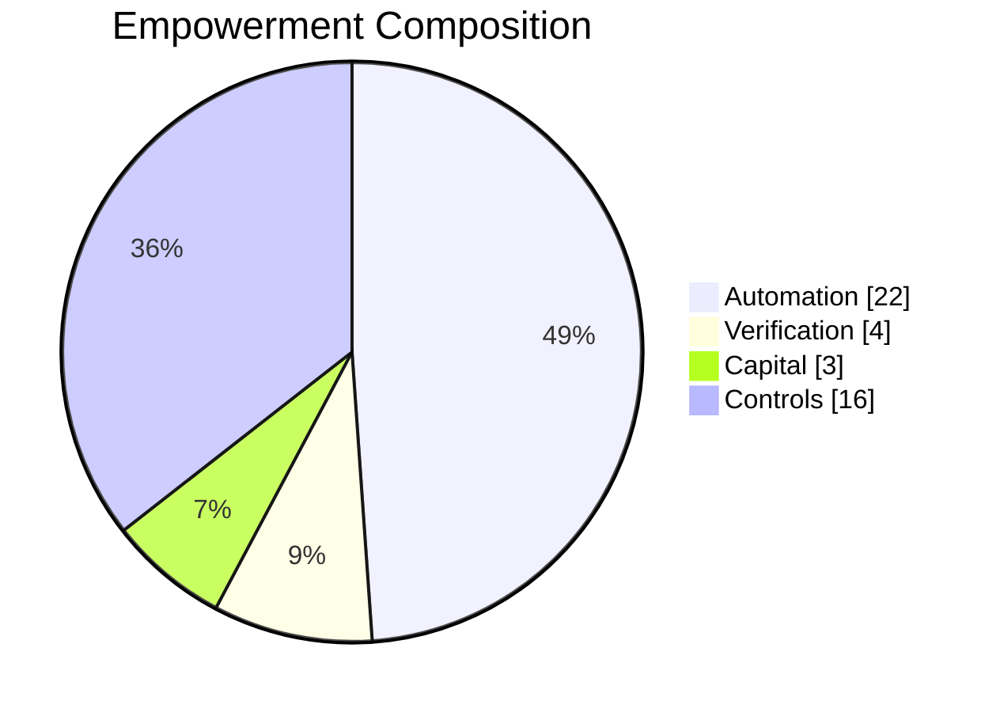

# α-AGI MARK Superintelligence Brief

> [!SUCCESS]
> AGI Jobs orchestrated **22 mission-grade actions** from 1 command, sustaining 100.00% local check pass rate and dispatching 3.85 ETH to the sovereign vault.

Scope: scripted financial-demo evidence. This brief does not demonstrate superintelligence, independent review, live buyer value, or production qualification.

## Mission Signals

- **Network:** hardhat (chainId 31337) (hardhat)
- **Orchestrator commit:** faf0fb1581244845dc7fea7125ef62b57596c628
- **Verification verdict:** PASS
- **Check pass rate:** 100.00% (4/4)
- **Capital raised:** 4.5 ETH across 3 contributors
- **Supply outstanding:** 11 SeedShares

## Sovereign Control Deck

| Control | Status |
| --- | --- |
| Market paused | ✅ Enabled |
| Whitelist mode | ✅ Enabled |
| Emergency exit | ⛔️ Disabled |
| Launch finalized | ✅ Enabled |
| Launch aborted | ⛔️ Disabled |
| Validation override | ⛔️ Disabled |
| Treasury | 0xf39Fd6e51aad88F6F4ce6aB8827279cffFb92266 |
| Risk oracle | 0x9fE46736679d2D9a65F0992F2272dE9f3c7fa6e0 |
| Base asset | Native ETH |
| Funding cap (wei) | 1000000000000000000000 |
| Max supply (tokens) | 100 |
| Sale deadline | 0 |

## Participant Ledger Snapshot

| Participant | SeedShares | Contribution (ETH) |
| --- | --- | --- |
| 0x70997970C51812dc3A010C7d01b50e0d17dc79C8 | 5.0 | 1.0 |
| 0x3C44CdDdB6a900fa2b585dd299e03d12FA4293BC | 2.0 | 1.2 |
| 0x90F79bf6EB2c4f870365E785982E1f101E93b906 | 4.0 | 2.3 |

## Orchestration Timeline


```mermaid
timeline
    title α-AGI MARK Sovereign Orchestration
    section Orchestration
      Mission boot sequence : AGI Jobs orchestrator engaged on hardhat (chainId 31337) (dry-run mode)
      Actors cleared for launch : Owner, investors, and validators funded ≥ 0.05 ETH
    section Seed Genesis
      Nova-Seed minted (#1) : Operator forges the foresight seed NFT underpinning the launch
    section Deployment
      Risk oracle council activated : Validator quorum contract online with 2-of-3 threshold
      Bonding-curve exchange deployed : AlphaMarkEToken market-maker ready for capital formation
      Sovereign vault commissioned : Vault bound to the exchange for sovereign ignition
    section Safety & Compliance
      Vault circuit breaker tested : Owner pauses and resumes the sovereign vault to verify emergency controls
    section Configuration
      Base asset retargeted : Funding rail toggled from ETH to stablecoin and back before launch
```

## Capital Flow Blueprint


```mermaid
flowchart LR
    Operator((Operator)) -->|Command one| Orchestrator{{AGI Jobs Orchestrator}}
    Orchestrator --> NovaSeed[Nova-Seed NFT]
    Orchestrator --> Exchange[AlphaMark Exchange]
    Orchestrator --> Oracle[Risk Oracle]
    Investors((Investors)) --> Exchange
    Oracle -->|Approvals 2/2| Exchange
    Exchange -->|Reserve 0.0 ETH| Vault[α-AGI Sovereign Vault]
    Vault --> Sovereign[[Sovereign Ignition]]
```

## Assurance Mindmap


```mermaid
mindmap
  root((α-AGI MARK Assurance))
    Confidence[100.00% check pass rate]
      Checks[4/4 invariants aligned]
    Validation[Validator quorum]
      Approvals[2/2 approvals]
    Controls[Owner actuators]
      Matrix[16 controls catalogued]
    Capital[Reserve discipline]
      Supply[11 SeedShares outstanding]
      ReserveBalance[0.0 ETH reserve]
```

## Empowerment Composition


```mermaid
pie showData
    title Empowerment Composition
    "Automation" : 22
    "Verification" : 4
    "Capital" : 3
    "Controls" : 16
```

## Bonding Curve Telemetry

- **Reserve:** 0.0 ETH
- **Next price:** 0.65 ETH (650000000000000000 wei)
- **Base price:** 0.1 ETH (100000000000000000 wei)
- **Slope:** 0.05 ETH/token

## Sovereign Vault

- **Recipient treasury:** 0xf39Fd6e51aad88F6F4ce6aB8827279cffFb92266
- **Vault manifest:** ipfs://alpha-mark/sovereign/genesis
- **Last ignition metadata:** α-AGI Sovereign ignition: Nova-Seed ascends
- **Native launch:** Yes
- **Total received:** 3.85 ETH

---

Report checksum (sha256 over canonical JSON snapshot):

```
aacce22694f771091f762799c3ea481127dbb31843616255f87767484d0d47ab
```