# α-AGI MARK Mission Timeline

Generated 2025-10-16T22:28:58.620Z on hardhat (chainId 31337).

- **Orchestrator mode:** dry-run
- **Commit:** c7f11d9aec96ad3de7103c89aaa8f517bbc9040c
- **Branch:** work

## Cinematic Timeline

```mermaid
timeline
    title α-AGI MARK Mission Timeline
    section Orchestration
      🚀 Mission boot sequence : AGI Jobs orchestrator engaged on hardhat (chainId 31337) (dry-run mode)
      💠 Actors cleared for launch : Owner, investors, and validators funded ≥ 0.05 ETH
    section Seed Genesis
      🌱 Nova-Seed minted (#1) (Owner) : Operator forges the foresight seed NFT underpinning the launch
    section Deployment
      🛡️ Risk oracle council activated (Owner) : Validator quorum contract online with 2-of-3 threshold
      🏛️ Bonding-curve exchange deployed (Owner) : AlphaMarkEToken market-maker ready for capital formation
      👑 Sovereign vault commissioned (Owner) : Vault bound to the exchange for sovereign ignition
    section Safety & Compliance
      🛡️ Vault circuit breaker tested (Owner) : Owner pauses and resumes the sovereign vault to verify emergency controls
    section Configuration
      🪙 Base asset retargeted (Owner) : Funding rail toggled from ETH to stablecoin and back before launch
      🛠️ Owner governance levers calibrated (Owner) : Treasury, funding cap, and whitelist configured for sovereign launch
    section Market Activation
      🟢 Investor A acquires 5 SeedShares (Investor A) : 1.0 ETH committed to the reserve
    section Safety & Compliance
      ⏸️ Market paused for compliance review (Owner) : Owner halts trading to showcase real-time control
      🛑 Pause enforcement confirmed (Investor C) : Investor C blocked while the market pause is active
      ▶️ Market resumed (Owner) : Owner reopens trading after compliance check
    section Market Activation
      🟢 Investor B acquires 3 SeedShares (Investor B) : 1.2 ETH committed to the reserve
      🟢 Investor C acquires 4 SeedShares (Investor C) : 2.3 ETH committed to the reserve
    section Governance
      🗳️ Validator A casts approval (Validator A) : Consensus progress\: 1/3
      ⚖️ Launch guard rejected premature finalize (Owner) : Owner cannot finalize before oracle quorum
      🗳️ Validator B casts approval (Validator B) : Consensus secured (2/2)
    section Liquidity
      🔄 Investor B redeems 1 SeedShares (Investor B) : 0.65 ETH released from the reserve
    section Launch
      ✨ Sovereign ignition finalized (Owner) : Funds transferred to the vault with ignition metadata recorded
    section Verification
      ✅ Triple-verification matrix aligned : Ledger, simulation, and on-chain state reconcile 1\:1
    section Mission Control
      🧾 Recap dossier synthesis : Preparing sovereign dashboard, owner matrix, and recap digest
```

## Event Ledger

| # | Phase | Event | Details | Actor |
|:-:|:------|:------|:--------|:------|
| 1 | Orchestration | 🚀 Mission boot sequence | AGI Jobs orchestrator engaged on hardhat (chainId 31337) (dry-run mode) | — |
| 2 | Orchestration | 💠 Actors cleared for launch | Owner, investors, and validators funded ≥ 0.05 ETH | — |
| 3 | Seed Genesis | 🌱 Nova-Seed minted (#1) | Operator forges the foresight seed NFT underpinning the launch | Owner |
| 4 | Deployment | 🛡️ Risk oracle council activated | Validator quorum contract online with 2-of-3 threshold | Owner |
| 5 | Deployment | 🏛️ Bonding-curve exchange deployed | AlphaMarkEToken market-maker ready for capital formation | Owner |
| 6 | Deployment | 👑 Sovereign vault commissioned | Vault bound to the exchange for sovereign ignition | Owner |
| 7 | Safety & Compliance | 🛡️ Vault circuit breaker tested | Owner pauses and resumes the sovereign vault to verify emergency controls | Owner |
| 8 | Configuration | 🪙 Base asset retargeted | Funding rail toggled from ETH to stablecoin and back before launch | Owner |
| 9 | Configuration | 🛠️ Owner governance levers calibrated | Treasury, funding cap, and whitelist configured for sovereign launch | Owner |
| 10 | Market Activation | 🟢 Investor A acquires 5 SeedShares | 1.0 ETH committed to the reserve | Investor A |
| 11 | Safety & Compliance | ⏸️ Market paused for compliance review | Owner halts trading to showcase real-time control | Owner |
| 12 | Safety & Compliance | 🛑 Pause enforcement confirmed | Investor C blocked while the market pause is active | Investor C |
| 13 | Safety & Compliance | ▶️ Market resumed | Owner reopens trading after compliance check | Owner |
| 14 | Market Activation | 🟢 Investor B acquires 3 SeedShares | 1.2 ETH committed to the reserve | Investor B |
| 15 | Market Activation | 🟢 Investor C acquires 4 SeedShares | 2.3 ETH committed to the reserve | Investor C |
| 16 | Governance | 🗳️ Validator A casts approval | Consensus progress: 1/3 | Validator A |
| 17 | Governance | ⚖️ Launch guard rejected premature finalize | Owner cannot finalize before oracle quorum | Owner |
| 18 | Governance | 🗳️ Validator B casts approval | Consensus secured (2/2) | Validator B |
| 19 | Liquidity | 🔄 Investor B redeems 1 SeedShares | 0.65 ETH released from the reserve | Investor B |
| 20 | Launch | ✨ Sovereign ignition finalized | Funds transferred to the vault with ignition metadata recorded | Owner |
| 21 | Verification | ✅ Triple-verification matrix aligned | Ledger, simulation, and on-chain state reconcile 1:1 | — |
| 22 | Mission Control | 🧾 Recap dossier synthesis | Preparing sovereign dashboard, owner matrix, and recap digest | — |
