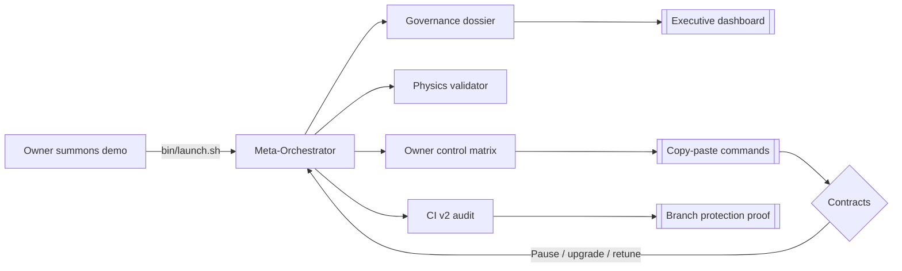

# 🎖️ Meta-Agentic α‑Field Omnidominion Demo

The **alpha-meta** showcase turns AGI Jobs v0 (v2) into a civilisation-scale command deck for non-technical owners. It layers the production-grade governance dossier generator, CI v2 shield verification, and owner automation drills into a single grandiose ritual that proves the platform delivers a superintelligent labour field entirely under owner control.

## Pillars



- **Superintelligent orchestration** – the orchestrator reuses the battle-tested `demo/agi-governance` engine with an alpha-meta mission manifest that encodes thermodynamics, Hamiltonian invariants, antifragility curvature, quantum governance tolerances, and mandatory CI protections.
- **Owner supremacy** – outputs include JSON + Markdown matrices listing every pause, resume, upgrade, treasury, sentinel, compliance, and deployment lever with ready-to-run CLI snippets. No capability is outside the owner’s reach.
- **CI v2 parity** – the run verifies the five mandatory GitHub checks (lint, tests, Foundry, coverage, CI summary) and fails loudly if the repository drifts from the protected pipeline.
- **Audit-ready artefacts** – deterministic Markdown dossier, HTML dashboard (with Mermaid rendered live), JSON summaries, and validation reports land in `demo/alpha-meta/reports/alpha-meta/` with SHA-stable filenames for evidence.

## One-command launch

```bash
# from repository root
./demo/alpha-meta/bin/launch.sh
```

The shell wrapper simply invokes:

```bash
npm run demo:alpha-meta
```

All artefacts route to `demo/alpha-meta/reports/alpha-meta/` by default. Pass custom destinations via:

```bash
npm run demo:alpha-meta -- --report-dir /tmp/alpha-meta --mission ./my-mission.json
```

## Outputs

- `alpha-meta-governance-report.md` – cinematic mission dossier describing thermodynamics, game-theoretic equilibrium, antifragility curvature, risk lattice, and owner supremacy metrics in natural language.
- `alpha-meta-dashboard.html` – standalone, executive-ready control room with Mermaid diagrams and interactive tooltips.
- `alpha-meta-summary.json` – machine-readable metrics for downstream automation.
- `alpha-meta-owner-diagnostics.*` – captures the results of `owner:audit-hamiltonian`, `reward-engine:report`, `owner:upgrade-status`, and `owner:compliance-report`.
- `alpha-meta-ci.json` – confirmation that CI v2 guards remain enforced (branch protection + workflow parity).
- `alpha-meta-validation.*` – independent recomputation of thermodynamic and equilibrium calculations.

## Empowered owner workflow

1. **Launch demo** – run `bin/launch.sh` or `npm run demo:alpha-meta`.
2. **Review dossier** – open `alpha-meta-dashboard.html` in a browser for grandiose flowcharts of energy → governance → quantum fields.
3. **Execute control drills** – copy-paste commands from the owner matrix (pause/unpause, thermostat retune, reward curve adjustments, sentinel rotations).
4. **Verify CI shield** – inspect `alpha-meta-ci.json`; it must list the five required jobs as enforced. Run `npm run ci:verify-branch-protection` for live confirmation.
5. **Archive evidence** – ship the Markdown + JSON bundle to auditors; hashes are deterministic so repeated runs remain comparable.

## Key scripts reused from AGI Jobs v0 (v2)

- `demo/agi-governance/scripts/runFullDemo.ts` – orchestrates dossier creation, validation, CI inspection, and owner automation.
- `demo/agi-governance/scripts/validateReport.ts` – recomputes all physics metrics to guarantee determinism.
- `demo/agi-governance/scripts/verifyCiStatus.ts` – reads workflow definitions and branch protection APIs to ensure CI v2 remains locked.
- `scripts/v2/*` owner utilities – invoked automatically to prove the owner can pause, retune, and upgrade every module.

> **Guarantee:** the alpha-meta demo never introduces bespoke contracts. It composes the production toolchain exactly as a mainnet deployment would, letting a visionary owner exercise total control without writing a single line of code.
