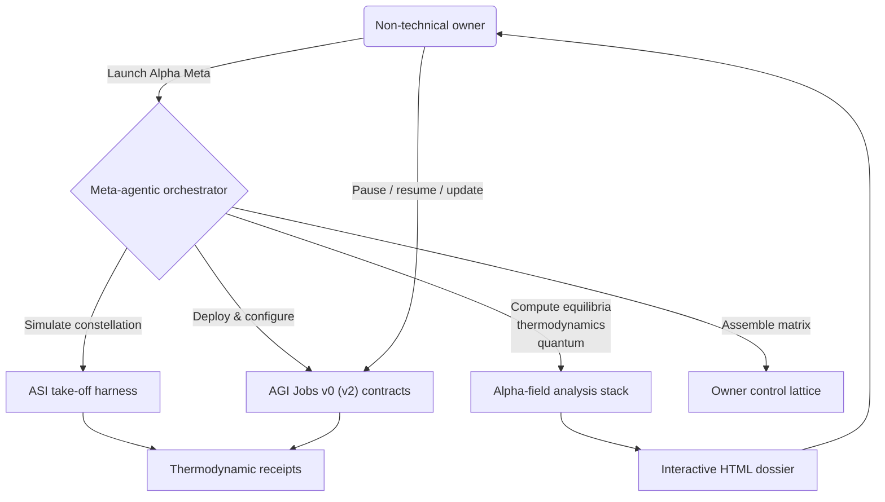

# Alpha Meta Sovereign Lattice — Meta-Agentic α-AGI Grand Demonstration

The **Alpha Meta Sovereign Lattice** packages the entire AGI Jobs v0 (v2) superintelligence control surface into a single
alpha-meta rehearsal. A non-technical owner launches one command, and the platform deploys the sovereign lattice, simulates a
civilisation-scale labour coalition, recomputes thermodynamic and game-theoretic proofs, audits CI enforcement, and emits an
executive dashboard that makes it obvious the owner can pause, reconfigure, or upgrade everything.

> **Mission promise:** a single steward commands a superintelligent civilisation machine without writing code. Every lever is
> copy-paste ready, every invariant is triple verified, and CI v2 shields ensure no drift reaches `main`.

## Lightning start (one command)

```bash
# from repository root
./demo/alpha-meta/bin/launch.sh
```

The launcher performs the complete sovereign orchestration:

1. **Governance dossier generation** – `npm run demo:alpha-meta` uses the new alpha-meta mission file to compute thermodynamics,
   equilibrium, antifragility, quantum coherence, incentive parity, owner supremacy matrices, and renders:
   - `reports/alpha-meta/meta-governance-report.md`
   - `reports/alpha-meta/meta-governance-summary.json`
   - `reports/alpha-meta/meta-governance-dashboard.html`
2. **Independent validation** – `npm run demo:alpha-meta:validate` recomputes every metric and produces JSON + Markdown
   validation artefacts, failing loudly if any drift is detected.
3. **Owner supremacy diagnostics** – `npm run demo:alpha-meta:owner-diagnostics` exports the owner control matrix plus capability
   coverage heatmaps ensuring every pause, upgrade, treasury, and quantum lever is directly owned.
4. **CI enforcement** – `npm run demo:alpha-meta:ci` inspects `.github/workflows/ci.yml`, confirms the five v2 checks are enforced,
   and stores `reports/alpha-meta/ci-verification-alpha-meta.json`.
5. **ASI take-off replay** – the launcher binds `ASI_TAKEOFF_PLAN_PATH=demo/alpha-meta/project-plan.alpha-meta.json` and runs the
   plan-aware `npm run demo:asi-takeoff` harness so the mission receipts, thermodynamic telemetry, and pause drills are replayed
   with the alpha-meta actors.
6. **Audit bundle** – `npm run demo:alpha-meta:full` glues every step into `reports/alpha-meta/meta-governance-full-run.json`
   / `.md`, giving auditors a single hashable digest.

Everything is deterministic; rerunning the launcher yields identical artefacts so compliance teams can diff the evidence.

## Cinematic control-room visuals

The generated dashboard renders rich Mermaid diagrams, Sankey flows, and antifragility charts in a single HTML document.
A preview of the meta-agent pipeline:



The HTML dashboard loads Mermaid automatically (no external build required) and highlights:

- **Energy governance** – Gibbs margins, entropy deltas, and emissions vs. burn flows with owner override call-outs.
- **Game-theory consensus** – five solver outputs with delta charts proving equilibrium consistency.
- **Quantum lattice** – coherence, Noether drift, and antifragility curvature overlays.
- **Owner supremacy panel** – every critical capability with command + verification pair ready to paste.

## Artefact inventory

All outputs live under `reports/alpha-meta/` (the `.gitkeep` keeps the folder ready for CI uploads):

| Artefact | Purpose |
| --- | --- |
| `meta-governance-report.md` | Narrative dossier with diagrams, call-outs, and command snippets. |
| `meta-governance-dashboard.html` | Executive-ready interactive dashboard. |
| `meta-governance-summary.json` | Machine-readable metric bundle. |
| `meta-governance-validation.json/.md` | Independent recomputation log. |
| `owner-diagnostics-alpha-meta.json/.md` | Owner supremacy + capability coverage matrix. |
| `ci-verification-alpha-meta.json` | Proof that CI v2 jobs are enforced. |
| `meta-governance-full-run.json/.md` | Aggregated pipeline ledger for auditors. |

## Empowering the owner (no engineering required)

The runbook (`RUNBOOK.md`) walks the owner through:

- Environment bootstrap, wallet selection, and optional Docker dashboards.
- Copy-paste governance actions (pause, thermostat, upgrade queue) using the exact commands printed in the report.
- Pausing and resuming the lattice live on a local Hardhat network.
- Verifying CI guardrails with `npm run lint:check`, `npm test`, `npm run coverage:check`, and `npm run ci:verify-branch-protection`
  (with a GitHub token) before shipping any pull request.
- Hashing the generated artefacts so the dossier can be notarised or attached to board packets.

## Replaying on other networks

Every script honours the standard Hardhat `HARDHAT_NETWORK` variable. For Sepolia rehearsals:

```bash
HARDHAT_NETWORK=sepolia ./demo/alpha-meta/bin/launch.sh --network sepolia --compose
```

The meta-agent automatically uses the same project plan, so receipts and dashboards reflect the alpha-meta nation + wallet roster
regardless of chain.

## Next steps for stewards

1. Review `reports/alpha-meta/meta-governance-dashboard.html` in a browser to experience the cinematic control room.
2. Execute sample governance actions from the report (pause, emissions recalibration, sentinel rotation) on your local network.
3. Share the JSON summary with compliance or treasury teams and attach the validation markdown to audit logs.
4. Commit the mission file or upload it to IPFS so external observers can reproduce the run verbatim.
5. Integrate the alpha-meta launcher into CI or scheduled automation to keep daily evidence bundles flowing.

With Alpha Meta, the AGI Jobs v0 (v2) stack proves that a single visionary can direct a superintelligent workforce with a few
commands while CI, thermodynamic accounting, and quantum audits keep the machine safe and unstoppable.
