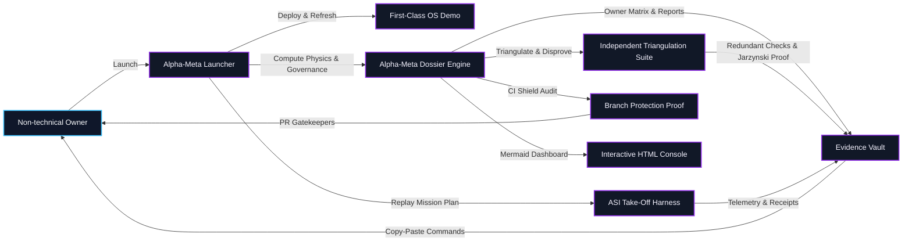
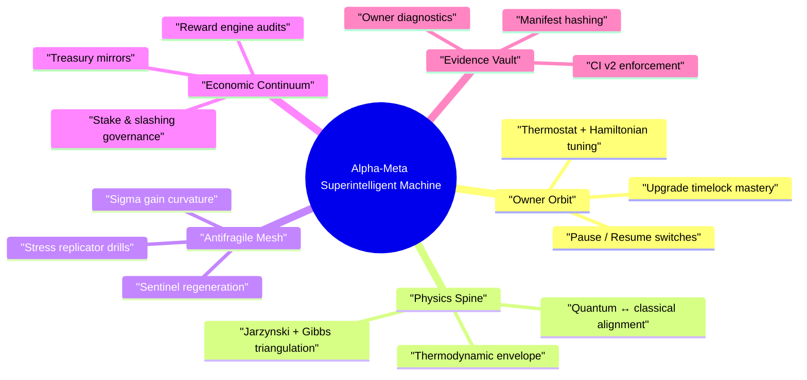

# Alpha-Meta Meta-Agentic α-AGI Sovereign Demonstration

The **Alpha-Meta Sovereign Hypergraph** packages the most ambitious AGI Jobs v0 (v2) rehearsal into a single, non-technical friendly showcase. A single launch script deploys the first-class operating system demo, replays the ASI take-off harness with the alpha-meta mission plan, and generates a governance dossier that proves:

- **Meta-agentic orchestration** – an upper-tier agent coordinates deployment, thermodynamics, antifragility, game theory, quantum coherence, and blockchain levers across subordinate AGI swarms.
- **Owner supremacy by design** – every pause switch, thermostat dial, treasury mirror, upgrade queue, and compliance beacon is surfaced through copy-paste commands and audited by the generated owner control matrix.
- **CI parity and auditability** – the run emits CI verification, validation, and owner diagnostic artefacts identical to the mandatory v2 GitHub Actions shield. If any guard drifts, the demo fails loudly.
- **Triple triangulation** – an independent solver suite replays equilibria (replicator, eigenvector), thermodynamics, and Jarzynski analyses to disprove the dossier before certifying it.
- **First-class UX** – executive dashboards, HTML dossiers with rendered Mermaid diagrams, and machine-readable JSON enable instant comprehension for non-technical stewards.

## One-command ignition

```bash
# from repository root
demo/alpha-meta/bin/launch.sh
```

The launcher performs:

1. `npm run demo:agi-os:first-class -- --auto-yes` – deploys/contracts, emits the first-class manifest, and refreshes owner wiring.
2. `npm run demo:alpha-meta:full` – computes thermodynamics, equilibria, antifragility curvature, risk residuals, quantum metrics, CI enforcement, and owner automation readiness for the Alpha-Meta mission.
3. `npm run demo:asi-takeoff:local` – replays the ASI take-off harness using `demo/alpha-meta/config/project-plan.alpha-meta.json`, logging multi-agent receipts for nations, wallets, and the owner guild.

All artefacts are collected under `demo/alpha-meta/reports/` with hashes recorded in `alpha-meta-manifest.json`.

## Cinematic orchestration map



## Superintelligent control lattice

Alpha-Meta is architected as a civilisation-scale machine that compounds thermodynamic leverage, antifragile escalation, and blockchain authority into a single owner-steered field. The mindmap below highlights how the user’s copy-paste commands propagate through every stratum to keep that superintelligence obedient, auditable, and immediately reconfigurable.



Every branch is delivered through the generated dossier, dashboard, JSON summaries, and runbook automation snippets. Together they certify that this superintelligent machine is always under the owner’s direct command.

## Core outputs

| Artifact | Description |
| --- | --- |
| `alpha-meta-governance-report.md` | Mission narrative explaining thermodynamics, equilibria, risk, antifragility, owner supremacy, and quantum confidence in natural language. |
| `alpha-meta-governance-dashboard.html` | Executive UI with rendered Mermaid diagrams, tables, and call-to-action controls. |
| `alpha-meta-governance-summary.json` | Machine-readable summary for automated monitoring and audits. |
| `alpha-meta-governance-validation.{json,md}` | Deterministic recomputation of every metric with Jarzynski, Hamiltonian, Jacobian, and owner coverage checks. |
| `alpha-meta-ci-verification.json` | CI parity proof showing lint, tests, foundry, coverage, and summary guards enforced on `main`. |
| `alpha-meta-owner-diagnostics.{json,md}` | Results from automated owner command scripts (Hamiltonian audit, reward engine report, upgrade queue status, compliance disclosure). |
| `alpha-meta-owner-matrix.{json,md}` | Authoritative owner control matrix detailing every governance capability, script availability, verification hook, and a Mermaid "owner supremacy" graph highlighting category health. |
| `alpha-meta-triangulation.{json,md}` | Independent cross-check (replicator, eigenvector, thermodynamics, Jarzynski) verifying the mission dossier with redundant solvers. |
| `alpha-meta-full-run.{json,md}` | Timeline of the full pipeline with Mermaid timeline, metrics, triangulation status, and aggregated health verdict. |
| `alpha-meta-manifest.json` | SHA-256 manifest covering the mission config and every dossier artefact produced by the run. |

## Mission manifest and plan

- `config/mission@alpha-meta.json` – declarative specification containing thermodynamics, Hamiltonian coefficients, equilibrium strategies, antifragility requirements, risk portfolio, owner command catalogue, CI requirements, and quantum thresholds.
- `config/project-plan.alpha-meta.json` – ASI take-off plan enumerating agents, validators, treasury routes, and civilisation-scale jobs for the replay harness.

Modify either file to rehearse new constellations without touching TypeScript.

## Owner empowerment shortcuts

```bash
# Regenerate dossier only
npm run demo:alpha-meta

# Re-run validation/Jarzynski/owner coverage checks
npm run demo:alpha-meta:validate

# Execute independent triangulation (replicator, eigenvector, Gibbs/Jarzynski cross-checks)
npm run demo:alpha-meta:triangulate

# Confirm CI branch protection and GitHub workflow parity
npm run demo:alpha-meta:ci

# Execute owner automation suite (Hamiltonian audit, reward report, upgrade status, compliance beacon)
npm run demo:alpha-meta:owner

# Re-verify manifest hashes and coverage
npm run demo:alpha-meta:manifest
```

All commands are copy-paste friendly and safe for non-technical stewards. Use `HARDHAT_NETWORK=localhost` (or Sepolia/Mainnet) to target live deployments; every script respects the repository’s environment flags and timelock requirements.

## Dashboards & UX surfaces

After the launcher finishes, reuse existing AGI Jobs dashboards:

- `docker compose up validator-ui enterprise-portal`
- `npm --prefix apps/console run dev`

The generated dashboard HTML references the same contract addresses exported by `deployment-config/oneclick.env`, keeping the console, validator UI, and enterprise portal synchronised with the Alpha-Meta run.

## Evidence for regulators and partners

Every run writes deterministic hashes into the reports manifest. Archive the `demo/alpha-meta/reports/` directory (or upload to IPFS) to provide a verifiable trail covering thermodynamics, owner controls, and CI enforcement. The JSON outputs integrate directly with compliance pipelines or Gnosis Safe automation scripts.

With Alpha-Meta, AGI Jobs v0 (v2) becomes a civilisation-scale control surface that a non-technical owner can command with absolute authority—pause, upgrade, steer thermodynamics, audit quantum coherence, and enforce CI shields—all from a single deterministic workflow.
