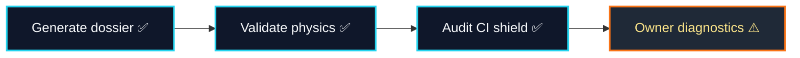

# Full Governance Demonstration Run
*Generated at:* 2025-10-20T13:37:42.986Z
*Total runtime:* 136.86 s

| Step | Status | Duration | Details |
| --- | --- | --- | --- |
| Generate dossier | ✅ | 53.14 s | \|F\|r\|e\|e\|-\|e\|n\|e\|r\|g\|y\| \|m\|a\|r\|g\|i\|n\| \|2\|2\|2\|1\|5\|3\|.\|7\|3\| \|k\|J\| \|·\| \|M\|a\|x\| \|m\|e\|t\|h\|o\|d\| \|d\|e\|v\|i\|a\|t\|i\|o\|n\| \|0\|.\|8\|4\|9\|3\|7\|4\| |
| Validate physics | ✅ | 52.97 s | \|A\|l\|l\| \|5\|8\| \|c\|h\|e\|c\|k\|s\| \|p\|a\|s\|s\|e\|d\| |
| Audit CI shield | ✅ | 0.06 s | \|A\|l\|l\| \|e\|n\|f\|o\|r\|c\|e\|m\|e\|n\|t\| \|g\|u\|a\|r\|d\|s\| \|l\|o\|c\|k\|e\|d\|.\| |
| Owner diagnostics | ⚠️ | 30.69 s | \|W\|a\|r\|n\|i\|n\|g\|s\|:\| \|[\|o\|w\|n\|e\|r\|:\|a\|u\|d\|i\|t\|-\|h\|a\|m\|i\|l\|t\|o\|n\|i\|a\|n\|]\| \|E\|R\|R\|O\|R\| \|@\| \|$\|.\|o\|n\|C\|h\|a\|i\|n\| \|—\| \|H\|H\|7\|0\|0\|:\| \|A\|r\|t\|i\|f\|a\|c\|t\| \|f\|o\|r\| \|c\|o\|n\|t\|r\|a\|c\|t\| \|"\|c\|o\|n\|t\|r\|a\|c\|t\|s\|/\|v\|2\|/\|H\|a\|m\|i\|l\|t\|o\|n\|i\|a\|n\|M\|o\|n\|i\|t\|o\|r\|.\|s\|o\|l\|:\|H\|a\|m\|i\|l\|t\|o\|n\|i\|a\|n\|M\|o\|n\|i\|t\|o\|r\|"\| \|n\|o\|t\| \|f\|o\|u\|n\|d\|.\| \||\| \|C\|r\|o\|s\|s\|-\|c\|h\|e\|c\|k\| \|m\|i\|s\|m\|a\|t\|c\|h\|:\| \|m\|i\|s\|s\|i\|o\|n\| \|a\|l\|i\|g\|n\|m\|e\|n\|t\|.\| \||\| \|[\|r\|e\|w\|a\|r\|d\|-\|e\|n\|g\|i\|n\|e\|:\|r\|e\|p\|o\|r\|t\|]\| \|E\|R\|R\|O\|R\| \|@\| \|$\|.\|o\|n\|C\|h\|a\|i\|n\| \|—\| \|H\|H\|7\|0\|0\|:\| \|A\|r\|t\|i\|f\|a\|c\|t\| \|f\|o\|r\| \|c\|o\|n\|t\|r\|a\|c\|t\| \|"\|c\|o\|n\|t\|r\|a\|c\|t\|s\|/\|v\|2\|/\|R\|e\|w\|a\|r\|d\|E\|n\|g\|i\|n\|e\|M\|B\|.\|s\|o\|l\|:\|R\|e\|w\|a\|r\|d\|E\|n\|g\|i\|n\|e\|M\|B\|"\| \|n\|o\|t\| \|f\|o\|u\|n\|d\|.\| \||\| \|[\|o\|w\|n\|e\|r\|:\|u\|p\|g\|r\|a\|d\|e\|-\|s\|t\|a\|t\|u\|s\|]\| \|S\|K\|I\|P\|P\|E\|D\| \|@\| \|$\|.\|o\|n\|C\|h\|a\|i\|n\| \|—\| \|N\|o\| \|t\|i\|m\|e\|l\|o\|c\|k\| \|a\|d\|d\|r\|e\|s\|s\| \|a\|v\|a\|i\|l\|a\|b\|l\|e\|.\| \||\| \|[\|o\|w\|n\|e\|r\|:\|c\|o\|m\|p\|l\|i\|a\|n\|c\|e\|-\|r\|e\|p\|o\|r\|t\|]\| \|S\|K\|I\|P\|P\|E\|D\| \|@\| \|$\|.\|o\|n\|C\|h\|a\|i\|n\| \|—\| \|N\|o\| \|t\|a\|x\| \|p\|o\|l\|i\|c\|y\| \|a\|d\|d\|r\|e\|s\|s\| \|c\|o\|n\|f\|i\|g\|u\|r\|e\|d\|.\| |

## Key Metrics
- Gibbs free energy: 222153.73 kJ
- Free-energy margin: 222153.73 kJ
- Antifragility curvature (2a): 9.20e-1
- Equilibrium max deviation: 0.849374
- Risk portfolio residual: 0.013
- Alpha-field confidence: 82.9%
- Superintelligence index: 95.8% (✅)
- Stackelberg bound respected: ✅
- Thermodynamic assurance: 100.0%
- Governance assurance: 92.6%
- Antifragility assurance: 100.0%
- Owner assurance: 100.0%
- Quantum coherence: 75.9% (aligned charge)
- Quantum free-energy delta: 2.222e+5 kJ
- Thermo ↔ quantum alignment: ⚠️ (limit 1.800e-1 kJ)
- Quantum state entropy: 2.237 bits
- Energy margin floor met: ✅
- Jacobian stable: ❌
- Owner capability coverage: ✅
- All owner commands present: ✅
- All owner verification scripts present: ✅
- Owner supremacy index: 100.0% (✅)
- CI shield: ✅ enforced
- Owner readiness: attention

## Artifact Index
- Governance dossier: `/workspace/AGIJobsv0/demo/alpha-meta/reports/alpha-meta-governance-report.md`
- Physics summary: `/workspace/AGIJobsv0/demo/alpha-meta/reports/alpha-meta-governance-summary.json`
- Interactive dashboard: `/workspace/AGIJobsv0/demo/alpha-meta/reports/alpha-meta-governance-dashboard.html`
- Validation JSON: `/workspace/AGIJobsv0/demo/alpha-meta/reports/alpha-meta-governance-validation.json`
- Validation Markdown: `/workspace/AGIJobsv0/demo/alpha-meta/reports/alpha-meta-governance-validation.md`
- CI verification: `/workspace/AGIJobsv0/demo/alpha-meta/reports/alpha-meta-ci-verification.json`
- Owner diagnostics JSON: `/workspace/AGIJobsv0/demo/alpha-meta/reports/alpha-meta-owner-diagnostics.json`
- Owner diagnostics Markdown: `/workspace/AGIJobsv0/demo/alpha-meta/reports/alpha-meta-owner-diagnostics.md`

> ✅ CI shield verified with all guards active.
> ⚠️ Owner automation warnings: 4, errors: 0