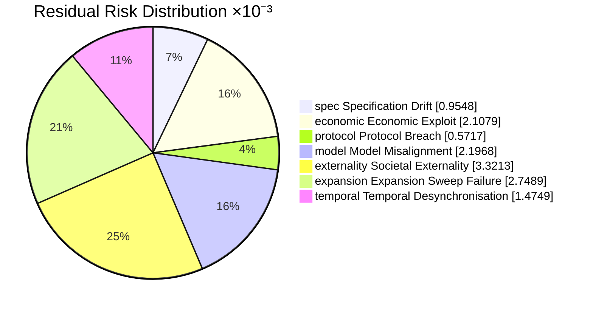
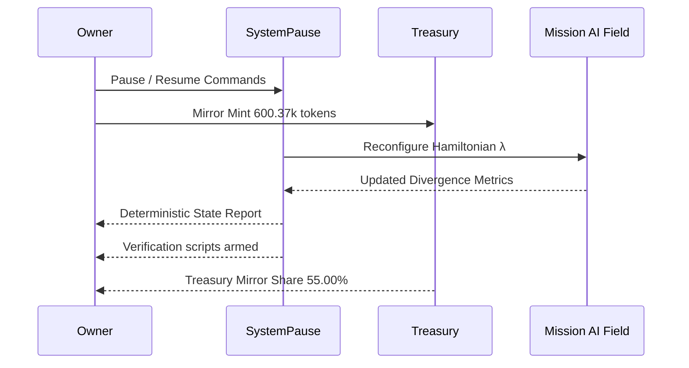

# Meta-Agentic α-AGI — Alpha-Meta Sovereign Hypergraph — Governance Demonstration Report
*Generated at:* 2025-10-20T16:25:26.920Z
*Version:* 2.0.0

> Alpha-Meta proves that AGI Jobs v0 (v2) empowers a non-technical owner to choreograph a civilisation-scale meta-agent that governs subordinate swarms, physics guarantees, and unstoppable blockchain levers in one deterministic command.

## 1. Thermodynamic Intelligence Ledger

- **Gibbs free energy:** 222.15k kJ (222.15M J)
- **Landauer limit envelope:** 0.00 kJ
- **Free-energy safety margin:** 222.15k kJ (100.00% of Gibbs)
- **Energy dissipated per block (burn):** 15.11k kJ
- **Cross-check delta:** 0.000e+0 kJ (≤ 1e-6 required)
- **Cross-check Gibbs (reference):** 222.15k kJ
- **Landauer within safety margin:** ✅
- **Stake Boltzmann envelope:** 3.816e-11 (dimensionless proof of energy-aligned stake)

## 2. Statistical Physics Partition Function Cross-Check

- **β (inverse temperature):** 0.0485
- **Partition function (Z):** 6.252e-17 (log Z -3.731e+1)
- **Expected energy:** 792.28 (scaled 225.17k kJ)
- **Free energy:** 769.30 (scaled 218.63k kJ)
- **Entropy:** 1.11 (scaled 18.35 kJ/K)
- **Heat capacity (β²·Var[E]):** 0.0763 (variance 32.43)
- **Free-energy identity Δ:** 2.615e-12
- **Δ vs thermodynamic Gibbs:** 3.52k kJ (⚠️ outside tolerance 312.40 kJ)

| Energy (dimensionless) | Degeneracy | Probability |
| --- | --- | --- |
| 792.00 | 3 | 99.76% |
| 908.00 | 2 | 0.24% |
| 1.05k | 3 | 0.00% |
| 1.18k | 1 | 0.00% |

## 3. Jarzynski Equality Verification

- **ΔF (Gibbs − Landauer):** 222.15k kJ
- **Scaled ΔF:** 781.68 (Landauer 0.00 → Gibbs 781.68)
- **⟨e^{-βW}⟩:** 2.074e-17
- **e^{-βΔF}:** 3.430e-17
- **Log-space delta:** 5.029e-1 (tolerance 7.582e-1 — ✅ aligned)
- **β input:** 0.0485 (matching statistical physics)

```mermaid
flowchart TD
  Landauer[Landauer 3.816e-14 kJ] -->|ΔF 222.15k kJ| Gibbs[Gibbs 222.15k kJ]
  Landauer -->|Sampled work| Jarzynski[⟨e^{-βW}⟩ log -38.414]
  Gibbs -->|Theory| Theoretical[e^{-βΔF} log -37.912]
```

## 4. Hamiltonian Control Plane

- **Kinetic term:** 112188.70M units
- **Potential term (scaled by λ):** 713.66k units
- **Hamiltonian energy:** 112187.99M units
- **Alternate computation check:** 112187.99M units
- **Difference:** 0.000e+0 (≤ 1e-3 target)

## 5. Incentive Free-Energy Flow

- **Mint rule η:** 0.98 (ΔV 612.00k tokens)
- **Total minted per event:** 600.37k tokens
- **Agent ↔ treasury parity:** ✅ Δ 0.00 tokens (0.0000% of mint, tolerance 0.40%)
- **Treasury mirror share:** 55.00% (agent share 55.00%)
- **Dust routed to treasury:** 0.0000 tokens

| Role | Share | Minted tokens |
| --- | --- | --- |
| Agent | 55.00% | 330.20k tokens |
| Validator | 18.00% | 108.07k tokens |
| Operator | 10.00% | 60.04k tokens |
| Sentinel | 9.00% | 54.03k tokens |
| Owner Atlas Guild | 8.00% | 48.03k tokens |

- **Burn curve:** burn 6.80%, treasury 2.60%, employer 0.60%
- **Per-job distribution:** burn 23.94k tokens, treasury 9.15k tokens, employer 2.11k tokens, worker payouts 316.80k tokens

- **Stake baseline:** agent 6.20k tokens, validator 12.60k tokens, operator 10.40k tokens (example stake 158.00k tokens)

| Role | Minimum stake (tokens) |
| --- | --- |
| Agent | 6.20k |
| Validator | 12.60k |
| Operator | 10.40k |

| Severity | Slash % stake | Amount slashed | Treasury share | Employer share | Burned |
| --- | --- | --- | --- | --- | --- |
| Entropy jitter | 16.00% | 25.28k tokens | 14.66k tokens | 6.32k tokens | 4.30k tokens |
| Thermostat bypass attempt | 48.00% | 75.84k tokens | 62.19k tokens | 8.34k tokens | 5.31k tokens |
| Hypergraph breach | 100.00% | 158.00k tokens | 145.36k tokens | 0.00 tokens | 12.64k tokens |

```mermaid
flowchart LR
  subgraph Energy[Energy Intelligence Stack]
    Thermo[Gibbs Free Energy 222.15k kJ]
    Burn[Burn Envelope 15.11k kJ/block]
    QuantumFlux[Quantum Free Energy 9.25e-23 kJ]
    Thermo --> Burn
    Thermo --> QuantumFlux
  end
  subgraph Incentives[Mint/Burn Governance]
    Mint[Mint η=0.98]
    BurnCurve[Burn Curve Δ Escrow]
    Mint --> BurnCurve
  end
  subgraph Equilibrium[Macro Equilibrium]
    StratA[Replicator Δ=0.00e+0]
    KKT[KKT Residual 0.00e+0 ✅]
    Divergence[Divergence 0.00e+0]
    Payoff[Payoff 1.02 tokens]
    StratA --> KKT
    KKT --> Divergence
    Divergence --> Payoff
  end
  subgraph Risk[Risk Engine]
    Residual[Residual 0.013]
  end
  subgraph AlphaField[Alpha-Field Assurance]
    Stackelberg[Stackelberg Δ=0.14]
    Confidence[Superintelligence 96%]
    ThermoSignal[Thermo Assurance 100%]
    GovernanceSignal[Governance Assurance 93%]
    AntifragileSignal[Antifragility Assurance 100%]
    OwnerSignal[Owner Supremacy 100%]
    QuantumSignal[Quantum Assurance 76%]
    CoherenceSignal[Coherence 76%]
    QuantumAlign[Quantum Alignment 222.15k kJ Δ (≤ 0.18 kJ)]
    EnergyFloor[Energy Margin 222.15k kJ]
    Stackelberg --> Confidence
    EnergyFloor --> ThermoSignal
    ThermoSignal --> Confidence
    GovernanceSignal --> Confidence
    AntifragileSignal --> Confidence
    OwnerSignal --> Confidence
    QuantumSignal --> Confidence
    QuantumAlign --> QuantumSignal
    CoherenceSignal --> QuantumAlign
  end
  subgraph Control[Owner Command Surface]
    Owner((Owner 0xAAAA…3333))
    Pauser([Pauser 0xBBBB…4444])
    Treasury([Treasury 0xCCCC…5555])
    Owner --> Pauser
    Owner --> Treasury
  end
  subgraph Chain[Mainnet Envelope]
    Governor[SystemPause]
    Monitor[RewardEngine]
    Governor --> Monitor
  end
  Thermo --> Mint
  BurnCurve --> StratA
  Payoff --> Residual
  Residual --> Stackelberg
  QuantumFlux --> CoherenceSignal
  Confidence --> Owner
  Owner --> Governor
```

## 6. Game-Theoretic Macro-Equilibrium

- **Discount factor:** 0.97 (must exceed 0.80 for uniqueness)
- **Replicator iterations to convergence:** 0
- **Continuous-flow iterations (RK4):** 2809
- **Perron eigenvector iterations:** 5
- **Replicator vs closed-form deviation:** 0.000e+0
- **Monte-Carlo RMS error:** 8.238e-1
- **Max deviation across methods:** 8.494e-1 (consistent)
- **Payoff at equilibrium:** 1.02 tokens
- **Closed-form KKT payoff (λ):** 1.02 tokens
- **KKT residual max:** 0.000e+0 (satisfied)
- **Simplex residual:** 2.220e-16
- **Governance divergence:** 0.000e+0 (target ≤ 0.00088)

| Strategy | Replicator | Closed-form | Monte-Carlo | Continuous RK4 | Perron eigenvector |
| --- | --- | --- | --- | --- | --- |
| Hypergraph Vanguard | 30.67% | 30.67% | 44.42% | 100.00% | 33.36% |
| Quantum Concord Syndicate | 33.28% | 33.28% | 30.83% | 0.00% | 33.33% |
| Sentinel Surge Mesh | 36.05% | 36.05% | 24.75% | 0.00% | 33.31% |

| Condition | Residual |
| --- | --- |
| Hypergraph Vanguard payoff Δ | 0.000e+0 |
| Quantum Concord Syndicate payoff Δ | 0.000e+0 |
| Sentinel Surge Mesh payoff Δ | 0.000e+0 |
| Probability simplex Δ | 2.220e-16 |

### Replicator Jacobian Stability

- **Gershgorin upper bound:** 3.800e-1 (unstable)
- **Spectral radius:** 1.018e+0
- **Analytic vs numeric max Δ:** 3.670e-1

| Analytic J[0,*] | Analytic J[1,*] | Analytic J[2,*] |
| --- | --- | --- |
| -3.05e-1 | -3.15e-1 | -3.16e-1 |
| -3.43e-1 | -3.33e-1 | -3.42e-1 |
| -3.71e-1 | -3.70e-1 | -3.61e-1 |

| Numeric J[0,*] | Numeric J[1,*] | Numeric J[2,*] |
| --- | --- | --- |
| 7.33e-3 | -3.07e-3 | -3.40e-3 |
| -3.69e-3 | 6.32e-3 | -2.69e-3 |
| -3.64e-3 | -3.25e-3 | 6.10e-3 |

## 7. Antifragility Tensor

- **Quadratic curvature (2a):** 9.202e-1 (> 0 indicates antifragility)
- **Monotonic welfare increase:** ✅

| σ | Welfare (tokens) | Average payoff | Divergence |
| --- | --- | --- | --- |
| 0.00 | -3.97 | 1.04 | 3.13e-2 |
| 0.17 | 9.47 | 1.04 | 3.13e-2 |
| 0.33 | 22.15 | 1.04 | 3.13e-2 |
| 0.49 | 34.85 | 1.04 | 3.13e-2 |
| 0.65 | 47.58 | 1.04 | 3.12e-2 |

```mermaid
mindmap
  root((Antifragility Tensor))
    "Quadratic curvature":::core
      "2a=9.20e-1":::core
    "Sigma Scan":::core
        "σ=0.00":::sigma --> "Welfare -3.97":::welfare
        "σ=0.17":::sigma --> "Welfare 9.47":::welfare
        "σ=0.33":::sigma --> "Welfare 22.15":::welfare
        "σ=0.49":::sigma --> "Welfare 34.85":::welfare
        "σ=0.65":::sigma --> "Welfare 47.58":::welfare
    "Quantum Lattice":::core
      "Coherence 76%":::sigma
      "Charge Δ 3.00e-2 (tol 7.00e-2)":::welfare
      "Alignment Δ 222.15k kJ":::sigma
    "Owner Actions":::core
      "Mint Mirror 55.00%"
      "Residual Risk 0.013"
      "Supremacy 100.0%":::core
  classDef core fill:#111827,stroke:#38bdf8,stroke-width:2px,color:#f9fafb,font-weight:600;
  classDef sigma fill:#1f2937,stroke:#f97316,stroke-width:2px,color:#fef3c7;font-weight:600;
  classDef welfare fill:#0f172a,stroke:#22d3ee,stroke-width:2px,color:#ecfeff;font-weight:600;
```

## 8. Alpha-Field Sovereign Assurance

- **Stackelberg advantage:** Δ0.14 vs cap 0.89 (✅ within)
- **Stackelberg floor satisfied:** ✅ (floor 0.11; achieved Δ 0.14)
- **Gibbs delta:** 39.55k kJ (target 182.60k ± 340.00 kJ)
- **Equilibrium divergence:** 0.000e+0 (limit 6.800e-3)
- **Entropy floor:** 18.35 kJ/K (floor 6.80 kJ/K)
- **Antifragility curvature:** 9.202e-1 (minimum 4.200e-4)
- **Sigma welfare gain:** 51.54 (minimum 0.06)
- **Owner coverage ratio:** 100.00% (threshold 96.00%)
- **Owner supremacy index:** 100.00% (minimum 95.00% — ✅)
- **Energy margin:** 222.15k kJ (floor 4.20k kJ — ✅)
- **Superintelligence index:** 95.8% (minimum 91.0% — ✅)
- **Quantum coherence confidence:** 75.9% (minimum 90.0% — ⚠️)
- **Thermo ↔ quantum free-energy delta:** 2.222e+5 kJ (limit 1.800e-1 — ⚠️)
- **Noether charge alignment:** Δ3.000e-2 (tolerance 7.000e-2 — ✅)
- **State entropy:** 2.237 bits (effective dimension 4.72)
- **Measurement variance:** 8.000e-3 (σ 0.089)
- **Composite confidence:** 82.9% (thermo 100.0% · governance 92.6% · antifragility 100.0% · owner 100.0%)

| State | Normalised weight | Energy |
| --- | --- | --- |
| ψ1 | 31.00% | 0.410 eV |
| ψ2 | 24.00% | 0.520 eV |
| ψ3 | 19.00% | 0.630 eV |
| ψ4 | 14.00% | 0.750 eV |
| ψ5 | 12.00% | 0.880 eV |

| Signal | Status |
| --- | --- |
| Stackelberg within cap | ✅ |
| Stackelberg floor met | ✅ |
| Gibbs delta within tolerance | ⚠️ |
| Divergence within limit | ✅ |
| Entropy above floor | ✅ |
| Antifragility curvature | ✅ |
| Sigma welfare gain | ✅ |
| Owner coverage | ✅ |
| Owner supremacy | ✅ |
| Energy margin | ✅ |
| Superintelligence threshold | ✅ |
| Quantum confidence floor | ⚠️ |
| Thermo ↔ quantum alignment | ⚠️ |

## 9. Risk & Safety Audit

- **Coverage weights:** staking 31.00%, formal 45.00%, fuzz 24.00%
- **Portfolio residual risk:** 0.013 (threshold 0.180 — within bounds)
- **Cross-check residual (baseline − mitigated):** 0.013

| ID | Threat | Likelihood | Impact | Coverage | Residual |
| --- | --- | --- | --- | --- | --- |
| spec | Specification Drift | 0.02 | 0.76 | 92.61% | 0.001 |
| economic | Economic Exploit | 0.01 | 0.69 | 76.50% | 0.002 |
| protocol | Protocol Breach | 0.01 | 0.86 | 94.46% | 0.001 |
| model | Model Misalignment | 0.03 | 0.64 | 86.27% | 0.002 |
| externality | Societal Externality | 0.01 | 0.77 | 69.19% | 0.003 |
| expansion | Expansion Sweep Failure | 0.02 | 0.60 | 73.05% | 0.003 |
| temporal | Temporal Desynchronisation | 0.01 | 0.61 | 78.02% | 0.001 |



## 10. Owner Supremacy & Command Surface

- **Owner:** 0xAAAABBBBCCCCDDDDEEEEFFFF0000111122223333
- **Pauser:** 0xBBBBCCCCDDDDEEEEFFFF00001111222233334444
- **Treasury:** 0xCCCCDDDDEEEEFFFF000011112222333344445555
- **Timelock:** 604800 seconds
- **Coverage achieved:** all critical capabilities accounted for
- **Owner supremacy index:** 100.00% (minimum 95.00% — ✅)
- **Command surfaces wired:** ✅ all npm scripts present
- **Verification surfaces wired:** ✅ all verifier scripts present

### Critical Capabilities
- **Pause orchestrator (pause).** Instantly halt AGI Jobs orchestration if divergence spikes.
  └─ <code>$ npm run owner:system-pause</code> (verify: <code>npm run owner:verify-control</code>) ✅ command script pinned • ✅ verifier script pinned
- **Resume orchestrator (resume).** Restart execution after antifragility recovery.
  └─ <code>$ npm run owner:system-pause -- --action unpause</code> (verify: <code>npm run owner:verify-control</code>) ✅ command script pinned • ✅ verifier script pinned
- **Thermostat update (parameter).** Adjust the macro temperature to stabilise energy flux.
  └─ <code>$ npm run thermostat:update</code> (verify: <code>npm run reward-engine:report</code>) ✅ command script pinned • ✅ verifier script pinned
- **Hamiltonian rewrite (governance).** Push updated λ/inertia parameters from physics computation.
  └─ <code>$ npm run owner:command-center</code> (verify: <code>npm run owner:audit-hamiltonian</code>) ✅ command script pinned • ✅ verifier script pinned
- **Treasury surge router (treasury).** Route treasury flows via owner-specified channels.
  └─ <code>$ npm run owner:dashboard -- --focus treasury</code> (verify: <code>npm run owner:compliance-report</code>) ✅ command script pinned • ✅ verifier script pinned
- **Sentinel refresh (sentinel).** Rotate enforcement guardians before antifragility decay.
  └─ <code>$ npm run owner:rotate -- --role Sentinel --count 16</code> (verify: <code>npm run monitoring:sentinels</code>) ✅ command script pinned • ✅ verifier script pinned
- **Upgrade queue (upgrade).** Submit unstoppable upgrade bundles to the timelock queue.
  └─ <code>$ npm run owner:upgrade</code> (verify: <code>npm run owner:upgrade-status</code>) ✅ command script pinned • ✅ verifier script pinned
- **Compliance broadcast (compliance).** Publish policy acknowledgements with evidence.
  └─ <code>$ npm run owner:compliance-report</code> (verify: <code>npm run owner:doctor</code>) ✅ command script pinned • ✅ verifier script pinned
- **Mission plan (plan).** Deploy new labour missions via owner plan tooling.
  └─ <code>$ npm run owner:plan</code> (verify: <code>npm run owner:plan:safe</code>) ✅ command script pinned • ✅ verifier script pinned
- **Sentinel validation (monitoring).** Validate monitoring sentinels and hooks.
  └─ <code>$ npm run monitoring:validate</code> (verify: <code>npm run monitoring:sentinels</code>) ✅ command script pinned • ✅ verifier script pinned

| Capability | Present |
| --- | --- |
| pause | ✅ |
| resume | ✅ |
| parameter | ✅ |
| governance | ✅ |
| treasury | ✅ |
| sentinel | ✅ |
| upgrade | ✅ |
| compliance | ✅ |
| plan | ✅ |
| monitoring | ✅ |

### Monitoring Sentinels
- sentinel://alpha-meta/thermostat
- sentinel://alpha-meta/treasury
- sentinel://alpha-meta/quantum
- sentinel://alpha-meta/owner
- sentinel://alpha-meta/antifragility



### Command Audit
| Category | Command Script | Status | Verification | Status |
| --- | --- | --- | --- | --- |
| pause | owner:system-pause | ✅ | owner:verify-control | ✅ |
| resume | owner:system-pause | ✅ | owner:verify-control | ✅ |
| parameter | thermostat:update | ✅ | reward-engine:report | ✅ |
| governance | owner:command-center | ✅ | owner:audit-hamiltonian | ✅ |
| treasury | owner:dashboard | ✅ | owner:compliance-report | ✅ |
| sentinel | owner:rotate | ✅ | monitoring:sentinels | ✅ |
| upgrade | owner:upgrade | ✅ | owner:upgrade-status | ✅ |
| compliance | owner:compliance-report | ✅ | owner:doctor | ✅ |
| plan | owner:plan | ✅ | owner:plan:safe | ✅ |
| monitoring | monitoring:validate | ✅ | monitoring:sentinels | ✅ |

## 11. Blockchain Deployment Envelope

- **Network:** mainnet-grade (chainId 1)
- **RPC:** https://alpha-meta.rpc
- **Gas target:** 32 gwei
- **Confirmations:** 2 (mainnet-safe: yes)
- **Upgrade delay:** 168 hours
- **Safe modules:** GnosisSafe://alpha-meta/owner, GnosisSafe://alpha-meta/treasury, GnosisSafe://alpha-meta/sentinels

| Contract | Address | Role |
| --- | --- | --- |
| SystemPause | 0x111122223333444455556666777788889999AAAa | Pauser |
| Thermostat | 0x22223333444455556666777788889999AAAABBBB | Parameter |
| RewardEngine | 0x3333444455556666777788889999AAAABBBBCCCC | Treasury |
| OwnerVault | 0x444455556666777788889999AAAABBBBCCCCDDDD | Owner |
| UpgradeGovernor | 0x55556666777788889999AAAABBBBCCCCDDDDEEEE | Upgrade |

| Contract | Function | Selector | Description |
| --- | --- | --- | --- |
| JobController | pauseJobs | 0x7c1d7a8f | Stops job lifecycle transitions instantly. |
| RewardEngine | pauseRewards | 0x2a3b9f1c | Locks token flows while the owner inspects anomalies. |
| Thermostat | pauseAdjustments | 0x3d0e4f6a | Freezes thermostat drift when energy variance spikes. |

## 12. CI Enforcement Ledger

- **Workflow name:** ci (v2)
- **Concurrency guard:** <code>ci-${{ github.workflow }}-${{ github.ref }}</code>
- **Minimum coverage:** 90%

| Job ID | Display name |
| --- | --- |
| lint | Lint & static checks |
| tests | Tests |
| foundry | Foundry |
| coverage | Coverage thresholds |
| summary | CI summary |

Run <code>npm run demo:agi-governance:ci</code> to assert the workflow still exports these shields.

## 13. Owner Execution Log (fill during live ops)

| Timestamp | Action | Tx hash | Operator | Notes |
| --- | --- | --- | --- | --- |
| _pending_ |  |  |  |  |