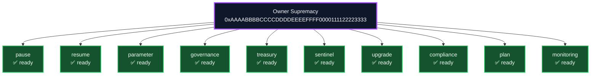

# Owner Control Matrix
*Generated at:* 2025-10-20T20:00:15.390Z
*Owner:* 0xAAAABBBBCCCCDDDDEEEEFFFF0000111122223333
*Pauser:* 0xBBBBCCCCDDDDEEEEFFFF00001111222233334444
*Treasury:* 0xCCCCDDDDEEEEFFFF000011112222333344445555
*Timelock:* 604800 seconds (168.00 hours)

## Owner Supremacy Graph

## Coverage
- Full coverage: ✅
- Command scripts present: ✅
- Verification scripts present: ✅
- Satisfied categories: pause, resume, parameter, governance, treasury, sentinel, upgrade, compliance, plan, monitoring

## Capabilities
| Category | Capability | Command | Command status | Verification | Verification status |
| --- | --- | --- | --- | --- | --- |
| pause | Pause orchestrator | owner:system-pause | ✅ ready | owner:verify-control | ✅ ready |
| resume | Resume orchestrator | owner:system-pause | ✅ ready | owner:verify-control | ✅ ready |
| parameter | Thermostat update | thermostat:update | ✅ ready | reward-engine:report | ✅ ready |
| governance | Hamiltonian rewrite | owner:command-center | ✅ ready | owner:audit-hamiltonian | ✅ ready |
| treasury | Treasury surge router | owner:dashboard | ✅ ready | owner:compliance-report | ✅ ready |
| sentinel | Sentinel refresh | owner:rotate | ✅ ready | monitoring:sentinels | ✅ ready |
| upgrade | Upgrade queue | owner:upgrade | ✅ ready | owner:upgrade-status | ✅ ready |
| compliance | Compliance broadcast | owner:compliance-report | ✅ ready | owner:doctor | ✅ ready |
| plan | Mission plan | owner:plan | ✅ ready | owner:plan:safe | ✅ ready |
| monitoring | Sentinel validation | monitoring:validate | ✅ ready | monitoring:sentinels | ✅ ready |

## Monitoring Sentinels
- sentinel://alpha-meta/thermostat
- sentinel://alpha-meta/treasury
- sentinel://alpha-meta/quantum
- sentinel://alpha-meta/owner
- sentinel://alpha-meta/antifragility
