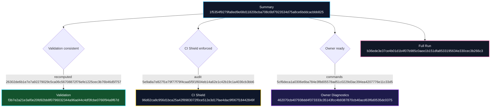

# Alpha-Meta Triangulation Ledger

- Generated: 2025-10-20T15:22:44.752Z
- Mission file: /workspace/AGIJobsv0/demo/alpha-meta/config/mission@alpha-meta.json
- Digest: `8f24260db136eaddc0807653ab29ca8b18f950757bd3872b867d612c10bf7bf0`

## Hash Register

| Artefact | Exists | SHA-256 | Consistent |
| --- | --- | --- | --- |
| Summary | Yes | 1f5354f9279fa8ed9e68d11820bcba708c6bf7923534d75a8ce6bddcacbbb825 | n/a |
| Validation | Yes | f3b7e2a21e3af0e20fd92bb8f0796032344a96ad44c4df3fcbe0766f94a9f67d | Yes |
| CI Shield | Yes | 96d62ca8c956d1bca25a42f8983072f0ce512e3d17fae4dac9f067f18442849f | Yes |
| Owner Diagnostics | Yes | 462070cb407938dd4f373333c35143fcc4b9387870cb40acd63f6d0535dc0375 | Yes |
| Full Run | Yes | b36ede3e37ce4b01d1b4f07b985c0aee1b151dfa8533195634e330cec3b266c3 | n/a |

## Systems Cohesion Diagram

## Notes

All triangulation checks succeeded. Stored artefacts match recomputed results.