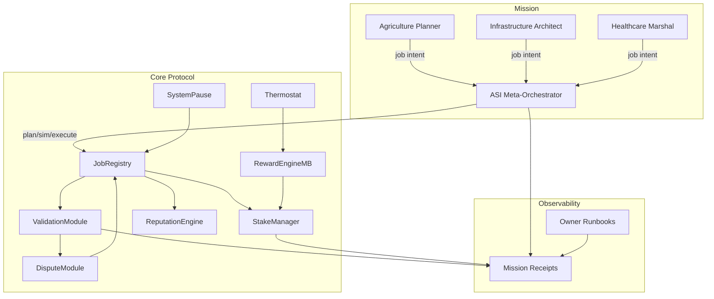

# ASI Take-Off Demonstration — Autonomous Nation Coordination

**Mission scope:** Execute a multi-sector governance drill (agriculture, infrastructure, healthcare) using the AGI Jobs v2 one-box orchestrator, thermodynamic incentives, and validator governance entirely on-chain.

---

## Quickstart

Local (Anvil / Hardhat):

```bash
cp demo/asi-takeoff/env.example .env
npm run demo:asi-takeoff:local
```

Generate the Markdown mission report:

```bash
npm run demo:asi-takeoff:report
```

Artifacts:

- `reports/<network>/asi-takeoff/receipts/mission.json`
- `reports/<network>/asi-takeoff/receipts/jobs/<slug>/*.json`
- `reports/<network>/asi-takeoff/asi-takeoff-report.md`

---

## System Overview



## Lifecycle

1. **Deploy defaults** – deterministic Hardhat script wires the v2 stack and pre-registers demo identities.
2. **Mission planning** – `aurora.demo.ts` loads `mission@v2.json`, calculates cross-job stake/reward requirements, and stages governor drills (pause/unpause, role minimum updates).
3. **Job loop** – each mission job posts, assigns, submits, validates, finalizes, and records receipts under `jobs/<slug>/` while maintaining backward-compatible single-job receipts for regression tooling.
4. **Thermostat tuning** – optional `asi-takeoff.thermostat@v2.json` applies global + role temperatures to illustrate incentive steering.
5. **Reporting** – `aurora-report.ts` renders the mission Markdown summary, merging deployment, stake, governance, and per-job records.

---

## Runbook

See [`RUNBOOK.md`](./RUNBOOK.md) for the step-by-step operator drill, including owner control verifications, validator proofs, and pausing procedures.
