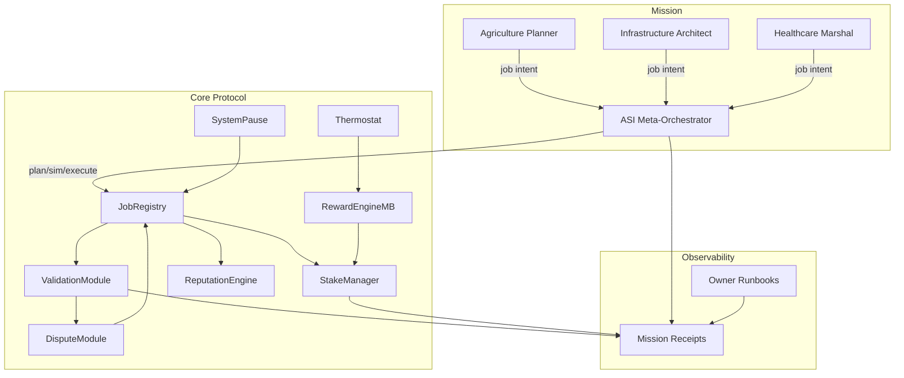

# ASI Take-Off Demonstration

This directory houses the deterministic artefacts that back the **ASI Take-Off Demonstration for AGI Jobs v0**.  The goal is to
produce a national-scale governance simulation using only the platform capabilities that already exist inside this repository.

The demonstration is orchestrated by the `scripts/v2/asiTakeoffDemo.ts` pipeline which automatically:

1. Compiles the protocol and regenerates constants required by the governance scripts.
2. Exercises the owner dry-run harness to simulate an end-to-end labour-market execution with staking, delivery, validation and payout.
3. Captures live thermodynamic telemetry (role shares, entropy, temperature) for the epoch.
4. Produces an owner mission-control report with a Mermaid governance diagram, safe-ready bundles, and change-surface analysis.
5. Verifies the owner-control wiring to prove that the SystemPause, treasury, and thermostat permissions match the repo's hardening
   playbooks.
6. Emits an audit-grade summary that maps the deterministic outputs to the high-speed rail initiative defined in
   `project-plan.json`.

The demo uses the following canonical actors:

- **engineering.agent.agi.eth** – parametric design lead
- **north.contractor.agi.eth** – northern corridor builder
- **south.contractor.agi.eth** – southern corridor builder
- **inspection.validator.agi.eth** – primary validator quorum
- **civic.validator.agi.eth** and **safety.validator.agi.eth** – supplemental auditors

Outputs are collected under `reports/asi-takeoff` and can be published as CI artefacts or ingested into downstream dashboards.
# ASI Take-Off Demonstration — Autonomous Nation Coordination

**Mission scope:** Execute a multi-sector governance drill (agriculture, infrastructure, healthcare) using the AGI Jobs v2 one-box orchestrator, thermodynamic incentives, and validator governance entirely on-chain.

---

## Quickstart

Local (Anvil / Hardhat):

```bash
cp demo/asi-takeoff/env.example .env
npm run demo:asi-takeoff:local

# Optional: generate a governance kit for the deterministic artefacts
npm run demo:asi-takeoff:kit -- --report-root reports/localhost/asi-takeoff --summary-md reports/localhost/asi-takeoff/asi-takeoff-report.md --bundle reports/localhost/asi-takeoff/receipts --logs reports/localhost/asi-takeoff/receipts
```

Generate the Markdown mission report:

```bash
npm run demo:asi-takeoff:report
```

Artifacts:

- `reports/<network>/asi-takeoff/receipts/mission.json`
- `reports/<network>/asi-takeoff/receipts/jobs/<slug>/*.json`
- `reports/<network>/asi-takeoff/asi-takeoff-report.md`
- `reports/<network>/asi-takeoff/governance-kit.json`
- `reports/<network>/asi-takeoff/governance-kit.md`

The governance kit consolidates the plan of record, dry-run harness output, thermodynamic telemetry, mission-control dossier, and integrity hashes for auditors.  The kit is generated automatically by `npm run demo:asi-takeoff` and can be reproduced for any report root with `npm run demo:asi-takeoff:kit`.

---

## System Overview



## Lifecycle

1. **Deploy defaults** – deterministic Hardhat script wires the v2 stack and pre-registers demo identities.
2. **Mission planning** – `aurora.demo.ts` loads `mission@v2.json`, calculates cross-job stake/reward requirements, and stages governor drills (pause/unpause, role minimum updates).
3. **Job loop** – each mission job posts, assigns, submits, validates, finalizes, and records receipts under `jobs/<slug>/` while maintaining backward-compatible single-job receipts for regression tooling.
4. **Thermostat tuning** – optional `asi-takeoff.thermostat@v2.json` applies global + role temperatures to illustrate incentive steering.
5. **Reporting** – `aurora-report.ts` renders the mission Markdown summary, merging deployment, stake, governance, and per-job records.

---

## Runbook

See [`RUNBOOK.md`](./RUNBOOK.md) for the step-by-step operator drill, including owner control verifications, validator proofs, and pausing procedures.
