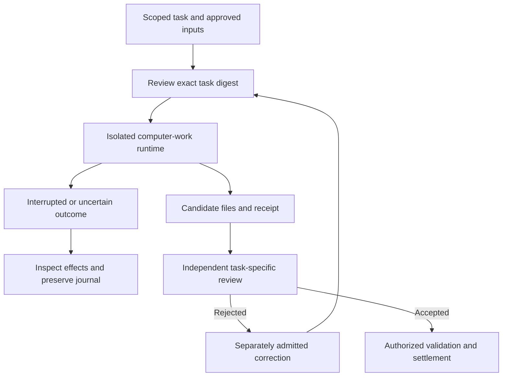
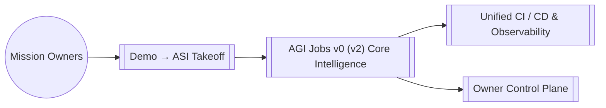

# ASI Takeoff — mission planning, computer work and governed execution

Explore national and planetary missions, turn digital work into independently reviewable deliverables, and rehearse the existing AGI Jobs v2 contract lifecycle. The original scenario plans, flowchart, presentation and three-job local-chain demonstration are retained.

**Start with the studio:** no wallet, API key, dependency installation or live provider is required. It is a local planning application, not an autonomous infrastructure operator or a production deployment.

## Start in two minutes

Use the repository's [pinned Node version](../../.nvmrc), then run from the repository root:

```bash
npm run demo:asi-takeoff:studio
```

Open **http://127.0.0.1:4176/**. Choose the national rail or planetary energy scenario, inspect exact budgets and dependencies, and download the synthetic computer-work task. The interface has English/French labels; source plans and technical evidence remain English. All studio assets, including its systems map, are local and work with external networks blocked.

The server listens on loopback, validates Host/Origin, rejects cross-site browser access and serves only an explicit asset list. It has no mutation or worker-dispatch API. **Refresh source** reloads the files; **Ctrl+C** stops the server. Set `PORT=4177` to change the port. The task pins port 4176: update its origin and re-admit its digest before using a different worker environment. This read-only local server is not a public authenticated service.

## Choose the right path

| Path | Command | What it establishes |
| --- | --- | --- |
| Interactive planning | `npm run demo:asi-takeoff:studio` | Source budget arithmetic and an explicitly assumed dependency schedule |
| Terminal planning | `npm run demo:asi-takeoff:plan -- planetary --json` | Same planning data as JSON; omit `--json` for a readable summary |
| Independent worker review | `node demo/asi-takeoff/computer-work/review.cjs analysis.json dossier.md` | Arithmetic, job coverage, dependency timing and dossier structure for the fixed synthetic exercise |
| Governance report pipeline | `npm run demo:asi-takeoff` | Local contract harness plus separately bootstrapped owner/thermodynamic reports; full repository dependencies required |
| Three-job local chain | `npm run demo:asi-takeoff:local` | Creation, submission, validator selection, commit/reveal, validation and employer settlement with mock tokens and configured results |
| Rebuild local report | `npm run demo:asi-takeoff:report` | Renders saved localhost receipts after the disposable node stops |
| Governance kit | `npm run demo:asi-takeoff:kit -- --help` | Hash-indexes supplied reports or local receipts; does not independently approve their claims |

The national and planetary project plans provide **scenario context** to the governance pipeline. They do not drive the three local mission jobs. That launcher reads `config/mission@v2.json` and its agriculture, infrastructure and healthcare specifications. Their IPFS-style result/schema references are illustrative fixtures, not published artifacts or evidence of actual delivered work.

## Exact planning and explicit assumptions

Token amounts remain decimal strings and are reconciled with `BigInt`, with up to 18 fractional places and a uint256 planning range. The dashboard does not convert them into USD/USDC or assume a live token's address or precision. Invalid amounts, duplicate jobs, missing dependencies and cycles fail visibly. Over-budget plans produce an observation, not a success claim.

| Source scenario | Budget | Planned rewards | Unallocated | Illustrative critical path |
| --- | ---: | ---: | ---: | ---: |
| National rail | 500000 AGIALPHA | 500000 | 0 | 300 days |
| Planetary energy | 780000 AGIALPHA | 680000 | 100000 | 41 days |

**Timing assumption:** for this exercise only, `deadlineDays` is treated as a job duration after every dependency finishes, with unlimited parallel resources. The original plans do not define executable deadline/resource semantics. Under this assumption, the planetary path exceeds the objective's 30-day horizon by 11 days. The studio exposes that discrepancy for review; it does not silently change the plan. Resolve the timing definition, resource constraints and physical dependencies before admitting real work.

Scenario owner/treasury labels, ENS-style handles, energy budgets and thermodynamic targets are illustrative. Verify actual identity roots, registrations, token contracts, owners and module wiring for any commissioned deployment. Placeholder labels are not valid Ethereum addresses. Physical construction, healthcare delivery, grid operation and trading require separately authorized real-world execution.

## Computer work: a concrete acceptance contract

The broader vision covers lawful work performed with a keyboard, mouse and screen: software development and QA, document/spreadsheet production, research, reconciliation, simulation and business-application workflows. Use public non-personal, appropriately licensed or synthetic inputs. Computer use expands what an agent can attempt; measure reliable accepted outcomes for each category.

| Surface | Supported route |
| --- | --- |
| OpenClaw with native Codex Computer Use or approved browser/files/code tools | Existing repository Responses adapter, dedicated worker profile, exact-task admission and durable dispatch journal |
| ChatGPT Work with approved Computer Use | Operator-led session exports candidate files for independent review; no remote Work dispatch API is assumed |
| OpenAI API computer use | A separately commissioned runtime supplies the environment, handles actions/code execution and returns observations through an approved endpoint |

[computer-work/task.json](computer-work/task.json) embeds the exact planetary source and its SHA-256. The worker produces `analysis.json` and `dossier.md`. All five jobs, rewards and dependencies must reconcile; the timing assumption and 41-versus-30-day conflict must be disclosed. The studio downloads this fixed task, its source and clearly labeled examples. Selecting another dashboard scenario does not alter the admitted task.

First check the supplied example:

```bash
node demo/asi-takeoff/computer-work/review.cjs demo/asi-takeoff/computer-work/analysis.example.json demo/asi-takeoff/computer-work/dossier.example.md
```

Expected: `accepted: true`, `jobsChecked: 5`, `productionApproved: false`, `settlementApproved: false`. The evaluator independently recomputes values without importing the planner. It rejects changed amounts, omitted/duplicate jobs, wrong dependencies, hidden schedule conflicts, wrong source hashes and approval claims. Dossier substance, source rights, worker provenance and actual application effects still require independent review. Example output is not proof of worker execution.

For an OpenClaw adapter receipt, check both embedded deliverables without manually copying their contents:

```bash
node demo/asi-takeoff/computer-work/review.cjs --receipt /path/to/receipt.json 73 your-deployment-id
```

Replace `73` and `your-deployment-id` with the expected values from the protected admission record, not values copied from the receipt under review. This mode checks the fixed task and its adapter digest, job/deployment binding, completion state, artifact names/types, exact UTF-8 byte counts and SHA-256 hashes before running the independent evaluator. It reads files of at most 1 MiB and never extracts or executes artifact contents. `declaredWorkerMode` distinguishes fixture/live declarations; `providerExecution` remains `not assessed`. An unsigned receipt can be fabricated with matching hashes: reconcile its attempt with the protected dispatch journal and actual effects, and obtain substantive review before acceptance or settlement. A changed task requires a separately commissioned evaluator.

For an operator-led Work session, provide the task and source, request the two UTF-8 files, and run the same checker on the exact returned bytes. For live OpenClaw commissioning, follow [the existing setup and recovery procedure](../../docs/computer-work.md#commission-a-real-worker). Use [worker-profiles.example.json](computer-work/worker-profiles.example.json), which admits **no jobs**, with a dedicated endpoint/agent, protected `COMPUTER_WORK_ASI_TAKEOFF_TOKEN`, absolute profile/journal paths and a unique deployment identity. Run the studio inside the worker's own network environment so loopback resolves correctly.

After the repository toolchain setup:

```bash
npm run build:orchestrator
node demo/One-Box/computer-work/run.cjs inspect demo/asi-takeoff/computer-work/task.json
```

Review the exact normalized digest and admit it with a real job ID through the protected operator profile. Only then use the documented explicit `run` path; it can perform real actions and incur provider cost. It is deliberately separate from the offline quickstart. Collect the adapter receipt, verify artifact hashes, review the deliverables and reconcile actual effects. Generic structural validation abstains on computer work: commission an independent validator and the existing identity, tax, staking, dispute and finality lifecycle before marketplace settlement. Keep signing keys outside the worker. Preserve journals and reconcile interrupted/unknown outcomes before admitting another attempt.

OpenClaw's Responses endpoint must be deliberately enabled and its bearer credentials treated as operator access. Enforce tool/network policy, limits and stop controls in the actual environment; a prompt does not create isolation and OpenClaw sandboxing is not enabled merely by naming it. Current inline adapter deliverables are bounded UTF-8 text; screenshots and binary Office files need a separately commissioned artifact store.


```mermaid
flowchart TD
    Brief["Scoped task and approved inputs"] --> Admit["Review exact task digest"]
    Admit --> Worker["Isolated computer-work runtime"]
    Worker --> Evidence["Candidate files and receipt"]
    Worker --> Unknown["Interrupted or uncertain outcome"]
    Unknown --> Reconcile["Inspect effects and preserve journal"]
    Evidence --> Review["Independent task-specific review"]
    Review -->|Rejected| Correct["Separately admitted correction"]
    Correct --> Admit
    Review -->|Accepted| Govern["Authorized validation and settlement"]
```

**Opportunity:** $40 trillion/year is retained as the project's planning assumption, not a verified TAM or revenue forecast. Track total labor spend, digitally addressable work, reachable/licensed workflows, reliably accepted tasks, customer demand and marketplace revenue separately. The AGIALPHA mock-token examples do not implement a USDC settlement migration.

## Retained local contract walkthrough

Complete the [root setup](../../docs/START_HERE.md#reproduce-the-local-baseline), then run `npm run demo:asi-takeoff:local`. Compilation can take several minutes. Anvil is preferred; installed Hardhat is the fallback. The launcher binds to `127.0.0.1`, checks chain ID 31337, preserves an existing node and stops only its own node. Choose another port with `DEMO_PORT=18545`; remove conflicting RPC/chain exports before retrying. No personal keys are needed for the default disposable fixtures.

Read `reports/localhost/asi-takeoff/asi-takeoff-report.md` and `receipts/jobs/` beneath that directory. The driver checks final on-chain job status and the commissioning checker reconciles the local receipts. These are local mock-token transactions, not delivery of the physical projects or execution by a live AI provider.

See [RUNBOOK.md](RUNBOOK.md) for the actual local kit command, planetary report pipeline, optional Python launcher, recovery and owner previews. Use separate report roots for separate pipeline runs. `run-status.json` marks the current pipeline as running/completed; a missing or running marker is not a successful current run. Older files can remain after an interruption and must not be mixed into current evidence.

## Systems map — preserved original


```mermaid
flowchart LR
    Operators((Mission Owners)) --> demo_asi_takeoff[[Demo → ASI Takeoff]]
    demo_asi_takeoff --> Core[["AGI Jobs v0 (v2) Core Intelligence"]]
    Core --> Observability[[Unified CI / CD & Observability]]
    Core --> Governance[[Owner Control Plane]]
```

The same relationship appears as a local SVG in the studio. The original [PDF](presentation/ASI_Take-Off_v0.pdf) and [PowerPoint](presentation/ASI_Take-Off_v0.pptx) remain unchanged as vision presentations; use this README and runbook for current commands and evidence boundaries. Their conceptual claims do not supersede tested runtime behavior.

## Validation and production acceptance

```bash
node --test demo/asi-takeoff/tests/planning.test.cjs demo/asi-takeoff/tests/studio.test.cjs
# With the repository dependencies installed:
node --test demo/asi-takeoff/tests/*.test.cjs
# With Playwright and its Chromium browser installed:
node demo/asi-takeoff/tests/browser-smoke.cjs
```

The focused workflow runs planning/review/server/pipeline tests, optional Python regressions, the full governance pipeline, the local-chain mission and its actual receipt kit. Receipt regressions include an authenticated local Responses fixture through the real adapter and rejection of changed tasks, wrong jobs/deployments, altered bytes and incorrect analysis with recomputed hashes. The fixture makes no live-provider call. Browser checks cover desktop/mobile, French labels, offline diagram display, downloads, untrusted text and failed loads. Runner hardening must remain active; the compiler host is explicitly allowed. Full repository checks must pass for the exact PR head before merge.

| Before production | Evidence needed |
| --- | --- |
| Task and data | Lawful scope, source rights, measurable deliverables and task-specific acceptance |
| Worker | Recorded versions, isolated accounts, actual tool/action policy, spending/time limits, interruption and prompt-injection tests |
| Review | Independent evaluator, artifact integrity, substantive dossier review and rejection/dispute procedure |
| Contracts | Actual identities, source commitments, authority, token configuration, audited changes, receipts and finality |
| Operations | Durable journals, monitoring, backups, stop/recovery drills and a staged rollout with named operators |

Local tests do not establish live-provider reliability, security-audit completion or universal human-level job performance. Preserve the useful scenarios, flowcharts and presentation assets when extending the demo. See the root [RUNBOOK](../../RUNBOOK.md), [OperatorRunbook](../../OperatorRunbook.md) and [computer-work guide](../../docs/computer-work.md).

External capabilities checked **2026-10-05** against primary documentation: [ChatGPT Work Computer Use](https://learn.chatgpt.com/docs/computer-use), [OpenAI API computer use](https://developers.openai.com/api/docs/guides/tools-computer-use), [OpenClaw Codex Computer Use](https://docs.openclaw.ai/plugins/codex-computer-use), [OpenResponses](https://docs.openclaw.ai/gateway/openresponses-http-api), and [OpenClaw sandboxing](https://docs.openclaw.ai/gateway/sandboxing). Availability, permissions and tool versions depend on the commissioned environment.
