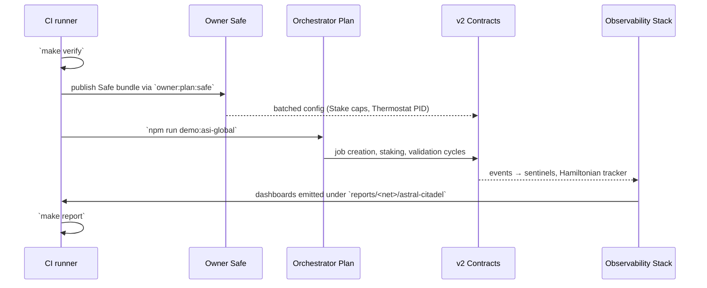

# Project Astral Citadel — AGI Jobs v0 (v2) Take-Off Demonstration

**Self-steering planetary coordination lattice** delivering cross-border economic planning, decentralized governance, and continuously tuned incentives using the production modules already shipped in AGI Jobs v0 (v2).

---

## Quickstart

```bash
# install toolchains and deps expected by the demo
make -C demo/astral-citadel bootstrap

# run the pre-flight governance + infrastructure verification bundle
make -C demo/astral-citadel verify

# execute the multi-jurisdiction orchestration storyline on local Anvil
make -C demo/astral-citadel dry-run

# push the same storyline against a target network (RPC + keys in env)
make -C demo/astral-citadel mission NETWORK=sepolia

# compile the panoramic mission report from the collected receipts
make -C demo/astral-citadel report
```

The Makefile intentionally wraps only commands that already exist in the repository (`npm run demo:asi-global`, `npm run demo:asi-takeoff:local`, the Aurora report generator, governance diagnostics, etc.) so that every automation path aligns with the maintained toolchain.

---

## Astral Citadel Stack Blueprint

Astral Citadel stitches together the v2 contracts, orchestration layer, and operational tooling into a unified, CI-enforced demonstration that feels like a planetary operating system for resource allocation.

```mermaid
flowchart TD
    classDef ledger fill:#0f172a,color:#f8fafc,stroke:#38bdf8;
    classDef gov fill:#111827,color:#fef3c7,stroke:#fbbf24;
    classDef ops fill:#082f49,color:#cffafe,stroke:#22d3ee;
    classDef ai fill:#1f2937,color:#fde68a,stroke:#fb923c;

    subgraph Governance Mesh
        Safe[Owner Safe]:::gov -->|runs| OwnerAtlas[scripts/v2/ownerControlAtlas.ts]:::ops
        OwnerAtlas --> OwnerDashboard[scripts/v2/owner-dashboard.ts]:::ops
        OwnerAtlas --> OwnerPulse[npm run owner:pulse]:::ops
        OwnerAtlas --> Emergency[npm run owner:emergency]:::ops
    end

    subgraph Protocol Spine
        JR[contracts/v2/JobRegistry.sol]:::ledger
        SM[contracts/v2/StakeManager.sol]:::ledger
        VM[contracts/v2/ValidationModule.sol]:::ledger
        DM[contracts/v2/DisputeModule.sol]:::ledger
        RE[contracts/v2/RewardEngineMB.sol]:::ledger
        TH[contracts/v2/Thermostat.sol]:::ledger
        FP[contracts/v2/FeePool.sol]:::ledger
    end

    subgraph Adaptive Planning Layer
        Orchestrator[apps/orchestrator]:::ai
        Simulator[orchestrator/simulator.py]:::ai
        Planner[scripts/v2/asiGlobalDemo.ts]:::ops
        MissionKit[scripts/v2/asiGlobalKit.ts]:::ops
    end

    subgraph Observability
        Sentinels[npm run monitoring:sentinels]:::ops
        MissionControl[npm run owner:mission-control]:::ops
        Hamiltonian[npm run hamiltonian:report]:::ops
    end

    Orchestrator --> Planner --> JR
    Planner --> MissionKit
    Simulator --> Planner
    JR --> VM --> DM --> JR
    JR --> SM --> RE --> FP
    TH --> RE
    Sentinels --> MissionControl
    MissionControl --> Governance Mesh
    Governance Mesh --> Protocol Spine
    Governance Mesh --> Observability
```

### Why this matters

* **Global coordination:** The orchestrator plan (`project-plan.json`) seeds interlinked jobs that span supply, infrastructure, and humanitarian relief, leveraging multi-region resource routing through `scripts/v2/asiGlobalDemo.ts` and the thermodynamic energy oracle.  
* **Decentralized governance:** Owners operate entirely through the v2 owner tooling (`owner:atlas`, `owner:command-center`, `owner:mission-control`) and can export Safe bundles or timelock ready transactions without bespoke scripts.  
* **Economic planning:** The same run surfaces `RewardEngineMB` temperatures, Hamiltonian metrics, and Energy Oracle deltas so that treasury and thermostat changes feed back into the plan.

---

## Automation Surfaces

| Domain | Automation | Backing command |
| --- | --- | --- |
| Identity & registry | ENS enforcement, registry diffing | `npm run identity:update -- --network <net>` |
| Thermodynamics | PID retuning, KPI redistribution | `npm run thermostat:update` & `npm run thermodynamics:report` |
| Economic envelope | RewardEngineMB shares, treasury routing | `npm run reward-engine:update`, `npm run platform:registry:update` |
| Observability | Sentinel dashboards, Hamiltonian watcher, owner pulse | `npm run observability:smoke`, `npm run monitoring:sentinels`, `npm run hamiltonian:report`, `npm run owner:pulse` |
| Mission timeline | Replayable orchestrations and report generation | `npm run demo:asi-global`, `npm run demo:asi-takeoff:report` |

Every surface above is already wired for GitHub Actions or external automation because the scripts accept env-configured RPC URLs, private keys, Safe transaction service URLs, and secrets via `.env`.

---

## Systems Lifecycle



---

## Economic Cadence Map

```mermaid
gantt
dateFormat  HH:mm
title Astral Citadel — Closed Loop Economic Cadence
section Pre-flight
Toolchain Integrity Checks           :done,    a1, 00:00, 00:10
Owner Safe Blueprint Export          :active,  a2, 00:10, 00:08
section Execution
Thermodynamic Snapshot               :         b1, 00:18, 00:07
Multi-Sector Job Deployment          :crit,    b2, 00:25, 00:15
Stake & Validation Mesh              :         b3, after b2, 00:10
section Analysis
RewardEngineMB Settlements           :         c1, after b3, 00:12
Mission Control Digest               :milestone, c2, after c1, 00:00
Sentinel Routing + Alerts            :active,  c3, 00:45, 00:15
```



---

## Artifacts in this folder

* [`RUNBOOK.md`](./RUNBOOK.md) — step-by-step operations guide with validation gates.
* [`project-plan.json`](./project-plan.json) — orchestrator-ready mission graph powering `scripts/v2/asiGlobalDemo.ts`.
* [`docs/systems-map.md`](./docs/systems-map.md) — supplementary diagrams (control surface, supply mesh, and thermal feedback loops).
* [`Makefile`](./Makefile) — reproducible automation entry-points for CI and human operators.

All artifacts are intentionally pure documentation/configuration so they can be consumed today without adding new runtime code.
