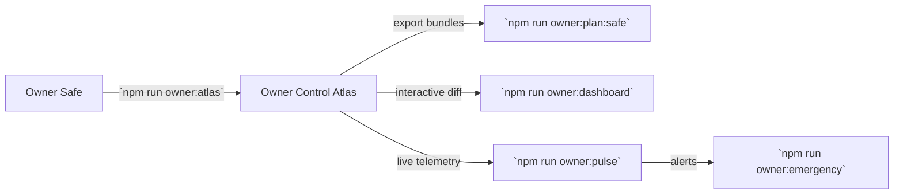

# Astral Citadel Operations Runbook

A production-sane walkthrough that keeps CI, governance, execution, and monitoring in lockstep. All commands are available today inside AGI Jobs v0 (v2).

---

## Phase 0 — Toolchain + Environment Integrity

1. `make -C demo/astral-citadel bootstrap`
   - Installs npm dependencies aligned with `.nvmrc` and ensures the TypeScript + Hardhat toolchain is present.
2. `npm run ci:verify-toolchain`
   - Validates Node, npm, Foundry, and Docker lockfiles to guarantee reproducible CI.
3. `npm run ci:verify-signers`
   - Confirms signer inventories match the hardcoded governance policies.
4. `npm run docs:verify`
   - Dead link detection for all Markdown, including this runbook.

> ✅ Gate: if any of the commands above fail, halt and remediate before moving forward.

---

## Phase 1 — Governance Posture

1. `npm run owner:atlas`
   - Snapshot every governance surface (Safe, Timelock, owner EOA) into a Markdown dossier.
2. `npm run owner:plan:safe -- --network <net>`
   - Emits a ready-to-upload transaction bundle using the same plan consumed during automation.
3. `npm run owner:dashboard -- --network <net>`
   - Visual diff of current configuration vs. the Astral Citadel desired state; ensure all deltas are intentional.
4. `npm run owner:emergency -- --network <net>`
   - Export the emergency pause playbook in case of thermodynamic runaway.

> ✅ Gate: Governance operators sign off on the diff & pause checklist before execution begins.

---

## Phase 2 — Mission Staging (Local)

1. `make -C demo/astral-citadel dry-run`
   - Wraps `npm run demo:asi-takeoff:local` to execute the orchestrator narrative against Anvil using `project-plan.json` inputs.
2. `AURORA_REPORT_SCOPE=astral-citadel AURORA_REPORT_TITLE='Astral Citadel — Dry Run' ts-node --transpile-only demo/aurora/bin/aurora-report.ts`
   - Summarizes dry-run receipts. Inspect risk codes emitted by `orchestrator/simulator.py`.
3. `npm run monitoring:validate`
   - Ensures sentinel definitions consumed by Mission Control remain valid.

> ✅ Gate: No blocking risk codes and sentinel validation passes.

---

## Phase 3 — Mainnet-Grade Execution

1. Export required secrets: `cp demo/aurora/env.example .env` and fill RPC URLs, deployer keys, Safe service endpoints.
2. `NETWORK=<net> make -C demo/astral-citadel mission`
   - Wraps `npm run demo:asi-global` with environment aware network selection (uses `.env` for credentials).
3. `npm run reward-engine:update -- --network <net>`
   - Applies RewardEngineMB adjustments triggered by the mission outputs.
4. `npm run thermostat:update -- --network <net>`
   - Re-tunes PID coefficients if entropy thresholds from the run were crossed.
5. `npm run platform:registry:update -- --network <net>`
   - Syncs platform-level job caps and treasury routing with the new plan.

> ✅ Gate: Governance signs the Safe bundle produced during execution. Receipts stored under `reports/<net>/astral-citadel/`.

---

## Phase 4 — Observability + Economic Feedback

1. `npm run owner:mission-control -- --network <net>`
   - Generates the Mission Control dashboard capturing every transaction, pause state, and module config.
2. `npm run hamiltonian:report -- --network <net>`
   - Samples Hamiltonian energy drift to confirm the energy budget remains within the defined corridor.
3. `npm run thermodynamics:report -- --network <net>`
   - Exports thermostat KPIs, temperature history, and entropy deltas.
4. `make -C demo/astral-citadel report`
   - Calls the shared mission reporter with Astral-specific metadata and publishes the consolidated Markdown dossier.
5. `npm run observability:smoke`
   - Validates Prometheus exporters, sentinel endpoints, and job metrics.

> ✅ Gate: Observability green across the board. Archive the generated reports with release artifacts.

---

## Contingencies

* **Thermal runaway** — Trigger `npm run owner:emergency` to pause via `SystemPause` and slash high-entropy actors.
* **Validator outage** — Increase quorum weights using `scripts/v2/asiGlobalKit.ts` generated payloads; validators can stake via `npm run validator:cli`.
* **Economic shock** — Run `npm run reward-engine:update -- --kpi emergency-liquidity` and adjust burn percentages through `config/thermodynamics.json` followed by `npm run thermostat:update`.

---

## Deliverables & Storage

* Mission receipts: `reports/<network>/astral-citadel/receipts/*.json`
* CI artifacts: `reports/<network>/astral-citadel/astral-citadel-report.md`
* Governance dossier: `reports/<network>/astral-citadel/governance.md`
* Thermodynamic snapshots: `reports/<network>/astral-citadel/thermodynamics.json`

All outputs leverage directories already produced by the Aurora/A.S.I. demos so downstream tooling (dashboards, release packager) can ingest them without modifications.
