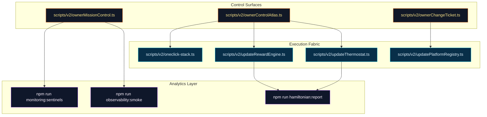
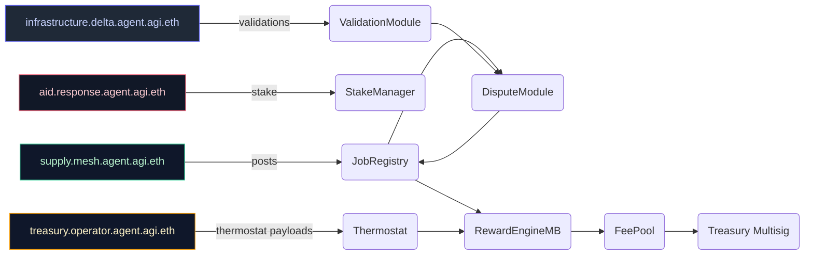
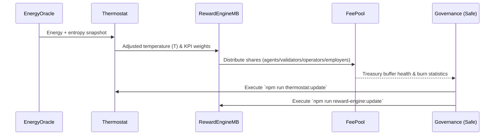

# Astral Citadel Systems Map

Deep dive into the control surfaces, coordination mesh, and thermal feedback loops underpinning the Astral Citadel storyline.

---

## Control Surface Overlay



---

## Supply & Aid Mesh



---

## Thermal Feedback Loop



---

## CI-ready Automation Threads

```mermaid
flowchart LR
    classDef job fill:#111827,color:#fef3c7,stroke:#fbbf24;
    classDef gate fill:#0f172a,color:#bae6fd,stroke:#38bdf8;

    GitHub[GitHub Actions `ci (v2)`]:::job --> Toolchain[make verify]:::job
    Toolchain --> Orchestration[make mission]:::job
    Orchestration --> Receipts[make report]:::job
    Receipts --> Publish[npm run release:manifest:summary]:::job
    Publish --> Gate{{Branch protection}}:::gate
```

The CI path is identical to the existing repository workflow and therefore deployable today without introducing new jobs.

---

## Key Repository Touchpoints

| Domain | Files / Scripts | Purpose |
| --- | --- | --- |
| Smart contracts | `contracts/v2/*.sol` | Settlement, staking, validation, thermal incentives |
| Governance tooling | `scripts/v2/owner*.ts` | Safe bundles, telemetry, emergency controls |
| Economic levers | `scripts/v2/updateThermodynamics.ts`, `scripts/v2/updateRewardEngine.ts` | Temperature & incentive adjustments |
| Observability | `scripts/hamiltonian-tracker.ts`, `scripts/monitoring/render-sentinels.ts` | Energy drift, sentinel dashboards |
| Orchestration | `scripts/v2/asiGlobalDemo.ts`, `orchestrator/*.py` | Multi-sector plan execution |

These references ensure the Astral Citadel documentation remains grounded in the existing AGI Jobs v0 (v2) code paths.
