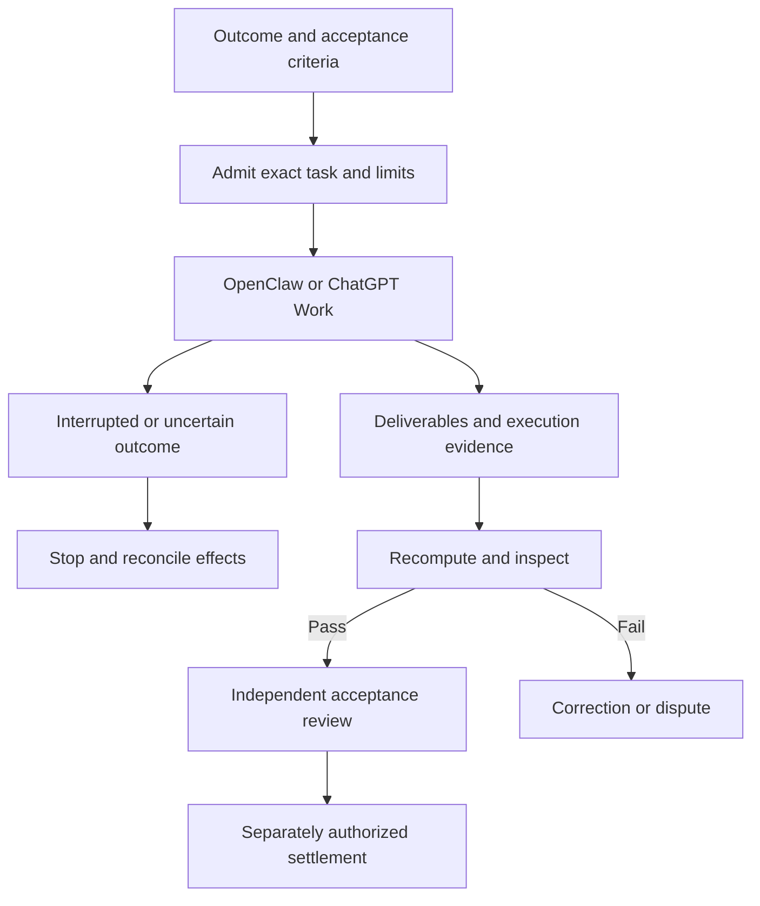

# AGI Jobs v0 (v2) — Astral Omnidominion Operating System Command Theatre

**A command theatre for work people perform using a keyboard and mouse while watching a screen.** Define the result, choose a capable worker, inspect its deliverables, and require evidence before acceptance and settlement.

Start with a small, executable rehearsal. Extend it through the repository's existing OpenClaw adapter, browser lab, ChatGPT Work operating procedure, and governance tools. The wider vision remains a market for useful digital work across software, research, documents, spreadsheets, design tools and operations.

## Start here — one command

From the repository root, with **Python 3.10+**:

```bash
python3 demo/astral-omnidominion-operating-system-command-theatre/run_demo.py
```

Open **`reports/astral-omnidominion-operating-system-command-theatre/report.html`** in your browser. No npm installation, Docker, account, API key or wallet is needed for this path. The runner uses only the standard library, makes no network calls and does not create an OS sandbox.

**Expected:** `Outcome: accepted`, six documents inspected, six acceptance checks passed. The source contains four ledger rows including one duplicate. The deliverable contains **three unique entries, one duplicate and a total of 21,999 cents ($219.99)**. The exported deliverable includes the complete deduplicated ledger in source order and sorted duplicate IDs; the checker verifies both against the input. These are synthetic ledger amounts, not USDC transfers.

| Choose your next step | What actually runs |
| --- | --- |
| [Offline rehearsal](launch-playbook.md#1-offline-rehearsal-default) | Real local JSON files, separate deterministic checking, SHA-256 verification and an offline HTML dashboard; fixture worker decisions |
| [Browser lab](../One-Box/computer-work/README.md) | Actual isolated Chromium interaction, screenshots and a provider-shaped fixture response |
| [OpenClaw / ChatGPT Work handoff](computer-work.md) | Existing live Responses adapter or operator-led Work execution after environment-specific commissioning |
| [Full AGI OS theatre](launch-playbook.md#2-full-agi-os-stack-advanced) | Existing Node/Docker/local-chain orchestration, owner maps and mission bundles |

## Prove that incorrect work is rejected

```bash
python3 demo/astral-omnidominion-operating-system-command-theatre/run_demo.py --scenario rejected --output reports/astral-rejected/report.json
python3 demo/astral-omnidominion-operating-system-command-theatre/run_demo.py --scenario paused --output reports/astral-paused/report.json
```

Both intentionally return **exit status 1**. Rejection introduces a one-cent error: five checks pass and the recomputed-total check fails. Pause blocks task execution and produces no task artifacts. A missing, empty, unreadable or oversized required document, or an invalid catalog, also blocks execution and reports what to fix. Nothing falls back to a live provider.

Verify saved evidence without executing a task:

```bash
python3 demo/astral-omnidominion-operating-system-command-theatre/run_demo.py --verify-report reports/astral-omnidominion-operating-system-command-theatre/report.json
```

Integrity verification returns zero for an intact accepted **or rejected** bundle; inspect `accepted` separately. A paused run has no complete bundle and cannot pass this check. Hashes establish byte consistency relative to the saved report, not producer identity or correctness. Every completed task retains a standalone `runs/<id>/receipt.json` and `index.html`; pass that receipt to `--verify-report` to inspect an earlier run. Preserve a trusted copy of the receipt outside a mutable worker directory for real audit use.

## Capabilities and evidence boundaries

The report preserves the original `coverage`, `documents` and `scores` fields, adds `schema_version: 2`, and labels the historical coordination/Gibbs/game-theory scores as **document-length illustrations**. They are not physics, profitability, reliability or production-readiness measurements.

The new work catalog includes ten concrete job types with illustrative **100 / 1,000 / 10,000 USDC** budgets, tool requirements, deliverables and acceptance conditions. Only ledger reconciliation is executed by this Python runner. A separate checker function provides meaningful error detection; it is not an independent validator identity. Every report retains `live_provider: false`, `browser_executed: false`, `settlement_approved: false` and `production_approved: false`.

The **$40 trillion/year** opportunity is retained as the project's **planning assumption**, not an independently verified estimate or promised platform revenue. Market size, digitally accessible tasks, licensed inputs, reliable execution, reviewer capacity, adoption and fee revenue are different quantities. Computer use broadens the task surface; each work category still needs measured acceptance evidence.

## Systems Map

The original map is preserved. It describes the intended integration topology, not a claim that the offline runner connects to these services.

```mermaid
flowchart LR
    Operators((Mission Owners)) --> demo_astral_omnidominion_operating_system_command_theatre[[Demo → Astral Omnidominion Operating System Command Theatre]]
    demo_astral_omnidominion_operating_system_command_theatre --> Core[[AGI Jobs v0 (v2) Core Intelligence]]
    Core --> Observability[[Unified CI / CD & Observability]]
    Core --> Governance[[Owner Control Plane]]
```

## From brief to useful work



## Directory guide

| File | Purpose |
| --- | --- |
| [launch-playbook.md](launch-playbook.md) | First run, expected output, full-stack path and troubleshooting |
| [computer-work.md](computer-work.md) | Current capabilities, handoff and commissioning requirements |
| [work-catalog.json](work-catalog.json) | Machine-readable task templates and market assumption |
| [owner-control-field-guide.md](owner-control-field-guide.md) | Correct governance commands and authority boundaries |
| [mission-review-checklist.md](mission-review-checklist.md) | Verify evidence and classify what a run actually proves |
| [ci-green-operations.md](ci-green-operations.md) | Targeted checks, repository gates and CI failure diagnosis |
| [run_demo.py](run_demo.py) | Offline runner and standalone evidence verifier |

## Quality and governance

Changes land through a pull request with the repository's required checks green. See [RUNBOOK.md](../../RUNBOOK.md), [OperatorRunbook.md](../../OperatorRunbook.md), and the [computer-work production boundaries](../../docs/computer-work.md). Keep secrets out of job specifications and evidence. Preserve the original flowcharts and full-stack tooling while commissioning each real worker separately.
