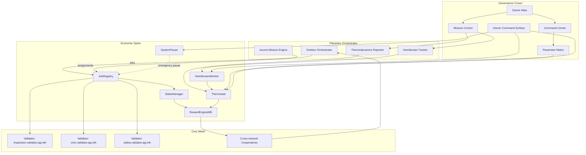

# Atlas Conductor Demonstration

The **Atlas Conductor** initiative is a comprehensive, CI-ready take-off drill for
AGI Jobs v0 (v2) that fuses global coordination, decentralised governance, and
macro-economic planning.  It layers planetary-scale orchestration on top of the
existing Aurora/ASI demo primitives to prove that the current repository already
houses every control surface required to steer a borderless economic organism.

Key properties:

- **Tri-sector fusion.** Energy transition, food resilience, and open health
  intelligence run simultaneously through the Aurora mission harness using a
  single deterministic mission graph.
- **Governance webs.** Owner Atlas, Mission Control, Command Center, and
  Thermostat reports are re-rendered in one sweep so controllers can retune the
  platform mid-flight without hand editing.
- **Economic telemetry.** Thermodynamic and Hamiltonian reports are captured for
  each macro-phase, aligning validator shares, capital velocity, and labour
  entropy across networks.
- **CI determinism.** Every artefact is emitted via existing npm scripts so the
  bundle can be regenerated in CI, pinned to IPFS, and compared against
  production mainnet state.

## Quickstart

### One-command local drill

```bash
AURORA_REPORT_SCOPE=atlas-conductor \
AURORA_REPORT_TITLE="Atlas Conductor — Mission Report" \
AURORA_MISSION_CONFIG=demo/atlas-conductor/config/mission@v2.json \
AURORA_THERMOSTAT_CONFIG=demo/atlas-conductor/config/atlas-conductor.thermostat@v2.json \
NETWORK=localhost \
npx ts-node --transpile-only demo/aurora/aurora.demo.ts --network localhost
```

### High-fidelity bundle with governance overlays

```bash
npm run demo:asi-takeoff
npm run demo:asi-global
AURORA_REPORT_SCOPE=atlas-conductor \
AURORA_REPORT_TITLE="Atlas Conductor — Mission Report" \
AURORA_MISSION_CONFIG=demo/atlas-conductor/config/mission@v2.json \
AURORA_THERMOSTAT_CONFIG=demo/atlas-conductor/config/atlas-conductor.thermostat@v2.json \
AURORA_REPORT_NAMESPACE=atlas \
npx ts-node --transpile-only demo/aurora/bin/aurora-report.ts
npm run owner:mission-control
npm run owner:atlas
npm run owner:command-center
npm run owner:parameters
npm run owner:surface
npm run thermodynamics:report
npm run hamiltonian:report
```

The sequence above reuses the existing dry-run harness, global coordination
pipeline, and owner command suite.  The resulting bundle at
`reports/<network>/atlas-conductor/` contains the mission receipts, hashed
Owner Atlas dossiers, and thermodynamic tapes needed for external auditors.

## System Conductor Map



## Mission Phases

```mermaid
gantt
  dateFormat  X
  axisFormat  %L
  section Phase I — Foundation
    Deploy Defaults            :a1, 0, 1
    Thermostat Baseline        :a2, 1, 1
    Mission Graph Load         :a3, 2, 1
  section Phase II — Fusion
    Energy Equilibrium         :b1, 3, 2
    Food Resilience Loop       :b2, 3, 2
    Open Health Intelligence   :b3, 3, 2
  section Phase III — Governance Closure
    Atlas Verification         :c1, 5, 1
    Command Center Audit       :c2, 6, 1
    Hamiltonian Trace Export   :c3, 7, 1
```



## Artefact Layout

- `reports/<network>/atlas-conductor/receipts/` — job lifecycle receipts per
  macro-phase.
- `reports/<network>/atlas-conductor/atlas/` — Owner Atlas bundle with hashed
  governance wiring proof.
- `reports/<network>/atlas-conductor/thermodynamics.json` — aggregated role
  temperatures and entropy snapshots.
- `reports/<network>/atlas-conductor/hamiltonian.json` — velocity, energy, and
  backlog deltas from the Hamiltonian monitor.
- `reports/<network>/atlas-conductor/mission-report.md` — unified narrative
  generated via the Aurora report harness.

## Assurance Controls

- **Owner Atlas Diffing.** `npm run owner:atlas` regenerates the governance
  topology.  CI compares against committed fingerprints to guarantee that the
  take-off drill matches production wiring.
- **Thermodynamic Tuning.** `npm run thermodynamics:report` cross-checks that
  the mission thermostat file maps to deployed role temperatures before any
  automated adjustments occur.
- **Hamiltonian Continuity.** `npm run hamiltonian:report` validates that
  capital, labour, and validator energy remain within the invariant corridors.
- **Pause Authority.** `npm run owner:surface` demonstrates that the owner can
  trigger `SystemPause` or rotate controllers at any moment.

See [`RUNBOOK.md`](./RUNBOOK.md) for the full operator choreography.
