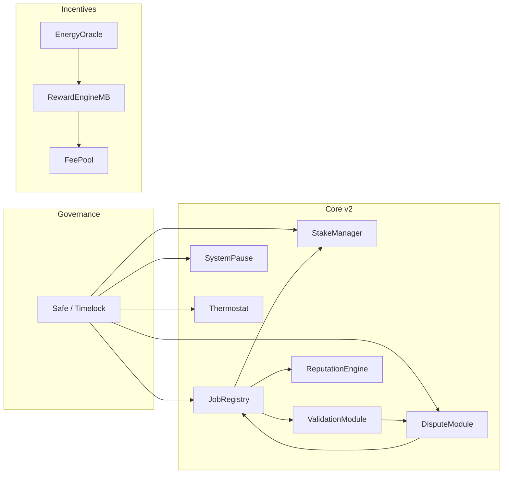
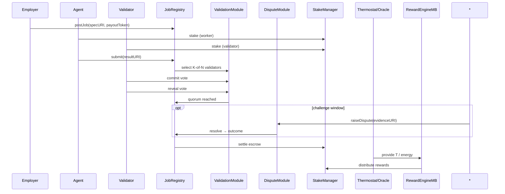

# Project AURORA — AGI Jobs v0 (v2) ASI Take‑Off Demo

**A planetary‑scale, auditable coordination sprint**: governed job posting, stake‑backed K‑of‑N validation with commit→reveal, dispute hooks, dynamic incentives via Thermostat/Energy Oracle, and operator dashboards — using only v2 capabilities.

---

## Quickstart

Local (Anvil):

```bash
cp demo/aurora/env.example .env
npm run demo:aurora:local
```

Target network:

```bash
# ensure RPC + keys in env
npm run demo:aurora:sepolia
```

Before targeting an existing deployment, either:

1. Run `npx hardhat run scripts/v2/deployDefaults.ts --network <network>` with `DEPLOY_DEFAULTS_OUTPUT` pointing to a JSON summary and export `AURORA_DEPLOY_OUTPUT` to that path, **or**
2. Provide direct overrides via environment variables (`AURORA_JOB_REGISTRY`, `AURORA_STAKE_MANAGER`, `AURORA_VALIDATION_MODULE`, `AURORA_IDENTITY_REGISTRY`, `AURORA_SYSTEM_PAUSE`).

**Outputs**

* `reports/<network>/aurora/receipts/*.json`
  * Includes `governance.json` capturing every forwarded + direct control action executed during the run
* `reports/<network>/aurora/aurora-report.md`
* Governance/owner snapshots can be generated via the existing owner tooling

---

## System (high level)



## Lifecycle (AURORA)



---

## Governance & Owner Control

Operators retain full authority over the demo deployment:

* `npm run owner:command-center -- --network <network>` renders the governance topology and owner change controls.
* `npm run owner:pulse -- --network <network>` snapshots pause guardians, module owners, and validator bounds in real time.
* `npx hardhat run scripts/v2/pauseTest.ts --network <network>` (dry-run by default) verifies that the configured `SystemPause` guardian can halt and resume modules before going live.
* Thermodynamic or incentive parameters can be tuned with `npx hardhat run scripts/v2/updateThermodynamics.ts --network <network>`; add `--execute` when the diff looks correct.

These commands ensure the contract owner can update parameters, rotate governance, and pause execution without modifying core code.

---

## Runbook

See [`RUNBOOK.md`](./RUNBOOK.md) for the step‑by‑step orchestration, including:

* Wiring checks and deployment via `scripts/v2/deployDefaults.ts`
* Automated module configuration and staking handled by `aurora.demo.ts`
* Receipt collection and the Markdown mission report summarised by `aurora-report.ts`

All receipts land under `reports/<net>/aurora/`. A Markdown summary is generated at `reports/<net>/aurora/aurora-report.md`.
